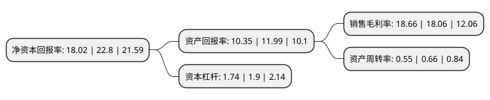

> 本页面由自动化程序生成于 2022年5月20日 01:11
> 内容可能存在错误，如有bug请提交issue至：https://github.com/Eroleice/doc-pi/issues
{.is-warning}

# 上市公司基本情况

## 基本资料

海思科医药集团股份有限公司（以下简称“海思科”）成立于2005年08月26日，山南市。于2012年01月17日在深交所中小板上市。

海思科注册资本107,668.622万元，主营业务:化药制剂及原料药的研发，生产和销售。主要产品:小容量注射液，大容量注射液，粉针剂三个大类。以下是详细信息：

- 公司名称: 海思科医药集团股份有限公司
- 股票代码: 002653.SZ
- 所在地: 西藏 - 山南市
- 成立日期: 2005年08月26日
- 注册资本: 107,668.622万元
- 法定代表人: 王俊民
- 主营业务: 主营业务:化药制剂及原料药的研发，生产和销售主要产品:小容量注射液，大容量注射液，粉针剂三个大类
- 公司官网: www.haisco.com
- 公司介绍: 公司成立于2000年，是一家集新药研发、生产制造、销售等业务于一体的多元化、专业化医药集团上市公司。目前研发中心的科研工作涉及肠外营养、肿瘤、心脑血管、抗病毒、内分泌、中枢神经等多个临床治疗领域，在创新药、高端仿制药专业领域启动了100余个新项目的研究开发。研发中心建有独立的仿制药、创新药大楼和中试车间、动物房等，配备有先进齐全的科研设施、仪器，在肠外静脉营养治疗领域的新产品开发方面处于国内领先水平。公司依据“战略合作、利益共享”的原则打造起覆盖全国主要省市地区的庞大销售网络。

## 股东及高管情况

上市公司第一大股东为王俊民，持股399,550,400股，占比37.11%，为上市公司实际控制人。

截至2022年03月31日，上市公司的前十大股东中，共有6名自然人股东，3个产品账户，1个海外主体，其中5%以上大股东共有4名。上市公司前十大股东明细如下：

> 截至2022年03月31日，上市公司前十大股东信息如下：

| 股东名称 | 持股数量（股） | 持股比例 |
| --- | --- | --- |
| 王俊民 | 399,550,400 | 37.11% |
| 范秀莲 | 223,465,600 | 20.75% |
| 郑伟 | 170,877,600 | 15.87% |
| 申萍 | 64,997,008 | 6.04% |
| 杨飞 | 42,442,286 | 3.94% |
| 中国工商银行股份有限公司-富国天惠精选成长混合型证券投资基金(LOF) | 9,000,000 | 0.84% |
| 郝聪梅 | 8,538,000 | 0.79% |
| 中国建设银行股份有限公司-富国价值创造混合型证券投资基金 | 5,460,459 | 0.51% |
| 交通银行股份有限公司-富国消费主题混合型证券投资基金 | 4,109,394 | 0.38% |
| 香港中央结算有限公司(陆股通) | 4,007,300 | 0.37% |

## 利润表分析

上市公司2021年总收入为27.73亿元，净利润为5.17亿元，实现盈利。

## 杜邦分析

> 数据列示周期：2021年 | 2020年 | 2019年
{.is-info}

上市公司的净资产收益率在近一年有所下降，下降幅度为-20.96%，其变化情况分解如下：
- 上市公司的销售毛利率在近一年上升了3.32%，可能是生产效率的提升、商品原材料价格下跌或商品价格的上涨所致。
- 上市公司的资产周转率在近一年下降了-16.67%，可能是源自于更慢的销售回款或库存管理效果下降。
- 上市公司的财务杠杆比率在近一年下降了-8.42%，可能是减少负债降低财务费用。

