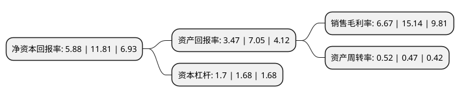

> 本页面由自动化程序生成于 2022年5月20日 01:11
> 内容可能存在错误，如有bug请提交issue至：https://github.com/Eroleice/doc-pi/issues
{.is-warning}

# 上市公司基本情况

## 基本资料

烟台东诚药业集团股份有限公司（以下简称“东诚药业”）成立于1998年12月31日，烟台市。于2012年05月25日在深交所中小板上市。

东诚药业注册资本80,221.433万元，肝素钠原料药，硫酸软骨素的研发，生产和销售。以下是详细信息：

- 公司名称: 烟台东诚药业集团股份有限公司
- 股票代码: 002675.SZ
- 所在地: 山东 - 烟台市
- 成立日期: 1998年12月31日
- 注册资本: 80,221.433万元
- 法定代表人: 由守谊
- 主营业务: 肝素钠原料药，硫酸软骨素的研发，生产和销售
- 公司官网: www.dcb-group.com
- 公司介绍: 公司成立于1998年，2012年5月成功登陆深交所。历经近20年的积累和发展，东诚药业现已发展成为一家覆盖生化原料药、中成药、化药、核药四大领域，融药品研发、生产、销售于一体的大型制药企业集团。东诚药业不断强化制剂业务发展，旗下子公司东诚大洋、东诚北方现有制剂产品覆盖心血管、抗肿瘤、泌尿、骨科及抗感染等治疗领域。近年来，公司高起点进入高技术壁垒和高成长性的核医药行业，相继并购成都云克药业、上海益泰医药、东诚欣科、南京江原安迪科，完成公司从诊断用核药到治疗用核药的全产业链布局，奠定了公司在中国核医药领域的地位。东诚药业不断加大科研投入，致力自主创新，不断引进泰山学者、973科学家等高素质人才。在“立足东方，诚诺健康”的企业使命指引下，东诚药业将秉承“稳健经营、持续发展、市场导向、客户至上、责任东诚、效益东诚”的经营理念，深化资源整合、优化产业结构、不断提升企业创新能力与核心竞争力，携手精英团队，服务人类健康，不断向着成长为专业领域的、持续创造卓越价值的制药企业踏步迈进。

## 股东及高管情况

上市公司第一大股东为烟台东益生物工程有限公司，持股124,888,049股，占比15.57%，**疑似为**上市公司实际控制人。

截至2022年03月31日，上市公司的前十大股东中，共有2名自然人股东，3名机构股东，3个产品账户，2个海外主体，其中5%以上大股东共有2名。上市公司前十大股东明细如下：

> 未能通过持股比例判定出上市公司实际控制人（持股30%以上）
> 可能存在通过间接持股、联合持股、协议控制等方式拥有实际控制权的主体，具体请参考上市公司定期公告！
{.is-warning}

> 截至2022年03月31日，上市公司前十大股东信息如下：

| 股东名称 | 持股数量（股） | 持股比例 |
| --- | --- | --- |
| 烟台东益生物工程有限公司 | 124,888,049 | 15.57% |
| 由守谊 | 80,924,299 | 10.09% |
| 嘉兴聚力叁号股权投资合伙企业(有限合伙) | 40,110,617 | 5% |
| 石雯 | 31,510,036 | 3.93% |
| PACIFIC RAINBOW INTERNATIONAL, INC. | 27,654,757 | 3.45% |
| 中国农业银行股份有限公司-嘉实新兴产业股票型证券投资基金 | 12,808,905 | 1.6% |
| 招商银行股份有限公司-嘉实远见精选两年持有期混合型证券投资基金 | 10,954,992 | 1.37% |
| 香港中央结算有限公司(陆股通) | 10,176,087 | 1.27% |
| 华夏人寿保险股份有限公司-自有资金 | 9,863,216 | 1.23% |
| 中国农业银行股份有限公司-嘉实核心成长混合型证券投资基金 | 9,521,165 | 1.19% |

## 利润表分析

上市公司2021年总收入为39.12亿元，净利润为2.6亿元，实现盈利。

## 杜邦分析

> 数据列示周期：2021年 | 2020年 | 2019年
{.is-info}

上市公司的净资产收益率在近一年有所下降，下降幅度为-50.21%，其变化情况分解如下：
- 上市公司的销售毛利率在近一年下降了-55.94%，可能是生产效率的下降、商品原材料价格上涨或商品价格的下跌所致。
- 上市公司的资产周转率在近一年上升了10.64%，可能是源自于更快的销售回款或库存管理效果提升。
- 上市公司的财务杠杆比率在近一年上升了1.19%，可能是增加负债扩大生产规模。

