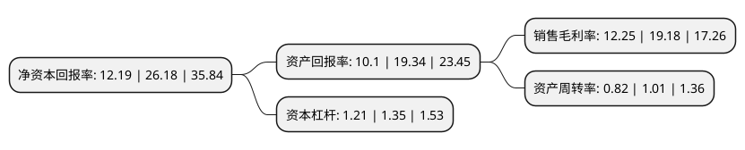

> 本页面由自动化程序生成于 2022年5月20日 01:11
> 内容可能存在错误，如有bug请提交issue至：https://github.com/Eroleice/doc-pi/issues
{.is-warning}

# 上市公司基本情况

## 基本资料

北京奥赛康药业股份有限公司（以下简称“奥赛康”）成立于1996年12月24日，北京市。于2015年05月15日在深交所中小板上市。

奥赛康注册资本92,816.035万元，主营业务:主要为石油化工行业，新型煤化工行业的大型建设项目提供工程勘察和岩土工程施工服务，服务领域包括:工程勘察(含测绘，勘察，检(监)测)，岩土工程施工，工程咨询与监理等。以下是详细信息：

- 公司名称: 北京奥赛康药业股份有限公司
- 股票代码: 002755.SZ
- 所在地: 北京 - 北京市
- 成立日期: 1996年12月24日
- 注册资本: 92,816.035万元
- 法定代表人: 陈庆财
- 主营业务: 主营业务:主要为石油化工行业，新型煤化工行业的大型建设项目提供工程勘察和岩土工程施工服务，服务领域包括:工程勘察(含测绘，勘察，检(监)测)，岩土工程施工，工程咨询与监理等
- 公司官网: www.ask-pharm.com
- 公司介绍: 公司于2018年12月完成了重大资产重组。公司的主营业务由主要从事为石油化工行业、新型煤化工行业的大型建设项目提供工程勘察和岩土工程施工服务等业务变更为药品研发、生产和销售。在长期的发展过程中，逐步创建了“以健康为本的‘头尾创新’的奥赛康管理模式”，既重视“头部创新”，重点抓研发和技术突破，又重视“尾部创新”，强调工艺改进、质量提升，使“尾部创新”与“头部创新”互相融合、相得益彰，实现公司可持续健康发展。奥赛康药业专注于中国医药细分市场，目前产品剂型主要定位于冻干粉针制剂，在国内抗消化性溃疡药物质子泵抑制剂注射剂产品细分领域市场占有率第一。奥赛康药业是国内最大的质子泵抑制剂(PPIs)注射剂生产企业之一，通过在医药制造行业多年的深耕细作，奥赛康药业形成了多品类多层次的产品管线和良好的产品质量口碑，资产规模和盈利能力均处于业界领先地位。2018年位列中国化学制药行业工业企业综合实力百强第35名。

## 股东及高管情况

上市公司第一大股东为南京奥赛康投资管理有限公司，持股317,470,588股，占比34.2%，为上市公司实际控制人。

截至2022年03月31日，上市公司的前十大股东中，共有4名自然人股东，5名机构股东，1个海外主体，其中5%以上大股东共有4名。上市公司前十大股东明细如下：

> 截至2022年03月31日，上市公司前十大股东信息如下：

| 股东名称 | 持股数量（股） | 持股比例 |
| --- | --- | --- |
| 南京奥赛康投资管理有限公司 | 317,470,588 | 34.2% |
| 中亿伟业控股有限公司 | 143,617,647 | 15.47% |
| 江苏苏洋投资实业有限公司 | 141,337,647 | 15.23% |
| 伟瑞发展有限公司 | 113,382,352 | 12.22% |
| 南京海济投资管理有限公司 | 37,794,117 | 4.07% |
| 陈会利 | 13,298,563 | 1.43% |
| 香港中央结算有限公司(陆股通) | 2,903,806 | 0.31% |
| 曲维孟 | 2,702,300 | 0.29% |
| 赵小奇 | 2,450,000 | 0.26% |
| 郭晓飞 | 2,052,356 | 0.22% |

## 利润表分析

上市公司2021年总收入为31.06亿元，净利润为3.8亿元，实现盈利。

## 杜邦分析

> 数据列示周期：2021年 | 2020年 | 2019年
{.is-info}

上市公司的净资产收益率在近一年有所下降，下降幅度为-53.44%，其变化情况分解如下：
- 上市公司的销售毛利率在近一年下降了-36.13%，可能是生产效率的下降、商品原材料价格上涨或商品价格的下跌所致。
- 上市公司的资产周转率在近一年下降了-18.81%，可能是源自于更慢的销售回款或库存管理效果下降。
- 上市公司的财务杠杆比率在近一年下降了-10.37%，可能是减少负债降低财务费用。

