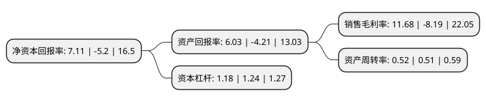

> 本页面由自动化程序生成于 2022年5月20日 01:12
> 内容可能存在错误，如有bug请提交issue至：https://github.com/Eroleice/doc-pi/issues
{.is-warning}

# 上市公司基本情况

## 基本资料

成都康弘药业集团股份有限公司（以下简称“康弘药业”）成立于1996年10月03日，成都市。于2015年06月26日在深交所中小板上市。

康弘药业注册资本91,946.395万元，公司主要从事中成药，化学药(合成原料药和药物制剂)及生物制品(分子治疗药物)的研发，生产和销售，传播专业创新的医药产品知识。以下是详细信息：

- 公司名称: 成都康弘药业集团股份有限公司
- 股票代码: 002773.SZ
- 所在地: 四川 - 成都市
- 成立日期: 1996年10月03日
- 注册资本: 91,946.395万元
- 法定代表人: 柯尊洪
- 主营业务: 公司主要从事中成药，化学药(合成原料药和药物制剂)及生物制品(分子治疗药物)的研发，生产和销售，传播专业创新的医药产品知识
- 公司官网: www.cnkh.com
- 公司介绍: 公司是一家致力于中成药、化学药及生物制品的研发、生产、销售及售后服务的医药集团。公司秉承“康平盛世、弘济众生”的宗旨，致力于“研发、制造、销售及传播专业创新的医药产品和知识，从根本上去改善患者个人体能和社会医疗效能，促进人类健康事业的进步”的企业宗旨；始终坚持“以临床需求为导向，在核心治疗领域，深入研究、专业创新、专业服务”的经营理念；坚持专业与创新相结合的发展战略，以技术创新为主线推动研发、生产和销售三大板块，持续专注于医药行业，致力于生物制品、中成药及化学药的研发、生产和销售，专业创新、专业服务。

## 股东及高管情况

上市公司第一大股东为成都康弘科技实业(集团)有限公司，持股292,014,900股，占比31.76%，为上市公司实际控制人。

截至2022年03月31日，上市公司的前十大股东中，共有8名自然人股东，1名机构股东，1个海外主体，其中5%以上大股东共有3名。上市公司前十大股东明细如下：

> 截至2022年03月31日，上市公司前十大股东信息如下：

| 股东名称 | 持股数量（股） | 持股比例 |
| --- | --- | --- |
| 成都康弘科技实业(集团)有限公司 | 292,014,900 | 31.76% |
| 柯尊洪 | 207,726,419 | 22.59% |
| 柯潇 | 76,760,000 | 8.35% |
| 龚静 | 33,177,779 | 3.61% |
| 钟建荣 | 10,579,479 | 1.15% |
| 钟建军 | 9,353,788 | 1.02% |
| 赵兴平 | 9,338,616 | 1.02% |
| 香港中央结算有限公司(陆股通) | 4,575,827 | 0.5% |
| 张志荣 | 4,130,000 | 0.45% |
| 周玉蓉 | 3,347,440 | 0.36% |

## 利润表分析

上市公司2021年总收入为36.05亿元，净利润为4.21亿元，实现盈利。

## 杜邦分析

> 数据列示周期：2021年 | 2020年 | 2019年
{.is-info}

上市公司的净资产收益率在近一年有所下降，下降幅度为-236.73%，其变化情况分解如下：
- 上市公司的销售毛利率在近一年下降了-242.61%，可能是生产效率的下降、商品原材料价格上涨或商品价格的下跌所致。
- 上市公司的资产周转率在近一年上升了1.96%，可能是源自于更快的销售回款或库存管理效果提升。
- 上市公司的财务杠杆比率在近一年下降了-4.84%，可能是减少负债降低财务费用。

