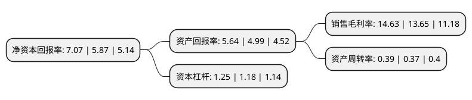

> 本页面由自动化程序生成于 2022年5月20日 01:12
> 内容可能存在错误，如有bug请提交issue至：https://github.com/Eroleice/doc-pi/issues
{.is-warning}

# 上市公司基本情况

## 基本资料

安徽黄山胶囊股份有限公司（以下简称“黄山胶囊”）成立于1996年08月12日，宣城市。于2016年10月25日在深交所中小板上市。

黄山胶囊注册资本21,364.155万元，公司主营业务为药用空心胶囊的生产与销售，主要产品包括明胶空心胶囊与肠溶明胶空心胶囊。以下是详细信息：

- 公司名称: 安徽黄山胶囊股份有限公司
- 股票代码: 002817.SZ
- 所在地: 安徽 - 宣城市
- 成立日期: 1996年08月12日
- 注册资本: 21,364.155万元
- 法定代表人: 余超彪
- 主营业务: 公司主营业务为药用空心胶囊的生产与销售，主要产品包括明胶空心胶囊与肠溶明胶空心胶囊
- 公司官网: www.hsjn.com
- 公司介绍: 公司创建于1989年，是一家专业生产明胶空心胶囊和肠溶明胶空心胶囊的大型胶囊生产制造商。公司长期致力于药用空心胶囊产品的研发、制造，为国内优先同时拥有明胶空心胶囊、肠溶明胶空心胶囊、结肠溶空心胶囊、植物空心胶囊和植物肠溶空心胶囊五大产品系列制造技术和生产能力的企业。公司是行业内规模最大的药用空心胶囊生产企业之一，年产能达300亿粒以上，并拥有专业化的药用空心胶囊生产设备，能够生产各种规格、品种的药用空心胶囊，并提供专业化的产品定制服务。公司现为中国医药包装协会药用空心胶囊专业委员会副主任单位之一，“旌川”牌药用空心胶囊获“安徽名牌产品”称号。

## 股东及高管情况

上市公司第一大股东为余春明，持股81,287,725股，占比38.05%，为上市公司实际控制人。

截至2022年03月31日，上市公司的前十大股东中，共有10名自然人股东，其中5%以上大股东共有1名。上市公司前十大股东明细如下：

> 截至2022年03月31日，上市公司前十大股东信息如下：

| 股东名称 | 持股数量（股） | 持股比例 |
| --- | --- | --- |
| 余春明 | 81,287,725 | 38.05% |
| 余超彪 | 7,395,000 | 3.46% |
| 余春禄 | 2,027,506 | 0.95% |
| 秦文基 | 1,642,754 | 0.77% |
| 段学东 | 1,338,400 | 0.63% |
| 叶松林 | 1,232,500 | 0.58% |
| 刘松林 | 1,051,475 | 0.49% |
| 张丕富 | 970,475 | 0.45% |
| 陈晓军 | 950,180 | 0.44% |
| 袁欣 | 895,443 | 0.42% |

## 利润表分析

上市公司2021年总收入为3.79亿元，净利润为0.55亿元，实现盈利。

## 杜邦分析

> 数据列示周期：2021年 | 2020年 | 2019年
{.is-info}

上市公司的净资产收益率在近一年有所上升，上升幅度为20.44%，其变化情况分解如下：
- 上市公司的销售毛利率在近一年上升了7.18%，可能是生产效率的提升、商品原材料价格下跌或商品价格的上涨所致。
- 上市公司的资产周转率在近一年上升了5.41%，可能是源自于更快的销售回款或库存管理效果提升。
- 上市公司的财务杠杆比率在近一年上升了5.93%，可能是增加负债扩大生产规模。

