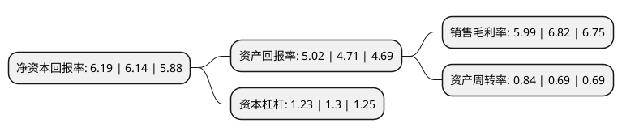

> 本页面由自动化程序生成于 2022年5月20日 01:12
> 内容可能存在错误，如有bug请提交issue至：https://github.com/Eroleice/doc-pi/issues
{.is-warning}

# 上市公司基本情况

## 基本资料

西藏易明西雅医药科技股份有限公司（以下简称“易明医药”）成立于2007年12月29日，拉萨市。于2016年12月09日在深交所中小板上市。

易明医药注册资本19,119.038万元，主要从事化学药(原料药和制剂)以及中成药的研发，生产和销售。主要产品:米格列醇片，瓜蒌皮注射液，盐酸纳美芬注射液，红金消结片，醋氯芬酸肠溶片等以下是详细信息：

- 公司名称: 西藏易明西雅医药科技股份有限公司
- 股票代码: 002826.SZ
- 所在地: 西藏 - 拉萨市
- 成立日期: 2007年12月29日
- 注册资本: 19,119.038万元
- 法定代表人: 彭辉
- 主营业务: 主要从事化学药(原料药和制剂)以及中成药的研发，生产和销售主要产品:米格列醇片，瓜蒌皮注射液，盐酸纳美芬注射液，红金消结片，醋氯芬酸肠溶片等
- 公司官网: www.emyy.cn
- 公司介绍: 公司是集研发、生产、销售为一体的国家级高新技术综合医药企业。公司长期以来致力于糖尿病、心血管疾病等老年慢性病症治疗及妇科产科领域核心产品的开发和研究，普药类产品广泛涉及抗生素类、抗过敏类、消化系统类。企业先后取得“西藏自治区科技型中小企业”、“国家级高新技术企业”、“国家级科技孵化企业”、“西藏国家级科技技术孵化企业”、“中国心脑血管病诊疗产业技术创新战略联盟理事单位(西藏)”、“中国专利优秀奖”等荣誉。

## 股东及高管情况

上市公司第一大股东为高帆，持股50,971,482股，占比26.66%，**疑似为**上市公司实际控制人。

截至2022年03月31日，上市公司的前十大股东中，共有8名自然人股东，1名机构股东，1个产品账户，其中5%以上大股东共有2名。上市公司前十大股东明细如下：

> 未能通过持股比例判定出上市公司实际控制人（持股30%以上）
> 可能存在通过间接持股、联合持股、协议控制等方式拥有实际控制权的主体，具体请参考上市公司定期公告！
{.is-warning}

> 截至2022年03月31日，上市公司前十大股东信息如下：

| 股东名称 | 持股数量（股） | 持股比例 |
| --- | --- | --- |
| 高帆 | 50,971,482 | 26.66% |
| 周战 | 14,361,702 | 7.51% |
| 庞国强 | 6,037,081 | 3.16% |
| 深圳市京信国投基金管理有限责任公司 | 5,170,050 | 2.7% |
| 西藏华金天马股权投资合伙企业(有限合伙) | 3,732,458 | 1.95% |
| 金小平 | 2,894,557 | 1.51% |
| 常文光 | 2,881,774 | 1.51% |
| 彭辉 | 2,852,340 | 1.49% |
| 张绪森 | 2,654,100 | 1.39% |
| 尚磊 | 1,960,021 | 1.03% |

## 利润表分析

上市公司2021年总收入为7.25亿元，净利润为0.43亿元，实现盈利。

## 杜邦分析

> 数据列示周期：2021年 | 2020年 | 2019年
{.is-info}

上市公司的净资产收益率在近一年有所上升，上升幅度为0.81%，其变化情况分解如下：
- 上市公司的销售毛利率在近一年下降了-12.17%，可能是生产效率的下降、商品原材料价格上涨或商品价格的下跌所致。
- 上市公司的资产周转率在近一年上升了21.74%，可能是源自于更快的销售回款或库存管理效果提升。
- 上市公司的财务杠杆比率在近一年下降了-5.38%，可能是减少负债降低财务费用。

