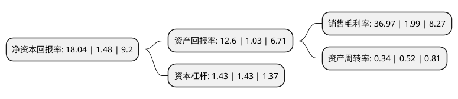

> 本页面由自动化程序生成于 2022年5月20日 01:13
> 内容可能存在错误，如有bug请提交issue至：https://github.com/Eroleice/doc-pi/issues
{.is-warning}

# 上市公司基本情况

## 基本资料

哈尔滨三联药业股份有限公司（以下简称“哈三联”）成立于1996年06月21日，哈尔滨市。于2017年09月22日在深交所中小板上市。

哈三联注册资本31,660.005万元，专业从事化学药品制剂的研发，生产和销售产品的适应症范围包括神经系统类，心脑血管类，肌肉骨骼类，全身抗感染类，抗肿瘤类，以及调节水，电解质及酸碱平衡，补充营养等医疗领域。主要产品为奥拉西坦注射液，丙氨酰谷氨酰胺注射液，注射用脑蛋白水解物，注射用盐酸川芎嗪，注射用骨肽，注射用炎琥宁，米氮平片，缬沙坦分散片，葡萄糖注射液，氯化钠注射液和复方氨基酸注射液等药品。以下是详细信息：

- 公司名称: 哈尔滨三联药业股份有限公司
- 股票代码: 002900.SZ
- 所在地: 黑龙江 - 哈尔滨市
- 成立日期: 1996年06月21日
- 注册资本: 31,660.005万元
- 法定代表人: 秦剑飞
- 主营业务: 专业从事化学药品制剂的研发，生产和销售产品的适应症范围包括神经系统类，心脑血管类，肌肉骨骼类，全身抗感染类，抗肿瘤类，以及调节水，电解质及酸碱平衡，补充营养等医疗领域主要产品为奥拉西坦注射液，丙氨酰谷氨酰胺注射液，注射用脑蛋白水解物，注射用盐酸川芎嗪，注射用骨肽，注射用炎琥宁，米氮平片，缬沙坦分散片，葡萄糖注射液，氯化钠注射液和复方氨基酸注射液等药品
- 公司官网: www.medisan.com.cn
- 公司介绍: 公司是专业从事化学药品制剂研发、生产和销售的国家级高新技术企业。公司始建于1996年，2001年冻干粉针、小容量注射剂、大容量注射剂一次性通过国家GMP认证，企业生产能力迅速提升，经济效益快速提高。主要产品为奥拉西坦注射液、丙氨酰谷氨酰胺注射液、注射用脑蛋白水解物、注射用盐酸川芎嗪、注射用骨肽、注射用炎琥宁、米氮平片、缬沙坦分散片、葡萄糖注射液和氯化钠注射液等药品，公司产品的剂型包括小容量注射剂、冻干粉针剂、固体制剂、非PVC软袋大输液、塑瓶大输液、玻瓶大输液、原料药等多种剂型。公司多年来荣获全国“企业信用评价AAA级信用企业”、2016年中国药品研发综合实力百强等殊荣。

## 股东及高管情况

上市公司第一大股东为秦剑飞，持股123,705,000股，占比39.07%，为上市公司实际控制人。

截至2022年03月31日，上市公司的前十大股东中，共有8名自然人股东，2名机构股东，其中5%以上大股东共有3名。上市公司前十大股东明细如下：

> 截至2022年03月31日，上市公司前十大股东信息如下：

| 股东名称 | 持股数量（股） | 持股比例 |
| --- | --- | --- |
| 秦剑飞 | 123,705,000 | 39.07% |
| 周莉 | 36,787,500 | 11.62% |
| 诸葛国民 | 27,000,000 | 8.53% |
| 哈尔滨利民盛德发展有限公司 | 12,375,000 | 3.91% |
| 秦臻 | 6,420,000 | 2.03% |
| 中瑞国信资产管理有限公司 | 2,952,000 | 0.93% |
| 王明新 | 1,534,500 | 0.48% |
| 姚发祥 | 962,500 | 0.3% |
| 梁延飞 | 708,800 | 0.22% |
| 吕建鸿 | 707,800 | 0.22% |

## 利润表分析

上市公司2021年总收入为9.45亿元，净利润为3.49亿元，实现盈利。

## 杜邦分析

> 数据列示周期：2021年 | 2020年 | 2019年
{.is-info}

上市公司的净资产收益率在近一年有所上升，上升幅度为1118.92%，其变化情况分解如下：
- 上市公司的销售毛利率在近一年上升了1757.79%，可能是生产效率的提升、商品原材料价格下跌或商品价格的上涨所致。
- 上市公司的资产周转率在近一年下降了-34.62%，可能是源自于更慢的销售回款或库存管理效果下降。
- 上市公司的财务杠杆比率在近一年下降了0%，可能是减少负债降低财务费用。

