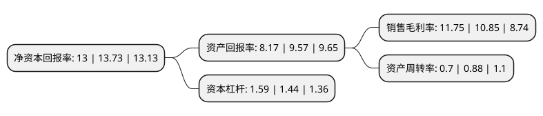

> 本页面由自动化程序生成于 2022年5月20日 01:13
> 内容可能存在错误，如有bug请提交issue至：https://github.com/Eroleice/doc-pi/issues
{.is-warning}

# 上市公司基本情况

## 基本资料

珠海润都制药股份有限公司（以下简称“润都股份”）成立于1999年12月30日，珠海市。于2018年01月05日在深交所中小板上市。

润都股份注册资本18,567.925万元，主营业务为化学药制剂，化学原料药，医药中间体的研发，生产和销售，产品应用范围涵盖消化性溃疡，高血压，手术局部麻醉，解热镇痛，抗感染类疾病，糖尿病等多个用药领域。主要产品雷贝拉唑钠肠溶胶囊，厄贝沙坦胶囊分别为治疗消化性溃疡，抗高血压的新一代药物。以下是详细信息：

- 公司名称: 珠海润都制药股份有限公司
- 股票代码: 002923.SZ
- 所在地: 广东 - 珠海市
- 成立日期: 1999年12月30日
- 注册资本: 18,567.925万元
- 法定代表人: 刘杰
- 主营业务: 主营业务为化学药制剂，化学原料药，医药中间体的研发，生产和销售，产品应用范围涵盖消化性溃疡，高血压，手术局部麻醉，解热镇痛，抗感染类疾病，糖尿病等多个用药领域主要产品雷贝拉唑钠肠溶胶囊，厄贝沙坦胶囊分别为治疗消化性溃疡，抗高血压的新一代药物
- 公司官网: www.rdpharma.cn
- 公司介绍: 公司是一家集药物研发、生产及销售为一体的现代化科技型医药企业，公司主营业务为化学药制剂、化学原料药、医药中间体的研发、生产和销售，产品应用范围涵盖消化性溃疡、高血压、手术麻醉、解热镇痛、抗感染类、糖尿病等多个领域。公司具有完善的质量管理体系，并严格按照国家GMP要求建立药品生产制造中心，现有产品生产线(涵盖原料药、片剂、胶囊剂、制剂中间体(微丸)等)均通过了国家新版GMP认证，部分特色原料药产品通过了世界卫生组织的GMP认证、欧盟CEP证书以及韩国、日本、俄罗斯、中国台湾等国家和地区的药品准入认证。公司是国家火炬计划重点高新技术企业、国家高新技术企业、国家博士后科研工作站、广东省省级企业技术中心、广东省创新型企业，具有强大的技术创新能力和坚实的科研基础。

## 股东及高管情况

上市公司第一大股东为陈新民，持股55,420,875股，占比29.85%，**疑似为**上市公司实际控制人。

截至2022年03月31日，上市公司的前十大股东中，共有6名自然人股东，1名机构股东，3个产品账户，其中5%以上大股东共有2名。上市公司前十大股东明细如下：

> 未能通过持股比例判定出上市公司实际控制人（持股30%以上）
> 可能存在通过间接持股、联合持股、协议控制等方式拥有实际控制权的主体，具体请参考上市公司定期公告！
{.is-warning}

> 截至2022年03月31日，上市公司前十大股东信息如下：

| 股东名称 | 持股数量（股） | 持股比例 |
| --- | --- | --- |
| 陈新民 | 55,420,875 | 29.85% |
| 李希 | 55,420,875 | 29.85% |
| 寇冰 | 3,646,193 | 1.96% |
| 卢其慧 | 2,950,950 | 1.59% |
| 周爱新 | 1,961,200 | 1.06% |
| 上海浦东发展银行股份有限公司-富国融泰三个月定期开放混合型发起式证券投资基金 | 1,888,814 | 1.02% |
| 兴业银行股份有限公司-广发稳鑫保本混合型证券投资基金 | 1,756,882 | 0.95% |
| 上海甄投资产管理有限公司-甄投稳定8号私募证券投资基金 | 1,655,440 | 0.89% |
| 珠海经济特区凯达集团有限公司 | 1,350,000 | 0.73% |
| 向阳 | 924,632 | 0.5% |

## 利润表分析

上市公司2021年总收入为11.89亿元，净利润为1.39亿元，实现盈利。

## 杜邦分析

> 数据列示周期：2021年 | 2020年 | 2019年
{.is-info}

上市公司的净资产收益率在近一年有所下降，下降幅度为-5.32%，其变化情况分解如下：
- 上市公司的销售毛利率在近一年上升了8.29%，可能是生产效率的提升、商品原材料价格下跌或商品价格的上涨所致。
- 上市公司的资产周转率在近一年下降了-20.45%，可能是源自于更慢的销售回款或库存管理效果下降。
- 上市公司的财务杠杆比率在近一年上升了10.42%，可能是增加负债扩大生产规模。

