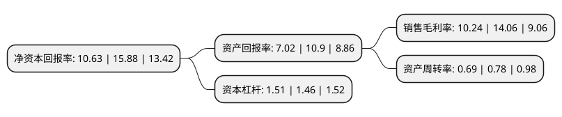

> 本页面由自动化程序生成于 2022年5月20日 01:13
> 内容可能存在错误，如有bug请提交issue至：https://github.com/Eroleice/doc-pi/issues
{.is-warning}

# 上市公司基本情况

## 基本资料

浙江昂利康制药股份有限公司（以下简称“昂利康”）成立于2001年12月30日，绍兴市。于2018年10月23日在深交所中小板上市。

昂利康注册资本9,594.682万元，主要产品:片剂(含头孢菌素类)，硬胶囊剂(含头孢菌素类)，颗粒剂(头孢菌素类)，原料药:谷维素，糠甾醇，多索茶碱，头孢拉定，托西酸舒他西林，盐酸班布特罗，维生素E烟酸酯，左氧氟沙星，头孢氨苄，头孢羟氨苄，碘海醇，头孢泊肟酯，替米沙坦，甘草酸二铵，氨甲环酸，苯磺酸左旋氨氯地，主营业务:公司主要从事化学原料药及制剂的研发，生产和销售以下是详细信息：

- 公司名称: 浙江昂利康制药股份有限公司
- 股票代码: 002940.SZ
- 所在地: 浙江 - 绍兴市
- 成立日期: 2001年12月30日
- 注册资本: 9,594.682万元
- 法定代表人: 方南平
- 主营业务: 主要产品:片剂(含头孢菌素类)，硬胶囊剂(含头孢菌素类)，颗粒剂(头孢菌素类)，原料药:谷维素，糠甾醇，多索茶碱，头孢拉定，托西酸舒他西林，盐酸班布特罗，维生素E烟酸酯，左氧氟沙星，头孢氨苄，头孢羟氨苄，碘海醇，头孢泊肟酯，替米沙坦，甘草酸二铵，氨甲环酸，苯磺酸左旋氨氯地，主营业务:公司主要从事化学原料药及制剂的研发，生产和销售
- 公司官网: www.alkpharm.com
- 公司介绍: 公司是一家致力于国人健康，以原料药和药物制剂为一体，以口服头孢类、心血管类和胃肠道类等药品为特色的现代化制药企业。公司拥有先进规划的药品生产基地，所有品种及生产车间均已通过新版GMP认证，同时通过了ISO14001认证、清洁生产认证和安全标准化认证等。公司特别重视企业品牌和产品品牌的培育和保护，是国内主要的口服头孢类原料药供应商，在同类竞争产品中已树立起了突出的品牌优势。公司积极响应国家“发展战略性新兴产业”的规划，依托各类创新平台，整合内外资源，积极开发新产品，改进传统工艺，实现产业升级，提升公司综合竞争力。

## 股东及高管情况

上市公司第一大股东为嵊州市君泰投资有限公司，持股34,000,000股，占比35.44%，为上市公司实际控制人。

截至2022年03月31日，上市公司的前十大股东中，共有8名自然人股东，1名机构股东，1个产品账户，其中5%以上大股东共有2名。上市公司前十大股东明细如下：

> 截至2022年03月31日，上市公司前十大股东信息如下：

| 股东名称 | 持股数量（股） | 持股比例 |
| --- | --- | --- |
| 嵊州市君泰投资有限公司 | 34,000,000 | 35.44% |
| 方南平 | 5,300,000 | 5.52% |
| 吕慧浩 | 3,450,000 | 3.6% |
| 叶树祥 | 1,384,500 | 1.44% |
| 杨国栋 | 1,379,999 | 1.44% |
| 张菊芬 | 778,000 | 0.81% |
| 朱玉华 | 775,770 | 0.81% |
| 吴伟华 | 520,000 | 0.54% |
| 上海宁泉资产管理有限公司-宁泉致远39号私募证券投资基金 | 420,715 | 0.44% |
| 吴守常 | 420,000 | 0.44% |

## 利润表分析

上市公司2021年总收入为13.8亿元，净利润为1.41亿元，实现盈利。

## 杜邦分析

> 数据列示周期：2021年 | 2020年 | 2019年
{.is-info}

上市公司的净资产收益率在近一年有所下降，下降幅度为-33.06%，其变化情况分解如下：
- 上市公司的销售毛利率在近一年下降了-27.17%，可能是生产效率的下降、商品原材料价格上涨或商品价格的下跌所致。
- 上市公司的资产周转率在近一年下降了-11.54%，可能是源自于更慢的销售回款或库存管理效果下降。
- 上市公司的财务杠杆比率在近一年上升了3.42%，可能是增加负债扩大生产规模。

