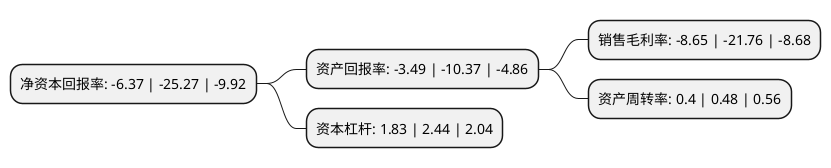

> 本页面由自动化程序生成于 2022年5月20日 01:14
> 内容可能存在错误，如有bug请提交issue至：https://github.com/Eroleice/doc-pi/issues
{.is-warning}

# 上市公司基本情况

## 基本资料

重庆莱美药业股份有限公司（以下简称“莱美药业”）成立于1999年09月06日，重庆市。于2009年10月30日在深交所创业板上市。

莱美药业注册资本105,591.121万元，抗感染药和特色专科用药(抗肿瘤药，肠外营养药等)以下是详细信息：

- 公司名称: 重庆莱美药业股份有限公司
- 股票代码: 300006.SZ
- 所在地: 重庆 - 重庆市
- 成立日期: 1999年09月06日
- 注册资本: 105,591.121万元
- 法定代表人: 梁建生
- 主营业务: 抗感染药和特色专科用药(抗肿瘤药，肠外营养药等)
- 公司官网: www.cqlummy.com
- 公司介绍: 公司是一家集科研、生产、销售于一体的高新技术医药企业。公司在2011年陆续被评为“国家生物产业基地龙头企业”、“国家火炬计划重点高新技术企业”。2012年陆续被评为“国家级创新型(试点)企业”、“中国医药研发产品线最佳工业企业”、“重庆市创新型企业”、“重庆市技术创新示范企业”、“重庆市知识产权试点单位”。企业信用评价AAA级信用企业。公司商标“莱美”被认定为“重庆知名商标”，多个品种被评为“重庆市高新技术产品”、“重庆市重点新产品”、“重庆市名牌产品”、“重庆市知名产品”，并多次被评为“重庆市诚信纳税先进企业”。公司研发实力雄厚，拥有“重庆公司药业技术中心”“公司——四川大学联合实验室”两个研发平台；拥有重庆市“市级企业技术中心”和与美国上市公司美国赛金药业共同组建的“重庆市药物质量控制工程技术研究中心”。公司是国内最早通过GMP、GSP认证的企业之一。公司在重庆茶园新区、长寿化工园区、湖南长沙浏阳、益阳和成都高新区均拥有生产基地。公司产品储备丰富，涵盖了大容量、小容量注射剂、粉针剂和冻干粉针剂在内的所有注射剂剂型，是国内注射剂剂型最全的医药生产企业之一。

## 股东及高管情况

上市公司第一大股东为广西梧州中恒集团股份有限公司，持股247,426,064股，占比23.43%，**疑似为**上市公司实际控制人。

截至2022年03月31日，上市公司的前十大股东中，共有6名自然人股东，1名机构股东，2个产品账户，1个海外主体，其中5%以上大股东共有2名。上市公司前十大股东明细如下：

> 未能通过持股比例判定出上市公司实际控制人（持股30%以上）
> 可能存在通过间接持股、联合持股、协议控制等方式拥有实际控制权的主体，具体请参考上市公司定期公告！
{.is-warning}

> 截至2022年03月31日，上市公司前十大股东信息如下：

| 股东名称 | 持股数量（股） | 持股比例 |
| --- | --- | --- |
| 广西梧州中恒集团股份有限公司 | 247,426,064 | 23.43% |
| 邱宇 | 140,080,000 | 13.27% |
| 同德乾元(北京)投资管理有限公司-南宁中恒同德医药产业投资基金合伙企业(有限合伙) | 21,447,778 | 2.03% |
| 广西国富创新股权投资基金管理有限公司-广西广投国宏健康产业基金合伙企业(有限合伙) | 11,111,111 | 1.05% |
| 唐洪梅 | 10,891,400 | 1.03% |
| 江文亮 | 10,172,939 | 0.96% |
| 香港中央结算有限公司(陆股通) | 9,258,645 | 0.88% |
| 陶仲华 | 9,115,470 | 0.86% |
| 张玉国 | 6,316,600 | 0.6% |
| 于范易 | 5,930,000 | 0.56% |

## 利润表分析

上市公司2021年总收入为12.25亿元，净利润为-1.06亿元，**未实现盈利**。

## 杜邦分析

> 数据列示周期：2021年 | 2020年 | 2019年
{.is-info}

上市公司的净资产收益率在近一年有所下降，下降幅度为-74.79%，其变化情况分解如下：
- 上市公司的销售毛利率在近一年下降了-60.25%，可能是生产效率的下降、商品原材料价格上涨或商品价格的下跌所致。
- 上市公司的资产周转率在近一年下降了-16.67%，可能是源自于更慢的销售回款或库存管理效果下降。
- 上市公司的财务杠杆比率在近一年下降了-25%，可能是减少负债降低财务费用。

