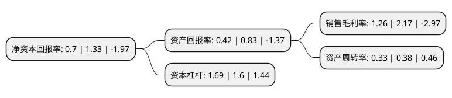

> 本页面由自动化程序生成于 2022年5月20日 01:14
> 内容可能存在错误，如有bug请提交issue至：https://github.com/Eroleice/doc-pi/issues
{.is-warning}

# 上市公司基本情况

## 基本资料

康芝药业股份有限公司（以下简称“康芝药业”）成立于1994年01月20日，海口市。于2010年05月26日在深交所创业板上市。

康芝药业注册资本45,000万元，公司主要从事儿童用药的研发，生产和销售。目前公司生产经营5种剂型11个儿童药品种，涵盖了我国当前儿童用药中销量最大的解热镇痛类，感冒类，抗生素类，呼吸系统类，消食定惊类和营养类等六大类的西药和中成药。除此以外，公司还拥有17个成人药品种。以下是详细信息：

- 公司名称: 康芝药业股份有限公司
- 股票代码: 300086.SZ
- 所在地: 海南 - 海口市
- 成立日期: 1994年01月20日
- 注册资本: 45,000万元
- 法定代表人: 洪江游
- 主营业务: 公司主要从事儿童用药的研发，生产和销售目前公司生产经营5种剂型11个儿童药品种，涵盖了我国当前儿童用药中销量最大的解热镇痛类，感冒类，抗生素类，呼吸系统类，消食定惊类和营养类等六大类的西药和中成药除此以外，公司还拥有17个成人药品种
- 公司官网: www.honz.com.cn
- 公司介绍: 公司是一家以儿童药为主业的上市公司。公司主要从事儿童药的研发、生产与销售业务，是国家火炬计划重点高新科技企业，并率先成立了以儿童药为主要研究方向的企业博士后科研工作站。公司秉承“诚善行药、福泽人类”的企业宗旨，奉行“做医药精品，做专业市场”的经营策略，积极践行“儿童大健康战略”和“精品战略”，致力于打造中国儿童大健康产业的领军品牌。公司深耕儿童用药市场多年，形成了完善的产品格局，拥有以“康芝”为主品牌的儿童药品集群，推出了以“瑞芝清”、“康芝松”、“康芝泰”、“金立爽”等为代表的独具康芝特色的明星产品，“康芝”品牌亦获评为“中国驰名商标”。公司在儿童用药领域迅速成长，先后获得“中国十大最具成长力医药企业”、“福布斯中国潜力企业”、“亚洲品牌500强”等殊荣。

## 股东及高管情况

上市公司第一大股东为海南宏氏投资有限公司，持股132,695,947股，占比29.49%，**疑似为**上市公司实际控制人。

截至2022年04月08日，上市公司的前十大股东中，共有7名自然人股东，2名机构股东，1个产品账户，其中5%以上大股东共有2名。上市公司前十大股东明细如下：

> 未能通过持股比例判定出上市公司实际控制人（持股30%以上）
> 可能存在通过间接持股、联合持股、协议控制等方式拥有实际控制权的主体，具体请参考上市公司定期公告！
{.is-warning}

> 截至2022年04月08日，上市公司前十大股东信息如下：

| 股东名称 | 持股数量（股） | 持股比例 |
| --- | --- | --- |
| 海南宏氏投资有限公司 | 132,695,947 | 29.49% |
| 广州高新区投资集团有限公司 | 22,550,000 | 5.0111% |
| 陈惠贞 | 8,148,683 | 1.81% |
| 洪江游 | 7,686,997 | 1.71% |
| 洪江涛 | 2,312,737 | 0.51% |
| 康芝药业股份有限公司-第一期员工持股计划 | 1,402,508 | 0.31% |
| 陈丽娟 | 1,379,800 | 0.25% |
| 王颖 | 1,379,800 | 0.31% |
| 陈丽娟 | 1,133,400 | 0.25% |
| 赖鸿就 | 1,083,000 | 0.24% |

## 利润表分析

上市公司2021年总收入为8.36亿元，净利润为0.1亿元，实现盈利。

## 杜邦分析

> 数据列示周期：2021年 | 2020年 | 2019年
{.is-info}

上市公司的净资产收益率在近一年有所下降，下降幅度为-47.37%，其变化情况分解如下：
- 上市公司的销售毛利率在近一年下降了-41.94%，可能是生产效率的下降、商品原材料价格上涨或商品价格的下跌所致。
- 上市公司的资产周转率在近一年下降了-13.16%，可能是源自于更慢的销售回款或库存管理效果下降。
- 上市公司的财务杠杆比率在近一年上升了5.62%，可能是增加负债扩大生产规模。

