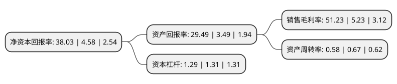

> 本页面由自动化程序生成于 2022年5月20日 01:15
> 内容可能存在错误，如有bug请提交issue至：https://github.com/Eroleice/doc-pi/issues
{.is-warning}

# 上市公司基本情况

## 基本资料

山西振东制药股份有限公司（以下简称“振东制药”）成立于1995年11月15日，长治市。于2011年01月07日在深交所创业板上市。

振东制药注册资本102,749.466万元，主营业务为中药制剂，化药制剂的研发，生产和销售。主要产品为岩舒注射液。以下是详细信息：

- 公司名称: 山西振东制药股份有限公司
- 股票代码: 300158.SZ
- 所在地: 山西 - 长治市
- 成立日期: 1995年11月15日
- 注册资本: 102,749.466万元
- 法定代表人: 李安平
- 主营业务: 主营业务为中药制剂，化药制剂的研发，生产和销售主要产品为岩舒注射液
- 公司官网: www.zdjt.com
- 公司介绍: 公司是山西省首家登陆创业板的上市企业，为高新技术企业。公司主要生产抗肿瘤、心脑血管、抗感染、消化系统、呼吸系统、维生素营养、解热镇痛、补益中成药等用药系列，中西药品、保健食品和家庭护理三大健康系列5百多个品规。现已形成种植、研发、生产、销售为一体的健康产业链。公司与美国国立肿瘤研究中心、澳大利亚阿德莱德大学、中国医学科学院、中国军事医学科学院、中国中医科学院、中国药科大学等国际国内多家科研院所合作，进行新产品的研制开发，并承担了多项国家重大专项科技项目。公司营销网络覆盖全国400余个城市，与全国数千家医疗单位建立了业务关系，形成了“多渠道，多模式”的销售体系，有完善的学术支持、售后服务与信息反馈渠道。

## 股东及高管情况

上市公司第一大股东为山西振东健康产业集团有限公司，持股353,604,926股，占比34.4143%，为上市公司实际控制人。

截至2022年03月31日，上市公司的前十大股东中，共有4名自然人股东，3名机构股东，3个产品账户，其中5%以上大股东共有2名。上市公司前十大股东明细如下：

> 截至2022年03月31日，上市公司前十大股东信息如下：

| 股东名称 | 持股数量（股） | 持股比例 |
| --- | --- | --- |
| 山西振东健康产业集团有限公司 | 353,604,926 | 34.4143% |
| 山西振东健康产业集团有限公司 | 353,604,926 | 34.4143% |
| 王恩环 | 29,466,499 | 2.87% |
| 中泰证券资管-山西振东制药股份有限公司第二期员工持股计划-中泰资管振东制药员工持股2号单一资产管理计划 | 20,167,608 | 1.96% |
| 上海通怡投资管理有限公司-通怡麒麟12号私募证券投资基金 | 17,594,000 | 1.71% |
| 顾为民 | 5,159,400 | 0.5% |
| 杨自芳 | 4,000,000 | 0.39% |
| 江苏锦珏投资管理有限公司-锦珏锦耀一号私募证券投资基金 | 3,779,233 | 0.37% |
| 日照钢铁有限公司 | 3,750,000 | 0.36% |
| 沈晗 | 3,745,100 | 0.36% |

## 利润表分析

上市公司2021年总收入为50.93亿元，净利润为26.09亿元，实现盈利。

## 杜邦分析

> 数据列示周期：2021年 | 2020年 | 2019年
{.is-info}

上市公司的净资产收益率在近一年有所上升，上升幅度为730.35%，其变化情况分解如下：
- 上市公司的销售毛利率在近一年上升了879.54%，可能是生产效率的提升、商品原材料价格下跌或商品价格的上涨所致。
- 上市公司的资产周转率在近一年下降了-13.43%，可能是源自于更慢的销售回款或库存管理效果下降。
- 上市公司的财务杠杆比率在近一年下降了-1.53%，可能是减少负债降低财务费用。

