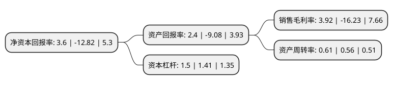

> 本页面由自动化程序生成于 2022年5月20日 01:16
> 内容可能存在错误，如有bug请提交issue至：https://github.com/Eroleice/doc-pi/issues
{.is-warning}

# 上市公司基本情况

## 基本资料

山东金城医药集团股份有限公司（以下简称“金城医药”）成立于2004年01月12日，淄博市。于2011年06月22日在深交所创业板上市。

金城医药注册资本38,741.099万元，主要产品是头孢类化学中间体(医药中间体，主要用于抗菌类药物的生产)及谷胱甘肽原料药(子公司山东金城生物药业有限公司产品)。以下是详细信息：

- 公司名称: 山东金城医药集团股份有限公司
- 股票代码: 300233.SZ
- 所在地: 山东 - 淄博市
- 成立日期: 2004年01月12日
- 注册资本: 38,741.099万元
- 法定代表人: 赵叶青
- 主营业务: 主要产品是头孢类化学中间体(医药中间体，主要用于抗菌类药物的生产)及谷胱甘肽原料药(子公司山东金城生物药业有限公司产品)
- 公司官网: www.jinchengpharm.com
- 公司介绍: 公司是国家高新技术企业、创业板上市企业。公司通过“实业+资本”双轮驱动发展模式，已构建形成独具金城特色的医药健康制药工业产业链，业务范围涉及生物制药、头孢类医药中间体、特色原料药、终端制剂、保健品、新材料、新兴高端医疗器械等产业领域主营业务主要分为医药化工、生物制药和药品制剂三大领域。主导产品有谷胱甘肽(花青肽美)、硝呋太尔胶囊(朗依君)、硝呋太尔制霉素阴道软胶囊(朗依)、匹多莫德分散片(唯田)、富马酸比索洛尔胶囊(美降之)、复方木香铝镁片(德瑞夫)、牡蛎碳酸钙咀嚼片(金娃宁)、注射用头孢唑林钠(安斯夫ANCEF)、AE-活性酯、呋喃铵盐等近百种。近年，公司先后获得“国家科技进步奖”、“中国制药工业百强”、“最受投资者尊重的上市公司100强”、“最佳创业板公司”、“最具创新力上市公司”、“中国医药行业成长50强”等荣誉。

## 股东及高管情况

上市公司第一大股东为淄博金城实业投资股份有限公司，持股78,552,154股，占比20.28%，**疑似为**上市公司实际控制人。

截至2022年03月31日，上市公司的前十大股东中，共有3名自然人股东，4名机构股东，3个产品账户，其中5%以上大股东共有1名。上市公司前十大股东明细如下：

> 未能通过持股比例判定出上市公司实际控制人（持股30%以上）
> 可能存在通过间接持股、联合持股、协议控制等方式拥有实际控制权的主体，具体请参考上市公司定期公告！
{.is-warning}

> 截至2022年03月31日，上市公司前十大股东信息如下：

| 股东名称 | 持股数量（股） | 持股比例 |
| --- | --- | --- |
| 淄博金城实业投资股份有限公司 | 78,552,154 | 20.28% |
| 全国社保基金一一五组合 | 11,000,000 | 2.84% |
| 赵鸿富 | 9,676,000 | 2.5% |
| 彭国华 | 9,300,000 | 2.4% |
| 中国工商银行-广发稳健增长证券投资基金 | 9,000,000 | 2.32% |
| 中国工商银行股份有限公司-广发稳健回报混合型证券投资基金 | 8,681,592 | 2.24% |
| 赵叶青 | 7,227,500 | 1.87% |
| 北京锦圣投资中心(有限合伙) | 6,352,558 | 1.64% |
| 青岛富和投资有限公司 | 6,209,000 | 1.6% |
| 东方证券股份有限公司 | 6,163,446 | 1.59% |

## 利润表分析

上市公司2021年总收入为31.38亿元，净利润为1.23亿元，实现盈利。

## 杜邦分析

> 数据列示周期：2021年 | 2020年 | 2019年
{.is-info}

上市公司的净资产收益率在近一年有所下降，下降幅度为-128.08%，其变化情况分解如下：
- 上市公司的销售毛利率在近一年下降了-124.15%，可能是生产效率的下降、商品原材料价格上涨或商品价格的下跌所致。
- 上市公司的资产周转率在近一年上升了8.93%，可能是源自于更快的销售回款或库存管理效果提升。
- 上市公司的财务杠杆比率在近一年上升了6.38%，可能是增加负债扩大生产规模。

