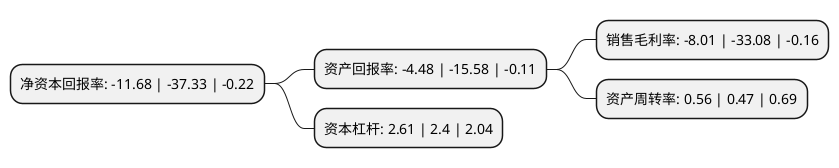

> 本页面由自动化程序生成于 2022年5月20日 01:16
> 内容可能存在错误，如有bug请提交issue至：https://github.com/Eroleice/doc-pi/issues
{.is-warning}

# 上市公司基本情况

## 基本资料

山西仟源医药集团股份有限公司（以下简称“仟源医药”）成立于2005年03月23日，大同市。于2011年08月19日在深交所创业板上市。

仟源医药注册资本22,797.092万元，主营业务为医药研发，生产和销售。主要产品有注射用美洛西林钠舒巴坦钠，注射用阿莫西林钠舒巴坦钠，阿莫西林克拉维酸钾片，注射用阿莫西林钠克拉维酸钾，注射用美洛西林钠，注射用阿洛西林钠，注射用氨曲南，注射用甲硝唑磷酸二钠，磷霉素氨丁三醇散，盐酸氟西汀胶囊，盐酸舍曲林片，盐酸氨溴索分散片，银杏叶分散片等，其中注射用阿莫西林钠舒巴坦钠，注射用甲硝唑磷酸二钠为国内首家上市新药品种，注射用氨曲南为国内首家获批仿制药品种。以下是详细信息：

- 公司名称: 山西仟源医药集团股份有限公司
- 股票代码: 300254.SZ
- 所在地: 山西 - 大同市
- 成立日期: 2005年03月23日
- 注册资本: 22,797.092万元
- 法定代表人: 黄乐群
- 主营业务: 主营业务为医药研发，生产和销售主要产品有注射用美洛西林钠舒巴坦钠，注射用阿莫西林钠舒巴坦钠，阿莫西林克拉维酸钾片，注射用阿莫西林钠克拉维酸钾，注射用美洛西林钠，注射用阿洛西林钠，注射用氨曲南，注射用甲硝唑磷酸二钠，磷霉素氨丁三醇散，盐酸氟西汀胶囊，盐酸舍曲林片，盐酸氨溴索分散片，银杏叶分散片等，其中注射用阿莫西林钠舒巴坦钠，注射用甲硝唑磷酸二钠为国内首家上市新药品种，注射用氨曲南为国内首家获批仿制药品种
- 公司官网: www.cy-pharm.com
- 公司介绍: 公司是以研发、生产和销售抗感染药为主的科技型医药企业，为山西省科学技术厅、山西省财政厅、山西省国家税务局、山西省地方税务局联合认定的高新技术企业。公司以提供解决细菌耐药问题的抗感染综合产品和方案为战略核心，目前在新一代青霉素领域具备较强竞争力。主要产品有注射用美洛西林钠舒巴坦钠、注射用阿莫西林钠舒巴坦钠、阿莫西林克拉维酸钾片、注射用阿莫西林钠克拉维酸钾、注射用美洛西林钠、注射用阿洛西林钠、注射用氨曲南、注射用甲硝唑磷酸二钠、磷霉素氨丁三醇散、盐酸氟西汀胶囊、盐酸舍曲林片、盐酸氨溴索分散片、银杏叶分散片等，其中注射用阿莫西林钠舒巴坦钠、注射用甲硝唑磷酸二钠为国内首家上市新药品种，注射用氨曲南为国内首家获批仿制药品种。

## 股东及高管情况

上市公司第一大股东为翁占国，持股15,772,409股，占比6.53%，**疑似为**上市公司实际控制人。

截至2022年05月10日，上市公司的前十大股东中，共有9名自然人股东，1个产品账户，其中5%以上大股东共有3名。上市公司前十大股东明细如下：

> 未能通过持股比例判定出上市公司实际控制人（持股30%以上）
> 可能存在通过间接持股、联合持股、协议控制等方式拥有实际控制权的主体，具体请参考上市公司定期公告！
{.is-warning}

> 上市公司第一大股东持股不超过10%，请检查是否存在公司控制权风险！
{.is-danger}

> 截至2022年05月10日，上市公司前十大股东信息如下：

| 股东名称 | 持股数量（股） | 持股比例 |
| --- | --- | --- |
| 翁占国 | 15,772,409 | 6.53% |
| 赵群 | 13,401,892 | 5.55% |
| 赵群 | 13,401,892 | 5.88% |
| 上海通怡投资管理有限公司-通怡金牛5号私募证券投资基金 | 10,000,000 | 4.39% |
| 黄圣强 | 9,397,827 | 4.12% |
| 崔为超 | 7,611,621 | 3.34% |
| 陆其康 | 5,436,300 | 2.38% |
| 黄乐群 | 5,165,060 | 2.27% |
| 宣航 | 3,137,116 | 1.38% |
| 徐昊 | 2,930,100 | 1.29% |

## 利润表分析

上市公司2021年总收入为9.3亿元，净利润为-0.75亿元，**未实现盈利**。

## 杜邦分析

> 数据列示周期：2021年 | 2020年 | 2019年
{.is-info}

上市公司的净资产收益率在近一年有所下降，下降幅度为-68.71%，其变化情况分解如下：
- 上市公司的销售毛利率在近一年下降了-75.79%，可能是生产效率的下降、商品原材料价格上涨或商品价格的下跌所致。
- 上市公司的资产周转率在近一年上升了19.15%，可能是源自于更快的销售回款或库存管理效果提升。
- 上市公司的财务杠杆比率在近一年上升了8.75%，可能是增加负债扩大生产规模。

