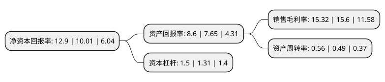

> 本页面由自动化程序生成于 2022年5月20日 01:17
> 内容可能存在错误，如有bug请提交issue至：https://github.com/Eroleice/doc-pi/issues
{.is-warning}

# 上市公司基本情况

## 基本资料

重庆博腾制药科技股份有限公司（以下简称“博腾股份”）成立于2005年07月07日，重庆市。于2014年01月29日在深交所创业板上市。

博腾股份注册资本54,416.532万元，主营业务:医药定制研发生产服务，主要产品是创新药医药中间体。以下是详细信息：

- 公司名称: 重庆博腾制药科技股份有限公司
- 股票代码: 300363.SZ
- 所在地: 重庆 - 重庆市
- 成立日期: 2005年07月07日
- 注册资本: 54,416.532万元
- 法定代表人: 居年丰
- 主营业务: 主营业务:医药定制研发生产服务，主要产品是创新药医药中间体
- 公司官网: www.porton.cn
- 公司介绍: 公司是一家按照国际标准为跨国制药公司和生物技术公司提供医药定制研发生产服务的国家级高新技术企业。公司已形成国内东西部以及海外的“3+3+1”生产、研发、技术基地协同布局，即以重庆为核心，以浙江上虞、江西宜春为驱动的三个生产基地；以重庆、成都和上海相辅相成的三大研发中心；以美国新泽西州为价值延伸的海外技术中心。公司的主要服务内容包括为创新药提供医药中间体的工艺研究开发、质量研究和安全性研究，以及为创新药提供医药中间体的定制生产服务，包括研发阶段的小规模生产服务到商业化阶段的大规模生产服务。公司主要服务于临床试验至专利药销售阶段的创新药，服务的药品治疗领域包括抗艾滋病、抗丙肝、降血脂、镇痛、抗糖尿病等。公司致力于成为世界创新药公司优选的一站式医药定制研发生产合作伙伴，助力世界新药发展。

## 股东及高管情况

上市公司第一大股东为重庆两江新区产业发展集团有限公司，持股78,982,719股，占比14.51%，**疑似为**上市公司实际控制人。

截至2022年03月31日，上市公司的前十大股东中，共有3名自然人股东，2名机构股东，5个产品账户，其中5%以上大股东共有4名。上市公司前十大股东明细如下：

> 未能通过持股比例判定出上市公司实际控制人（持股30%以上）
> 可能存在通过间接持股、联合持股、协议控制等方式拥有实际控制权的主体，具体请参考上市公司定期公告！
{.is-warning}

> 截至2022年03月31日，上市公司前十大股东信息如下：

| 股东名称 | 持股数量（股） | 持股比例 |
| --- | --- | --- |
| 重庆两江新区产业发展集团有限公司 | 78,982,719 | 14.51% |
| 居年丰 | 58,890,521 | 10.82% |
| 陶荣 | 44,195,030 | 8.12% |
| 张和兵 | 41,903,020 | 7.7% |
| 中国工商银行股份有限公司-中欧医疗健康混合型证券投资基金 | 26,660,397 | 4.9% |
| 张家港卓远投资合伙企业(有限合伙) | 22,687,600 | 4.17% |
| 中国建设银行股份有限公司-工银瑞信前沿医疗股票型证券投资基金 | 14,000,061 | 2.57% |
| 中国银行股份有限公司-广发医疗保健股票型证券投资基金 | 12,092,341 | 2.22% |
| 华泰瑞联基金管理有限公司-南京华泰瑞联并购基金二号(有限合伙) | 10,070,893 | 1.85% |
| 中国工商银行股份有限公司-中欧医疗创新股票型证券投资基金 | 7,703,939 | 1.42% |

## 利润表分析

上市公司2021年总收入为31.05亿元，净利润为4.75亿元，实现盈利。

## 杜邦分析

> 数据列示周期：2021年 | 2020年 | 2019年
{.is-info}

上市公司的净资产收益率在近一年有所上升，上升幅度为28.87%，其变化情况分解如下：
- 上市公司的销售毛利率在近一年下降了-1.79%，可能是生产效率的下降、商品原材料价格上涨或商品价格的下跌所致。
- 上市公司的资产周转率在近一年上升了14.29%，可能是源自于更快的销售回款或库存管理效果提升。
- 上市公司的财务杠杆比率在近一年上升了14.5%，可能是增加负债扩大生产规模。

