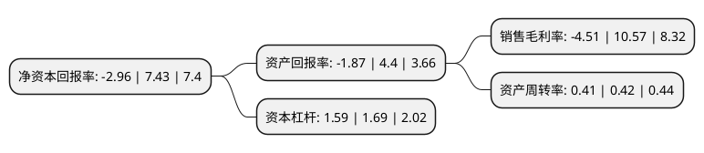

> 本页面由自动化程序生成于 2022年5月20日 01:17
> 内容可能存在错误，如有bug请提交issue至：https://github.com/Eroleice/doc-pi/issues
{.is-warning}

# 上市公司基本情况

## 基本资料

广东溢多利生物科技股份有限公司（以下简称“溢多利”）成立于1991年09月03日，珠海市。于2014年01月28日在深交所创业板上市。

溢多利注册资本49,006.816万元，从事饲用酶制剂的研发，生产和销售，主要产品为饲用酶制剂，包括:饲用复合酶，饲用植酸酶和饲用木聚糖酶等，另外还有少量其他饲料添加剂和兽药中药等产品。以下是详细信息：

- 公司名称: 广东溢多利生物科技股份有限公司
- 股票代码: 300381.SZ
- 所在地: 广东 - 珠海市
- 成立日期: 1991年09月03日
- 注册资本: 49,006.816万元
- 法定代表人: 陈少美
- 主营业务: 从事饲用酶制剂的研发，生产和销售，主要产品为饲用酶制剂，包括:饲用复合酶，饲用植酸酶和饲用木聚糖酶等，另外还有少量其他饲料添加剂和兽药中药等产品
- 公司官网: www.yiduoli.com
- 公司介绍: 公司是应用现代生物技术，立足生物产业，致力特色生物药品、新型生物酶制剂、无抗植物提取物、功能性饲料添加剂的创新型高科技企业。公司拥有基因工程技术、酶工程技术、生物工程技术、液体发酵技术、固体发酵技术、复合酶协同技术、制剂剂型技术、高分子絮凝技术、酶制剂产品应用技术以及甾体激素合成等诸多创新型核心技术，为公司高速成长及持续发展奠定扎实基础。公司是中国生物酶制剂行业首家上市公司(股票代码300381)、首批高新技术企业、全球极具竞争力的甾体激素医药企业。

## 股东及高管情况

上市公司第一大股东为珠海市金大地投资有限公司，持股151,767,378股，占比30.97%，为上市公司实际控制人。

截至2022年05月17日，上市公司的前十大股东中，共有8名自然人股东，1名机构股东，1个海外主体，其中5%以上大股东共有1名。上市公司前十大股东明细如下：

> 截至2022年05月17日，上市公司前十大股东信息如下：

| 股东名称 | 持股数量（股） | 持股比例 |
| --- | --- | --- |
| 珠海市金大地投资有限公司 | 151,767,378 | 30.97% |
| JPMORGAN CHASE BANK, NATIONAL ASSOCIATION | 11,874,473 | 2.42% |
| 刘喜荣 | 9,708,800 | 1.98% |
| 蔡小如 | 8,278,545 | 1.69% |
| 陈少武 | 7,503,500 | 1.53% |
| 邓波卿 | 7,277,600 | 1.49% |
| 李军民 | 6,710,533 | 1.37% |
| 李惠明 | 6,058,800 | 1.24% |
| 林蔚江 | 5,112,100 | 1.04% |
| 王世忱 | 4,839,500 | 0.99% |

## 利润表分析

上市公司2021年总收入为18.92亿元，净利润为-0.86亿元，**未实现盈利**。

## 杜邦分析

> 数据列示周期：2021年 | 2020年 | 2019年
{.is-info}

上市公司的净资产收益率在近一年有所下降，下降幅度为-139.84%，其变化情况分解如下：
- 上市公司的销售毛利率在近一年下降了-142.67%，可能是生产效率的下降、商品原材料价格上涨或商品价格的下跌所致。
- 上市公司的资产周转率在近一年下降了-2.38%，可能是源自于更慢的销售回款或库存管理效果下降。
- 上市公司的财务杠杆比率在近一年下降了-5.92%，可能是减少负债降低财务费用。

