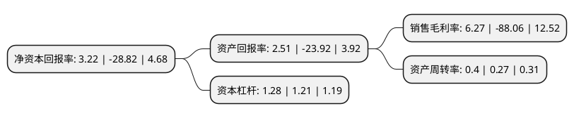

> 本页面由自动化程序生成于 2022年5月20日 01:17
> 内容可能存在错误，如有bug请提交issue至：https://github.com/Eroleice/doc-pi/issues
{.is-warning}

# 上市公司基本情况

## 基本资料

四川金石亚洲医药股份有限公司（以下简称“金石亚药”）成立于2004年07月15日，成都市。于2015年04月24日在深交所创业板上市。

金石亚药注册资本40,174.387万元，主营业务为钢增强塑料复合管道技术的研发和应用，为客户提供钢增强塑料复合管全套生产工艺，技术解决方案及成套生产设备(生产线)。主要产品为钢增强塑料复合管生产线，现有两大类别:缠绕钢丝增强管生产线和钢带增强塑料管生产线。以下是详细信息：

- 公司名称: 四川金石亚洲医药股份有限公司
- 股票代码: 300434.SZ
- 所在地: 四川 - 成都市
- 成立日期: 2004年07月15日
- 注册资本: 40,174.387万元
- 法定代表人: 魏宝康
- 主营业务: 主营业务为钢增强塑料复合管道技术的研发和应用，为客户提供钢增强塑料复合管全套生产工艺，技术解决方案及成套生产设备(生产线)主要产品为钢增强塑料复合管生产线，现有两大类别:缠绕钢丝增强管生产线和钢带增强塑料管生产线
- 公司官网: www.goldstone-group.com
- 公司介绍: 公司致力于钢增强塑料复合管道、真空镀膜技术的研发和应用，为客户提供钢增强塑料复合管、真空镀膜全套生产工艺、技术解决方案及成套生产设备。公司集方案设计、产品制造、生产销售、安装调试、售后服务五位为一体。目前是中国高新技术企业、四川省企业技术中心、中国塑料加工工业协会塑料管道专委会理事单位、《特种结构》理事单位。荣获建设部科技促进中心和中国化学建材协调组-塑料管道专家组共同颁发的“突出贡献”奖。2017年，公司收购亚洲制药，公司开始涉及医药健康行业，形成专用设备制造与医药制造共同发展的业务模式。“快克”系列感冒药已经成为国内家喻户晓的品牌，在感冒药领域具备较高知名度，产品及品牌竞争优势显著，连续多届在西普会上获“健康中国·品牌榜”，并获得“中国驰名商标”的荣誉。

## 股东及高管情况

上市公司第一大股东为高雅萍，持股100,878,929股，占比25.11%，**疑似为**上市公司实际控制人。

截至2022年03月31日，上市公司的前十大股东中，共有6名自然人股东，2名机构股东，2个产品账户，其中5%以上大股东共有2名。上市公司前十大股东明细如下：

> 未能通过持股比例判定出上市公司实际控制人（持股30%以上）
> 可能存在通过间接持股、联合持股、协议控制等方式拥有实际控制权的主体，具体请参考上市公司定期公告！
{.is-warning}

> 截至2022年03月31日，上市公司前十大股东信息如下：

| 股东名称 | 持股数量（股） | 持股比例 |
| --- | --- | --- |
| 高雅萍 | 100,878,929 | 25.11% |
| 蒯一希 | 54,580,180 | 13.59% |
| 王玉连 | 19,047,500 | 4.74% |
| 楼金 | 14,638,327 | 3.64% |
| 浙江迪耳投资有限公司 | 14,564,367 | 3.63% |
| 上海通怡投资管理有限公司-通怡梧桐19号私募证券投资基金 | 8,212,620 | 2.04% |
| 海南亚东南工贸有限公司 | 8,155,544 | 2.03% |
| 浙江天堂硅谷资产管理集团有限公司-天堂硅谷-金石定增资产管理计划 | 7,084,213 | 1.76% |
| 傅海鹰 | 6,597,760 | 1.64% |
| 陈绍江 | 6,267,000 | 1.56% |

## 利润表分析

上市公司2021年总收入为10.53亿元，净利润为0.66亿元，实现盈利。

## 杜邦分析

> 数据列示周期：2021年 | 2020年 | 2019年
{.is-info}

上市公司的净资产收益率在近一年有所下降，下降幅度为-111.17%，其变化情况分解如下：
- 上市公司的销售毛利率在近一年下降了-107.12%，可能是生产效率的下降、商品原材料价格上涨或商品价格的下跌所致。
- 上市公司的资产周转率在近一年上升了48.15%，可能是源自于更快的销售回款或库存管理效果提升。
- 上市公司的财务杠杆比率在近一年上升了5.79%，可能是增加负债扩大生产规模。

