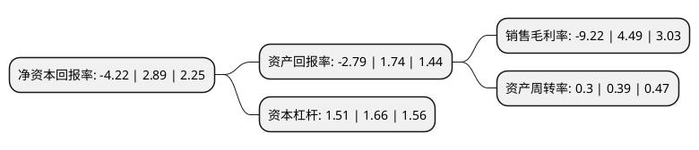

> 本页面由自动化程序生成于 2022年5月20日 01:17
> 内容可能存在错误，如有bug请提交issue至：https://github.com/Eroleice/doc-pi/issues
{.is-warning}

# 上市公司基本情况

## 基本资料

福建广生堂药业股份有限公司（以下简称“广生堂”）成立于2001年06月28日，宁德市。于2015年04月22日在深交所创业板上市。

广生堂注册资本15,925.9万元，本公司是一家专业从事核苷类抗乙肝病毒药物研发，生产与销售的高科技企业，主要产品包括阿甘定-阿德福韦酯，贺甘定-拉米夫定，恩甘定-恩替卡韦等核苷类抗乙肝病毒药物。以下是详细信息：

- 公司名称: 福建广生堂药业股份有限公司
- 股票代码: 300436.SZ
- 所在地: 福建 - 宁德市
- 成立日期: 2001年06月28日
- 注册资本: 15,925.9万元
- 法定代表人: 李国平
- 主营业务: 本公司是一家专业从事核苷类抗乙肝病毒药物研发，生产与销售的高科技企业，主要产品包括阿甘定-阿德福韦酯，贺甘定-拉米夫定，恩甘定-恩替卡韦等核苷类抗乙肝病毒药物
- 公司官网: www.cosunter.com
- 公司介绍: 公司主要从事核苷类抗乙肝病毒药物的研发、生产与销售，主要产品包括阿甘定-阿德福韦酯、贺甘定-拉米夫定、恩甘定-恩替卡韦等核苷类抗乙肝病毒药物。公司拥有完整的核苷类抗乙肝病毒药物产品线，公司已经获准上市的核苷(酸)类抗乙肝病毒药物产品包括福甘定、恩甘定、贺甘定和阿甘定，是目前国内唯一拥有四大核苷(酸)类抗乙肝病毒药物原料药及制剂注册批件的医药企业，且富马酸替诺福韦二吡呋酯和恩替卡韦为乙肝防治指南推荐的抗乙肝病毒治疗的一线用药，并被纳入2017年版《国家基本医疗保险、工伤保险和生育保险药品目录》。

## 股东及高管情况

上市公司第一大股东为福建奥华集团有限公司，持股22,368,651股，占比14.05%，**疑似为**上市公司实际控制人。

截至2022年03月31日，上市公司的前十大股东中，共有6名自然人股东，2名机构股东，2个海外主体，其中5%以上大股东共有4名。上市公司前十大股东明细如下：

> 未能通过持股比例判定出上市公司实际控制人（持股30%以上）
> 可能存在通过间接持股、联合持股、协议控制等方式拥有实际控制权的主体，具体请参考上市公司定期公告！
{.is-warning}

> 截至2022年03月31日，上市公司前十大股东信息如下：

| 股东名称 | 持股数量（股） | 持股比例 |
| --- | --- | --- |
| 福建奥华集团有限公司 | 22,368,651 | 14.05% |
| 叶理青 | 13,536,700 | 8.5% |
| 李国平 | 10,560,866 | 6.63% |
| 福建平潭奥泰科技投资中心(有限合伙) | 8,025,000 | 5.04% |
| 李国栋 | 7,500,000 | 4.71% |
| 奥华集团-华福证券-19奥华E1担保及信托财产专户 | 7,200,000 | 4.52% |
| 奥华集团-华福证券-19奥华E2担保及信托财产专户 | 5,500,000 | 3.45% |
| 范秋华 | 1,910,646 | 1.2% |
| 蔡云霞 | 1,866,827 | 1.17% |
| 黄彩艳 | 1,702,000 | 1.07% |

## 利润表分析

上市公司2021年总收入为3.7亿元，净利润为-0.35亿元，**未实现盈利**。

## 杜邦分析

> 数据列示周期：2021年 | 2020年 | 2019年
{.is-info}

上市公司的净资产收益率在近一年有所下降，下降幅度为-246.02%，其变化情况分解如下：
- 上市公司的销售毛利率在近一年下降了-305.35%，可能是生产效率的下降、商品原材料价格上涨或商品价格的下跌所致。
- 上市公司的资产周转率在近一年下降了-23.08%，可能是源自于更慢的销售回款或库存管理效果下降。
- 上市公司的财务杠杆比率在近一年下降了-9.04%，可能是减少负债降低财务费用。

