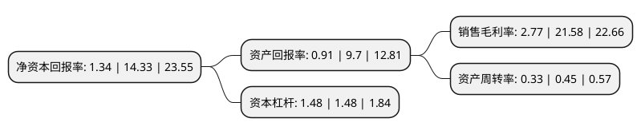

> 本页面由自动化程序生成于 2022年5月20日 01:18
> 内容可能存在错误，如有bug请提交issue至：https://github.com/Eroleice/doc-pi/issues
{.is-warning}

# 上市公司基本情况

## 基本资料

江西富祥药业股份有限公司（以下简称“富祥药业”）成立于2002年03月20日，景德镇市。于2015年12月22日在深交所创业板上市。

富祥药业注册资本55,000.483万元，主要产品:舒巴坦系列酶抑制剂原料药，中间体及相关产品，他唑巴坦系列酶抑制剂原料药，中间体及相关产品，碳青霉烯类原料药的中间体。主营业务:从事原料药，医药中间体及相关产品研发，生产与销售。以下是详细信息：

- 公司名称: 江西富祥药业股份有限公司
- 股票代码: 300497.SZ
- 所在地: 江西 - 景德镇市
- 成立日期: 2002年03月20日
- 注册资本: 55,000.483万元
- 法定代表人: 包建华
- 主营业务: 主要产品:舒巴坦系列酶抑制剂原料药，中间体及相关产品，他唑巴坦系列酶抑制剂原料药，中间体及相关产品，碳青霉烯类原料药的中间体主营业务:从事原料药，医药中间体及相关产品研发，生产与销售
- 公司官网: www.fushine.cn
- 公司介绍: 公司是一家专业从事化学药物研发、生产、销售和服务的创新型制药企业，是国家高新技术企业、江西省优秀企业、江西省优秀非公有制企业、江西省创新型试点企业，并设有“省级企业技术中心”。公司拥有核心技术和较强的研发创新能力，拥有多项国家发明专利以及十多个省级重点新产品、优秀科技新产品，部分产品已纳入江西省科技创新“六个一”工程和江西省十大战略性新兴产业“生物和新医药”研发引导计划，是江西省化学合成药发展规划中的龙头骨干企业。公司长期注重EHS(环保/职业健康/安全)管理体系的建设，在与全球知名制药集团以及国内大型制药企业的合作过程中，不断提升、完善。公司是江西省第一家通过清洁生产验收的企业，也是一家安全生产标准化二级达标企业，并多次获“环境保护先进单位”、“安全生产工作先进单位”荣誉称号。公司拥有较强的市场开拓能力，是目前全球最大的内酰胺酶抑制剂原料药生产基地，也是碳青霉烯类药物及其中间体的主要供应商之一。公司在国内外客户中享有良好的声誉及合作，产品销往全球十多个国家和地区。

## 股东及高管情况

上市公司第一大股东为包建华，持股114,815,808股，占比20.88%，**疑似为**上市公司实际控制人。

截至2022年03月31日，上市公司的前十大股东中，共有4名自然人股东，2名机构股东，4个产品账户，其中5%以上大股东共有1名。上市公司前十大股东明细如下：

> 未能通过持股比例判定出上市公司实际控制人（持股30%以上）
> 可能存在通过间接持股、联合持股、协议控制等方式拥有实际控制权的主体，具体请参考上市公司定期公告！
{.is-warning}

> 截至2022年03月31日，上市公司前十大股东信息如下：

| 股东名称 | 持股数量（股） | 持股比例 |
| --- | --- | --- |
| 包建华 | 114,815,808 | 20.88% |
| 王远淞 | 17,730,620 | 3.22% |
| 喻文军 | 17,621,846 | 3.2% |
| 景德镇市富祥投资有限公司 | 7,555,200 | 1.37% |
| 景德镇金融控股有限责任公司 | 6,683,652 | 1.22% |
| 江西富祥药业股份有限公司-第一期员工持股计划 | 5,798,844 | 1.05% |
| 柯丹 | 3,523,000 | 0.64% |
| 中国工商银行-华安安信消费服务股票型证券投资基金 | 3,251,500 | 0.59% |
| 中国银行股份有限公司-招商安华债券型证券投资基金 | 3,182,987 | 0.58% |
| 中国建设银行股份有限公司-广发科技创新混合型证券投资基金 | 3,176,900 | 0.58% |

## 利润表分析

上市公司2021年总收入为14.29亿元，净利润为0.39亿元，实现盈利。

## 杜邦分析

> 数据列示周期：2021年 | 2020年 | 2019年
{.is-info}

上市公司的净资产收益率在近一年有所下降，下降幅度为-90.65%，其变化情况分解如下：
- 上市公司的销售毛利率在近一年下降了-87.16%，可能是生产效率的下降、商品原材料价格上涨或商品价格的下跌所致。
- 上市公司的资产周转率在近一年下降了-26.67%，可能是源自于更慢的销售回款或库存管理效果下降。
- 上市公司的财务杠杆比率在近一年下降了0%，可能是减少负债降低财务费用。

