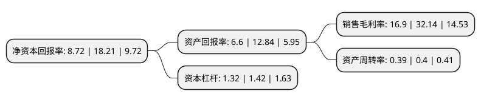

> 本页面由自动化程序生成于 2022年5月20日 01:18
> 内容可能存在错误，如有bug请提交issue至：https://github.com/Eroleice/doc-pi/issues
{.is-warning}

# 上市公司基本情况

## 基本资料

贝达药业股份有限公司（以下简称“贝达药业”）成立于2003年01月07日，杭州市。于2016年11月07日在深交所创业板上市。

贝达药业注册资本41,538.867万元，主要产品:埃克替尼。主营业务:研究和开发自主知识产权创新药物，医药研发，生产，营销。以下是详细信息：

- 公司名称: 贝达药业股份有限公司
- 股票代码: 300558.SZ
- 所在地: 浙江 - 杭州市
- 成立日期: 2003年01月07日
- 注册资本: 41,538.867万元
- 法定代表人: 丁列明
- 主营业务: 主要产品:埃克替尼主营业务:研究和开发自主知识产权创新药物，医药研发，生产，营销
- 公司官网: www.bettapharma.com
- 公司介绍: 公司是一家由海归博士创办的，以自主知识产权创新药物研究与开发为核心，集医药研发、生产、营销于一体的国家级高新技术企业。公司坚持新药研发，以“Better Medicine,Better Life”为使命，以“为中国百姓创制更多用得起的好药”为宗旨，矢志成为总部在中国的跨国制药企业。公司以“市场需求为导向、科学创新为根本，聚焦肿瘤领域，涵盖大分子，战略高度合理布局，高效执行把握先机”为指导理念，围绕小分子靶向药、免疫疗法和联合治疗三个方向开展研究。公司多次获国家“重大新药创制”科技重大专项，并列入国家科技部“国家高新技术研究发展计划(863计划)”、“国家火炬计划”、“国家战略性创新产品”。

## 股东及高管情况

上市公司第一大股东为宁波凯铭投资管理合伙企业(有限合伙)，持股80,064,000股，占比19.27%，**疑似为**上市公司实际控制人。

截至2022年03月31日，上市公司的前十大股东中，共有4名机构股东，1个产品账户，5个海外主体，其中5%以上大股东共有3名。上市公司前十大股东明细如下：

> 未能通过持股比例判定出上市公司实际控制人（持股30%以上）
> 可能存在通过间接持股、联合持股、协议控制等方式拥有实际控制权的主体，具体请参考上市公司定期公告！
{.is-warning}

> 截至2022年03月31日，上市公司前十大股东信息如下：

| 股东名称 | 持股数量（股） | 持股比例 |
| --- | --- | --- |
| 宁波凯铭投资管理合伙企业(有限合伙) | 80,064,000 | 19.27% |
| 浙江济和创业投资有限公司 | 54,324,000 | 13.08% |
| 温州特瑞西创企业管理合伙企业(有限合伙) | 28,797,061 | 6.93% |
| WANG YINXIANG | 15,494,564 | 3.73% |
| 浙江贝成投资管理合伙企业(有限合伙) | 14,713,531 | 3.54% |
| LAV Equity (Hong Kong) Co., Limited | 10,800,000 | 2.6% |
| 香港中央结算有限公司(陆股通) | 10,775,096 | 2.59% |
| 全国社保基金一零二组合 | 5,822,775 | 1.4% |
| ZHANG HANCHENG | 4,554,007 | 1.1% |
| BETA PHARMA, INC. | 4,550,015 | 1.1% |

## 利润表分析

上市公司2021年总收入为22.45亿元，净利润为3.79亿元，实现盈利。

## 杜邦分析

> 数据列示周期：2021年 | 2020年 | 2019年
{.is-info}

上市公司的净资产收益率在近一年有所下降，下降幅度为-52.11%，其变化情况分解如下：
- 上市公司的销售毛利率在近一年下降了-47.42%，可能是生产效率的下降、商品原材料价格上涨或商品价格的下跌所致。
- 上市公司的资产周转率在近一年下降了-2.5%，可能是源自于更慢的销售回款或库存管理效果下降。
- 上市公司的财务杠杆比率在近一年下降了-7.04%，可能是减少负债降低财务费用。

