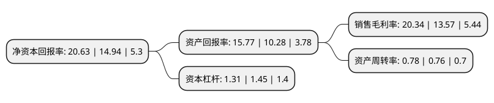

> 本页面由自动化程序生成于 2022年5月20日 01:18
> 内容可能存在错误，如有bug请提交issue至：https://github.com/Eroleice/doc-pi/issues
{.is-warning}

# 上市公司基本情况

## 基本资料

沈阳兴齐眼药股份有限公司（以下简称“兴齐眼药”）成立于1977年03月24日，沈阳市。于2016年12月08日在深交所创业板上市。

兴齐眼药注册资本8,809.588万元，公司专注于眼科药物领域，是一家主要从事眼科药物研发，生产，销售的专业企业，主要产品是眼科处方药物。以下是详细信息：

- 公司名称: 沈阳兴齐眼药股份有限公司
- 股票代码: 300573.SZ
- 所在地: 辽宁 - 沈阳市
- 成立日期: 1977年03月24日
- 注册资本: 8,809.588万元
- 法定代表人: 刘继东
- 主营业务: 公司专注于眼科药物领域，是一家主要从事眼科药物研发，生产，销售的专业企业，主要产品是眼科处方药物
- 公司官网: www.sinqi.com
- 公司介绍: 公司是专业从事眼科药物研发、生产及销售的国家级火炬高新技术企业。公司成立多年来，秉承“经营健康、缔造光明”的企业理念，以“专心、专注、专业”的工作精神投入到人类眼健康产业。目前，公司拥有抗菌药、抗炎药、人工泪液、角膜修复药、抗疲劳药、散瞳药、手术用药、干眼治疗药等八大系列十五个重点产品，为眼科疾病治疗领域提供了高品质的产品。依托于省级企业技术中心和省级眼科药物工程技术研究中心，兴齐眼药建成了常规眼用制剂、即型凝胶、缓释制剂、药理与药代动力学等专业的眼科药物研究平台，具备综合的眼科药物研发创新能力。

## 股东及高管情况

上市公司第一大股东为刘继东，持股25,175,500股，占比28.58%，**疑似为**上市公司实际控制人。

截至2022年03月31日，上市公司的前十大股东中，共有2名自然人股东，1名机构股东，6个产品账户，1个海外主体，其中5%以上大股东共有1名。上市公司前十大股东明细如下：

> 未能通过持股比例判定出上市公司实际控制人（持股30%以上）
> 可能存在通过间接持股、联合持股、协议控制等方式拥有实际控制权的主体，具体请参考上市公司定期公告！
{.is-warning}

> 截至2022年03月31日，上市公司前十大股东信息如下：

| 股东名称 | 持股数量（股） | 持股比例 |
| --- | --- | --- |
| 刘继东 | 25,175,500 | 28.58% |
| 中国工商银行股份有限公司-富国天惠精选成长混合型证券投资基金(LOF) | 3,000,000 | 3.41% |
| 中国工商银行股份有限公司-广发多因子灵活配置混合型证券投资基金 | 2,803,691 | 3.18% |
| 基本养老保险基金一六零二一组合 | 2,104,539 | 2.39% |
| 香港中央结算有限公司(陆股通) | 1,673,770 | 1.9% |
| 中信证券-中信银行-中信证券卓越成长两年持有期混合型集合资产管理计划 | 1,605,439 | 1.82% |
| 中国建设银行股份有限公司-富国低碳新经济混合型证券投资基金 | 1,565,472 | 1.78% |
| 高峨 | 1,063,000 | 1.21% |
| 中信里昂资产管理有限公司-客户资金 | 980,442 | 1.11% |
| 中国建设银行股份有限公司-富国天博创新主题混合型证券投资基金 | 897,900 | 1.02% |

## 利润表分析

上市公司2021年总收入为10.27亿元，净利润为2.09亿元，实现盈利。

## 杜邦分析

> 数据列示周期：2021年 | 2020年 | 2019年
{.is-info}

上市公司的净资产收益率在近一年有所上升，上升幅度为38.09%，其变化情况分解如下：
- 上市公司的销售毛利率在近一年上升了49.89%，可能是生产效率的提升、商品原材料价格下跌或商品价格的上涨所致。
- 上市公司的资产周转率在近一年上升了2.63%，可能是源自于更快的销售回款或库存管理效果提升。
- 上市公司的财务杠杆比率在近一年下降了-9.66%，可能是减少负债降低财务费用。

