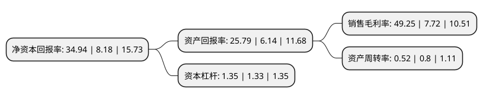

> 本页面由自动化程序生成于 2022年5月20日 01:18
> 内容可能存在错误，如有bug请提交issue至：https://github.com/Eroleice/doc-pi/issues
{.is-warning}

# 上市公司基本情况

## 基本资料

南京海辰药业股份有限公司（以下简称“海辰药业”）成立于2003年01月15日，南京市。于2017年01月12日在深交所创业板上市。

海辰药业注册资本12,000万元，主要产品:抗生素类，利尿剂类，消化类，免疫调节类，抗病毒类，心脑血管类等药物。主营业务:化学药品的研发，生产和销售。以下是详细信息：

- 公司名称: 南京海辰药业股份有限公司
- 股票代码: 300584.SZ
- 所在地: 江苏 - 南京市
- 成立日期: 2003年01月15日
- 注册资本: 12,000万元
- 法定代表人: 曹于平
- 主营业务: 主要产品:抗生素类，利尿剂类，消化类，免疫调节类，抗病毒类，心脑血管类等药物主营业务:化学药品的研发，生产和销售
- 公司官网: www.hicin.cn
- 公司介绍: 公司是一家集医药研发、生产和市场营销为一体的国家级高新技术企业。公司建有国家级GMP标准的冻干粉针、小容量注射剂、头孢粉针、固体制剂及原料药车间。产品种类涵盖心脑血管、消化、内分泌、抗感染、免疫等领域，可生产60多个代表品种。先后向市场推出注射用托拉塞米、注射用头孢替安、注射用单磷酸阿糖腺苷、注射用更昔洛韦钠、注射用头孢西酮钠、注射用替加环素、注射用兰索拉唑等多个临床必用产品。公司多次被政府部门授予“国家火炬计划重点高新技术企业”、“江苏省高成长型中小企业”、“产学研先进企业”、“技术创新先进企业”、“劳动与社会保障诚信企业”、“信息化带动工业化示范企业”、“重合同、守信用企业”、“南京市节能减排先进单位”、“优秀民营企业”等荣誉称号。

## 股东及高管情况

上市公司第一大股东为曹于平，持股50,491,306股，占比42.08%，为上市公司实际控制人。

截至2022年03月31日，上市公司的前十大股东中，共有9名自然人股东，1个产品账户，其中5%以上大股东共有3名。上市公司前十大股东明细如下：

> 截至2022年03月31日，上市公司前十大股东信息如下：

| 股东名称 | 持股数量（股） | 持股比例 |
| --- | --- | --- |
| 曹于平 | 50,491,306 | 42.08% |
| 姜晓群 | 11,973,913 | 9.98% |
| 柳晓泉 | 7,982,608 | 6.65% |
| 姚晓敏 | 3,991,305 | 3.33% |
| 西藏信托有限公司-西藏信托-智臻33号集合资金信托计划 | 2,127,730 | 1.77% |
| 蒋金元 | 1,053,450 | 0.88% |
| 毛幼聪 | 872,100 | 0.73% |
| 魏娟意 | 848,224 | 0.71% |
| 魏巍 | 710,658 | 0.59% |
| 宋姿蓉 | 671,100 | 0.56% |

## 利润表分析

上市公司2021年总收入为5.78亿元，净利润为2.84亿元，实现盈利。

## 杜邦分析

> 数据列示周期：2021年 | 2020年 | 2019年
{.is-info}

上市公司的净资产收益率在近一年有所上升，上升幅度为327.14%，其变化情况分解如下：
- 上市公司的销售毛利率在近一年上升了537.95%，可能是生产效率的提升、商品原材料价格下跌或商品价格的上涨所致。
- 上市公司的资产周转率在近一年下降了-35%，可能是源自于更慢的销售回款或库存管理效果下降。
- 上市公司的财务杠杆比率在近一年上升了1.5%，可能是增加负债扩大生产规模。

