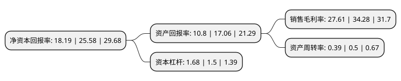

> 本页面由自动化程序生成于 2022年5月20日 01:19
> 内容可能存在错误，如有bug请提交issue至：https://github.com/Eroleice/doc-pi/issues
{.is-warning}

# 上市公司基本情况

## 基本资料

海南普利制药股份有限公司（以下简称“普利制药”）成立于1992年07月14日，海口市。于2017年03月28日在深交所创业板上市。

普利制药注册资本43,698.174万元，主要产品:冻干粉针剂;小容量注射剂;片剂，胶囊剂，颗粒剂，干混悬剂，散剂;软膏剂，凝胶剂;原料药(萘普生，卡托普利，曲匹布通，地氯雷他定，富马酸酮替芬，马来酸曲美布汀，盐酸多巴酚丁胺，盐酸酚氟拉明，L—半胱氨酸，氢氧化镁，更昔洛韦，尼麦角林);药用辅料(微晶纤维素丸芯，蔗糖丸芯，淀粉丸芯);主营业务:药物研发，生产及销售。以下是详细信息：

- 公司名称: 海南普利制药股份有限公司
- 股票代码: 300630.SZ
- 所在地: 海南 - 海口市
- 成立日期: 1992年07月14日
- 注册资本: 43,698.174万元
- 法定代表人: 范敏华
- 主营业务: 主要产品:冻干粉针剂;小容量注射剂;片剂，胶囊剂，颗粒剂，干混悬剂，散剂;软膏剂，凝胶剂;原料药(萘普生，卡托普利，曲匹布通，地氯雷他定，富马酸酮替芬，马来酸曲美布汀，盐酸多巴酚丁胺，盐酸酚氟拉明，L—半胱氨酸，氢氧化镁，更昔洛韦，尼麦角林);药用辅料(微晶纤维素丸芯，蔗糖丸芯，淀粉丸芯);主营业务:药物研发，生产及销售
- 公司官网: www.hnpoly.com
- 公司介绍: 公司始建于1992年，是专业从事化学药物制剂研发、生产和销售的高新技术企业，已通过中国医药企业制剂国际化先导企业认证。普利制药专注并擅长于药物缓控释制技术、掩味制剂技术和难溶性注射剂技术，公司主要产品地氯雷他定片为国家级火炬项目，地氯雷他定干混悬剂为海南省高新技术产品，并获海南省科学技术三等奖，双氯酚酸钠肠溶缓释胶囊获海南省科学技术二等奖。普利制药坚持“普泽天下，利在健康”的公司宗旨，贯彻“诚信、高效、创新、专业”的经营理念，经过二十多年的发展，树立了“技术领先，品质优良”的良好信誉，为普利制药的可持续健康发展奠定了良好的基础，已经成为多家国内外知名企业和机构的战略合作伙伴。

## 股东及高管情况

上市公司第一大股东为范敏华，持股148,083,509股，占比33.89%，为上市公司实际控制人。

截至2022年03月31日，上市公司的前十大股东中，共有2名自然人股东，1名机构股东，6个产品账户，1个海外主体，其中5%以上大股东共有2名。上市公司前十大股东明细如下：

> 截至2022年03月31日，上市公司前十大股东信息如下：

| 股东名称 | 持股数量（股） | 持股比例 |
| --- | --- | --- |
| 范敏华 | 148,083,509 | 33.89% |
| 朱小平 | 31,026,544 | 7.1% |
| 中国工商银行股份有限公司-中欧医疗健康混合型证券投资基金 | 21,409,189 | 4.9% |
| 中国工商银行股份有限公司-中欧医疗创新股票型证券投资基金 | 9,761,386 | 2.23% |
| 泰康人寿保险有限责任公司-投连-创新动力 | 6,166,487 | 1.41% |
| 华润深国投信托有限公司-华润信托·慎知资产行知集合资金信托计划 | 6,099,511 | 1.4% |
| 香港中央结算有限公司(陆股通) | 4,578,536 | 1.05% |
| 中国工商银行股份有限公司-景顺长城竞争优势混合型证券投资基金 | 4,237,352 | 0.97% |
| 上海盘京投资管理中心(有限合伙)-盛信2期私募证券投资基金 | 3,960,200 | 0.91% |
| 前海人寿保险股份有限公司-分红保险产品华泰组合 | 3,144,253 | 0.72% |

## 利润表分析

上市公司2021年总收入为15.08亿元，净利润为4.16亿元，实现盈利。

## 杜邦分析

> 数据列示周期：2021年 | 2020年 | 2019年
{.is-info}

上市公司的净资产收益率在近一年有所下降，下降幅度为-28.89%，其变化情况分解如下：
- 上市公司的销售毛利率在近一年下降了-19.46%，可能是生产效率的下降、商品原材料价格上涨或商品价格的下跌所致。
- 上市公司的资产周转率在近一年下降了-22%，可能是源自于更慢的销售回款或库存管理效果下降。
- 上市公司的财务杠杆比率在近一年上升了12%，可能是增加负债扩大生产规模。

