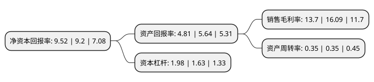

> 本页面由自动化程序生成于 2022年5月20日 01:19
> 内容可能存在错误，如有bug请提交issue至：https://github.com/Eroleice/doc-pi/issues
{.is-warning}

# 上市公司基本情况

## 基本资料

江西同和药业股份有限公司（以下简称“同和药业”）成立于2004年04月20日，宜春市。于2017年03月31日在深交所创业板上市。

同和药业注册资本20,592.168万元，主要产品:特色化学原料药及中间体，专利原料药中间体;主营业务:化学原料药和医药中间体的研发，生产和销售。以下是详细信息：

- 公司名称: 江西同和药业股份有限公司
- 股票代码: 300636.SZ
- 所在地: 江西 - 宜春市
- 成立日期: 2004年04月20日
- 注册资本: 20,592.168万元
- 法定代表人: 庞正伟
- 主营业务: 主要产品:特色化学原料药及中间体，专利原料药中间体;主营业务:化学原料药和医药中间体的研发，生产和销售
- 公司官网: www.jxsynergy.com
- 公司介绍: 公司位于风景秀丽的江西奉新工业园区，工厂按照GMP标准兴建，装备良好的厂房设施适应原料药产品生产的国际化要求。公司主要从事原料药、液晶化合物及中间体的生产，主要品种的生产能力及产品质量在中国处于领先水平。公司是中国质量管理最严格的原料药生产厂之一，主要原料药品种均有DMF文件，Q7等相关的ICH文件得到良好的实施，追求零缺陷通过官方质量体系检查。主要原料药品种通过SFDA、US-FDA、PMDA，KFDA等官方机构的GMP检查，产品出口到全球多个国家和地区。公司持续引进科技人才、与科研机构的广泛合作以及研发费用的高投入保证了研发实力的持续提升。公司在发展过程中形成了以“认真严谨、诚实守信、团结协作、主动提升”为核心价值观的企业文化，致力于“推行第一流的管理，培养第一流的人才，生产第一流的产品，创建第一流的企业”的追求。

## 股东及高管情况

上市公司第一大股东为庞正伟，持股44,006,636股，占比20.98%，**疑似为**上市公司实际控制人。

截至2022年03月31日，上市公司的前十大股东中，共有5名自然人股东，1名机构股东，4个产品账户，其中5%以上大股东共有2名。上市公司前十大股东明细如下：

> 未能通过持股比例判定出上市公司实际控制人（持股30%以上）
> 可能存在通过间接持股、联合持股、协议控制等方式拥有实际控制权的主体，具体请参考上市公司定期公告！
{.is-warning}

> 截至2022年03月31日，上市公司前十大股东信息如下：

| 股东名称 | 持股数量（股） | 持股比例 |
| --- | --- | --- |
| 庞正伟 | 44,006,636 | 20.98% |
| 丰隆实业有限公司 | 37,007,568 | 17.64% |
| 上海宽投资产管理有限公司-宽投幸运星5号私募证券投资基金 | 4,850,000 | 2.31% |
| 王桂红 | 3,554,451 | 1.69% |
| 上海磐耀资产管理有限公司-磐耀通享16号私募证券投资基金 | 3,350,000 | 1.6% |
| 中国建设银行股份有限公司-国泰大制造两年持有期混合型证券投资基金 | 2,650,000 | 1.26% |
| 梁忠诚 | 2,575,712 | 1.23% |
| 国泰基金管理有限公司-社保基金四二一组合 | 2,536,125 | 1.21% |
| 李岭 | 2,200,065 | 1.05% |
| 陈达会 | 1,954,545 | 0.93% |

## 利润表分析

上市公司2021年总收入为5.92亿元，净利润为0.81亿元，实现盈利。

## 杜邦分析

> 数据列示周期：2021年 | 2020年 | 2019年
{.is-info}

上市公司的净资产收益率在近一年有所上升，上升幅度为3.48%，其变化情况分解如下：
- 上市公司的销售毛利率在近一年下降了-14.85%，可能是生产效率的下降、商品原材料价格上涨或商品价格的下跌所致。
- 上市公司的资产周转率在近一年下降了0%，可能是源自于更慢的销售回款或库存管理效果下降。
- 上市公司的财务杠杆比率在近一年上升了21.47%，可能是增加负债扩大生产规模。

