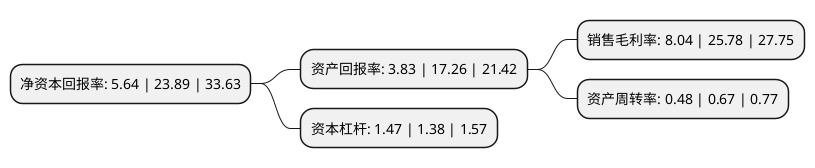

> 本页面由自动化程序生成于 2022年5月20日 01:19
> 内容可能存在错误，如有bug请提交issue至：https://github.com/Eroleice/doc-pi/issues
{.is-warning}

# 上市公司基本情况

## 基本资料

浙江天宇药业股份有限公司（以下简称“天宇股份”）成立于2003年02月14日，台州市。于2017年09月19日在深交所创业板上市。

天宇股份注册资本34,797.716万元，公司主营业务为化学原料药及中间体的研发，生产和销售，按照业务类型可分为原料药及中间体的非CMO业务和原料药及中间体的CMO业务。主要产品:原料药(氯沙坦钾，坎地沙坦酯，奥美沙坦酯，替米沙坦，缬沙坦，厄贝沙坦，孟鲁司特纳)制造;医药中间体制造。以下是详细信息：

- 公司名称: 浙江天宇药业股份有限公司
- 股票代码: 300702.SZ
- 所在地: 浙江 - 台州市
- 成立日期: 2003年02月14日
- 注册资本: 34,797.716万元
- 法定代表人: 屠勇军
- 主营业务: 公司主营业务为化学原料药及中间体的研发，生产和销售，按照业务类型可分为原料药及中间体的非CMO业务和原料药及中间体的CMO业务主要产品:原料药(氯沙坦钾，坎地沙坦酯，奥美沙坦酯，替米沙坦，缬沙坦，厄贝沙坦，孟鲁司特纳)制造;医药中间体制造
- 公司官网: www.tianyupharm.com
- 公司介绍: 公司成立于2003年，是一家专业研究、开发、制造原料药以及高级医药中间体的股份制制药企业。天宇股份主要生产心脑血管类药物、降血糖类药物、降血脂类药物、抗凝血类药物和抗哮喘类药物等医药中间体和原料药。产品畅销海内外市场，得到客户的认可与好评。天宇股份作为国家火炬计划重点高新技术企业，已连续多年列入台州市黄岩区工业十强企业，先后被认定为浙江省高新技术企业研究开发中心、浙江省心脑血管类药物企业研究院、浙江省科技创新载体、浙江省创新试点企业、浙江省专利示范企业等。

## 股东及高管情况

上市公司第一大股东为林洁，持股122,028,474股，占比35.07%，为上市公司实际控制人。

截至2022年03月31日，上市公司的前十大股东中，共有4名自然人股东，1名机构股东，5个产品账户，其中5%以上大股东共有3名。上市公司前十大股东明细如下：

> 截至2022年03月31日，上市公司前十大股东信息如下：

| 股东名称 | 持股数量（股） | 持股比例 |
| --- | --- | --- |
| 林洁 | 122,028,474 | 35.07% |
| 屠勇军 | 57,109,409 | 16.41% |
| 浙江台州圣庭投资有限公司 | 21,544,945 | 6.19% |
| 屠善增 | 10,479,056 | 3.01% |
| 广发银行股份有限公司-国泰聚信价值优势灵活配置混合型证券投资基金 | 6,770,360 | 1.95% |
| 中国建设银行股份有限公司-汇添富创新医药主题混合型证券投资基金 | 4,940,343 | 1.42% |
| 中国工商银行股份有限公司-中欧医疗健康混合型证券投资基金 | 4,806,746 | 1.38% |
| 珠海阿巴马资产管理有限公司-阿巴马元享红利11号私募证券投资基金 | 3,733,000 | 1.07% |
| 马成 | 3,017,968 | 0.87% |
| 中国工商银行股份有限公司-汇添富医药保健混合型证券投资基金 | 2,856,526 | 0.82% |

## 利润表分析

上市公司2021年总收入为25.45亿元，净利润为2.04亿元，实现盈利。

## 杜邦分析

> 数据列示周期：2021年 | 2020年 | 2019年
{.is-info}

上市公司的净资产收益率在近一年有所下降，下降幅度为-76.39%，其变化情况分解如下：
- 上市公司的销售毛利率在近一年下降了-68.81%，可能是生产效率的下降、商品原材料价格上涨或商品价格的下跌所致。
- 上市公司的资产周转率在近一年下降了-28.36%，可能是源自于更慢的销售回款或库存管理效果下降。
- 上市公司的财务杠杆比率在近一年上升了6.52%，可能是增加负债扩大生产规模。

