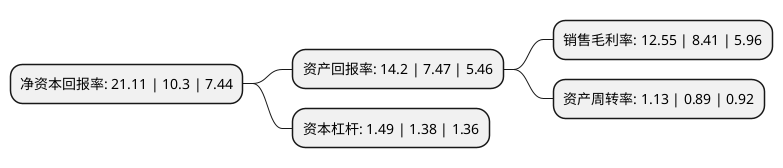

> 本页面由自动化程序生成于 2022年5月20日 01:19
> 内容可能存在错误，如有bug请提交issue至：https://github.com/Eroleice/doc-pi/issues
{.is-warning}

# 上市公司基本情况

## 基本资料

湖南九典制药股份有限公司（以下简称“九典制药”）成立于2001年01月19日，长沙市。于2017年10月10日在深交所创业板上市。

九典制药注册资本23,468.73万元，医药产品的研发，生产和销售及技术转让。目前在售主要产品有原料药，化药制剂，中药制剂，植物提取物，药用辅料等系列品种。以下是详细信息：

- 公司名称: 湖南九典制药股份有限公司
- 股票代码: 300705.SZ
- 所在地: 湖南 - 长沙市
- 成立日期: 2001年01月19日
- 注册资本: 23,468.73万元
- 法定代表人: 朱志宏
- 主营业务: 医药产品的研发，生产和销售及技术转让目前在售主要产品有原料药，化药制剂，中药制剂，植物提取物，药用辅料等系列品种
- 公司官网: www.hnjiudian.com
- 公司介绍: 公司座落于风景秀丽的长沙国家生物产业基地，是集研发、生产、销售于一体的现代化制药企业。公司主营业务为医药产品的研发、生产和销售及技术转让，产品主要涵盖药品制剂、原料药、药用辅料及植物提取物四大类别。公司相继被认定为国家“高技术产业化示范工程”企业、国家“产业技术成果转化项目”企业、国家火炬计划重点高新技术企业、湖南省高新技术企业、湖南省医药工业十佳企业、湖南省首批示范性医药企业、湖南省知识产权培育工程优秀企业、湖南省纳税信用A级单位、湖南省信贷诚信单位，“九典”商标被评为湖南省著名商标。公司拥有符合国家GMP标准的原料药车间、口服固体制剂车间、口服液体制剂车间、外用制剂车间、药用辅料车间、植物提取车间、医疗器械车间等，并配备有先进的生产检验设备。公司已获得一百多个新药证书或生产批件，已申请专利近百项，承担了十多项国家级项目，多个项目获得湖南省科技进步二、三等奖。

## 股东及高管情况

上市公司第一大股东为朱志宏，持股83,910,000股，占比35.75%，为上市公司实际控制人。

截至2022年03月31日，上市公司的前十大股东中，共有6名自然人股东，2名机构股东，2个产品账户，其中5%以上大股东共有2名。上市公司前十大股东明细如下：

> 截至2022年03月31日，上市公司前十大股东信息如下：

| 股东名称 | 持股数量（股） | 持股比例 |
| --- | --- | --- |
| 朱志宏 | 83,910,000 | 35.75% |
| 段立新 | 34,686,432 | 14.78% |
| 陈丽芳 | 4,818,600 | 2.05% |
| 长沙旺典投资合伙企业(有限合伙) | 4,068,000 | 1.73% |
| 招商银行股份有限公司-安信医药健康主题股票型发起式证券投资基金 | 3,710,700 | 1.58% |
| 吕巨波 | 2,272,650 | 0.97% |
| 中国工商银行股份有限公司-汇添富医疗积极成长一年持有期混合型证券投资基金 | 2,164,100 | 0.92% |
| 国元证券股份有限公司 | 1,759,600 | 0.75% |
| 郑霞辉 | 1,741,741 | 0.74% |
| 朱志云 | 1,639,286 | 0.7% |

## 利润表分析

上市公司2021年总收入为16.27亿元，净利润为2.04亿元，实现盈利。

## 杜邦分析

> 数据列示周期：2021年 | 2020年 | 2019年
{.is-info}

上市公司的净资产收益率在近一年有所上升，上升幅度为104.95%，其变化情况分解如下：
- 上市公司的销售毛利率在近一年上升了49.23%，可能是生产效率的提升、商品原材料价格下跌或商品价格的上涨所致。
- 上市公司的资产周转率在近一年上升了26.97%，可能是源自于更快的销售回款或库存管理效果提升。
- 上市公司的财务杠杆比率在近一年上升了7.97%，可能是增加负债扩大生产规模。

