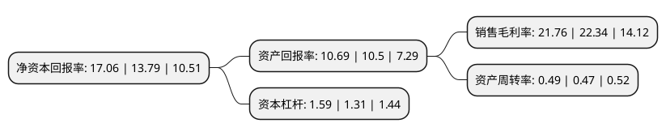

> 本页面由自动化程序生成于 2022年5月20日 01:20
> 内容可能存在错误，如有bug请提交issue至：https://github.com/Eroleice/doc-pi/issues
{.is-warning}

# 上市公司基本情况

## 基本资料

康龙化成(北京)新药技术股份有限公司（以下简称“康龙化成”）成立于2004年07月01日，北京市。于2019年01月28日在深交所创业板上市。

康龙化成注册资本79,417.71万元，公司的主营业务为药物研究，开发及生产CRMO服务，分为药物发现和药物开发研发服务两部分。以下是详细信息：

- 公司名称: 康龙化成(北京)新药技术股份有限公司
- 股票代码: 300759.SZ
- 所在地: 北京 - 北京市
- 成立日期: 2004年07月01日
- 注册资本: 79,417.71万元
- 法定代表人: 楼柏良
- 主营业务: 公司的主营业务为药物研究，开发及生产CRMO服务，分为药物发现和药物开发研发服务两部分
- 公司官网: www.pharmaron.com；www.pharmaron.cn
- 公司介绍: 公司是一家领先的全流程一体化医药研发服务平台，业务遍及全球，致力于协助客户加速药物创新。根据弗若斯特沙利文的资料，按2018年的总收益计，公司是中国第二大医药研发服务平台及全球三大药物发现服务供应商之一。公司在药物发现、临床前及早期临床开发服务方面处于领先地位，并一直致力于拓展下游业务，包括临床后期开发及商业化生产等服务。公司不断扩大医药研发服务领域，并掌握主要研发学科的专业知识以覆盖各研发阶段的主要里程碑，协助客户加快推进研发计划。作为领先的药物发现医药研发服务供应商，公司对分子已积累深刻的科学见解，并自客户创新药物研发初期起即取得客户信任。

## 股东及高管情况

上市公司第一大股东为深圳市信中康成投资合伙企业(有限合伙)，持股148,335,300股，占比18.68%，**疑似为**上市公司实际控制人。

截至2022年03月31日，上市公司的前十大股东中，共有1名自然人股东，5名机构股东，1个产品账户，3个海外主体，其中5%以上大股东共有5名。上市公司前十大股东明细如下：

> 未能通过持股比例判定出上市公司实际控制人（持股30%以上）
> 可能存在通过间接持股、联合持股、协议控制等方式拥有实际控制权的主体，具体请参考上市公司定期公告！
{.is-warning}

> 截至2022年03月31日，上市公司前十大股东信息如下：

| 股东名称 | 持股数量（股） | 持股比例 |
| --- | --- | --- |
| 深圳市信中康成投资合伙企业(有限合伙) | 148,335,300 | 18.68% |
| 香港中央结算(代理人)有限公司 | 133,999,593 | 16.87% |
| PHARMARON HOLDINGS LIMITED | 97,600,003 | 12.29% |
| 香港中央结算有限公司(陆股通) | 44,110,213 | 5.55% |
| 天津君联闻达股权投资合伙企业(有限合伙) | 42,609,392 | 5.37% |
| 楼小强 | 33,500,000 | 4.22% |
| 中国工商银行股份有限公司-中欧医疗健康混合型证券投资基金 | 32,347,682 | 4.07% |
| 深圳市信中龙成投资合伙企业(有限合伙) | 28,378,866 | 3.57% |
| 宁波龙泰康投资管理有限公司 | 21,500,000 | 2.71% |
| 北京多泰投资管理有限公司 | 12,923,103 | 1.63% |

## 利润表分析

上市公司2021年总收入为74.43亿元，净利润为16.2亿元，实现盈利。

## 杜邦分析

> 数据列示周期：2021年 | 2020年 | 2019年
{.is-info}

上市公司的净资产收益率在近一年有所上升，上升幅度为23.71%，其变化情况分解如下：
- 上市公司的销售毛利率在近一年下降了-2.6%，可能是生产效率的下降、商品原材料价格上涨或商品价格的下跌所致。
- 上市公司的资产周转率在近一年上升了4.26%，可能是源自于更快的销售回款或库存管理效果提升。
- 上市公司的财务杠杆比率在近一年上升了21.37%，可能是增加负债扩大生产规模。

