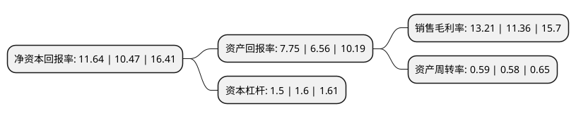

> 本页面由自动化程序生成于 2022年5月20日 01:21
> 内容可能存在错误，如有bug请提交issue至：https://github.com/Eroleice/doc-pi/issues
{.is-warning}

# 上市公司基本情况

## 基本资料

湖北共同药业股份有限公司（以下简称“共同药业”）成立于2006年05月15日，襄阳市。于2021年04月09日在深交所创业板上市。

共同药业注册资本11,527.7万元，公司是一家专业从事甾体药物原料的研发，生产及销售的高新技术企业，主要产品为甾体药物生产所需的起始物料和中间体。以下是详细信息：

- 公司名称: 湖北共同药业股份有限公司
- 股票代码: 300966.SZ
- 所在地: 湖北 - 襄阳市
- 成立日期: 2006年05月15日
- 注册资本: 11,527.7万元
- 法定代表人: 系祖斌
- 主营业务: 公司是一家专业从事甾体药物原料的研发，生产及销售的高新技术企业，主要产品为甾体药物生产所需的起始物料和中间体
- 公司官网: www.gotopharm.com
- 公司介绍: 公司是一家专业从事甾体药物原料的研发、生产及销售的高新技术企业，主要产品为甾体药物生产所需的起始物料和中间体。在甾体药物起始物料领域，公司是国内最大的供应商之一；在甾体药物中间体领域，公司掌握了多种产品的生产技术，实现了起始物料至性激素类中间体的完整产品路线覆盖，并能够生产多种皮质激素类中间体和孕激素类中间体，产品线丰富，能够满足客户的多元化需求并受到市场认可。公司已与国内甾体药物龙头企业天药股份、溢多利、以及国际知名制药企业CHEMO和AMRI等国内外客户建立了良好的合作关系。公司自成立以来专注于主营业务发展和科技创新，获得了各级政府及主管部门的认可和奖励。公司被认定为“湖北省植物甾醇工程技术研究中心”、“湖北省甾体药物及中间体工程研究中心”和“院士(专家)工作站”；并获得“省科技进步奖二等奖”、“科技型中小企业创新奖”和“发展工业经济优秀单位”等荣誉，凭借“利用植物甾醇发酵生产雄烯二酮新工艺”获得了中国生产力促进中心协会颁布的“中国好技术”称号。

## 股东及高管情况

上市公司第一大股东为系祖斌，持股36,567,000股，占比31.72%，为上市公司实际控制人。

截至2022年03月31日，上市公司的前十大股东中，共有2名自然人股东，6名机构股东，2个产品账户，其中5%以上大股东共有2名。上市公司前十大股东明细如下：

> 截至2022年03月31日，上市公司前十大股东信息如下：

| 股东名称 | 持股数量（股） | 持股比例 |
| --- | --- | --- |
| 系祖斌 | 36,567,000 | 31.72% |
| 李明磊 | 15,371,000 | 13.33% |
| 北京共同创新投资合伙企业(有限合伙) | 5,501,200 | 4.77% |
| 安徽利昶投资中心(有限合伙) | 5,467,200 | 4.74% |
| 浙江华海药业股份有限公司 | 4,270,700 | 3.7% |
| 宜昌悦和股权投资基金管理有限公司-湖北兴发高投新材料创业投资基金合伙企业(有限合伙) | 3,417,000 | 2.96% |
| 深圳市创新投资集团有限公司 | 2,562,700 | 2.22% |
| 武汉红土创新创业投资有限公司 | 2,528,500 | 2.19% |
| 湖北高金生物科技创业投资基金合伙企业(有限合伙) | 2,050,200 | 1.78% |
| 石家庄红土冀深创业投资有限公司 | 1,708,500 | 1.48% |

## 利润表分析

上市公司2021年总收入为5.9亿元，净利润为0.78亿元，实现盈利。

## 杜邦分析

> 数据列示周期：2021年 | 2020年 | 2019年
{.is-info}

上市公司的净资产收益率在近一年有所上升，上升幅度为11.17%，其变化情况分解如下：
- 上市公司的销售毛利率在近一年上升了16.29%，可能是生产效率的提升、商品原材料价格下跌或商品价格的上涨所致。
- 上市公司的资产周转率在近一年上升了1.72%，可能是源自于更快的销售回款或库存管理效果提升。
- 上市公司的财务杠杆比率在近一年下降了-6.25%，可能是减少负债降低财务费用。

