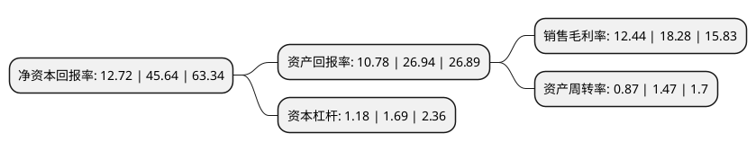

> 本页面由自动化程序生成于 2022年5月20日 01:22
> 内容可能存在错误，如有bug请提交issue至：https://github.com/Eroleice/doc-pi/issues
{.is-warning}

# 上市公司基本情况

## 基本资料

西藏多瑞医药股份有限公司（以下简称“多瑞医药”）成立于2016年12月22日，昌都市。于2021年09月29日在深交所创业板上市。

多瑞医药注册资本8,000万元，公司主要从事化学药品制剂及其原料药的研发，生产和销售业务。以下是详细信息：

- 公司名称: 西藏多瑞医药股份有限公司
- 股票代码: 301075.SZ
- 所在地: 西藏 - 昌都市
- 成立日期: 2016年12月22日
- 注册资本: 8,000万元
- 法定代表人: 邓勇
- 主营业务: 公司主要从事化学药品制剂及其原料药的研发，生产和销售业务
- 公司官网: www.duoruiyy.com
- 公司介绍: 公司主要从事化学药品制剂及其原料药的研发、生产和销售业务。自成立以来，公司重点围绕围手术期和急抢救领域进行产品管线布局，目前已成为血浆代用品细分领域的领先企业。公司核心产品醋酸钠林格注射液系通过自主研发而推出的国内首仿药品，临床上主要用于补充体液，调节电解质平衡、纠正酸中毒，临床应用科室包括麻醉科、ICU、急诊科、大外科、烧伤科等。2017年度、2018年度、2019年度及2020年1-3月，公司醋酸钠林格注射液的销售收入分别为13,443.05万元、34,833.25万元、44,901.86万元及9,978.90万元，保持稳定增长态势。发行人及子公司共拥有7个药物品种、15个药品注册批件，包括醋酸钠林格注射液、复方电解质注射液和复方甘露醇注射液等。除现有产品外，公司正以血浆代用品为深耕主线，以急抢救用药、儿童用药、精神类用药等特色领域为侧翼，积极开展新产品开发，逐步构建产品梯队。

## 股东及高管情况

上市公司第一大股东为西藏嘉康时代科技发展有限公司，持股46,677,966股，占比58.35%，为上市公司实际控制人。

截至2022年03月31日，上市公司的前十大股东中，共有5名自然人股东，4名机构股东，1个海外主体，其中5%以上大股东共有3名。上市公司前十大股东明细如下：

> 截至2022年03月31日，上市公司前十大股东信息如下：

| 股东名称 | 持股数量（股） | 持股比例 |
| --- | --- | --- |
| 西藏嘉康时代科技发展有限公司 | 46,677,966 | 58.35% |
| 嘉兴秋阳股权投资合伙企业(有限合伙)-嘉兴秋昱投资合伙企业(有限合伙) | 6,406,780 | 8.01% |
| 西藏清畅企业管理合伙企业(有限合伙) | 5,898,305 | 7.37% |
| 武汉海峡高新科技发展股份有限公司 | 1,016,949 | 1.27% |
| 彭衍蒙 | 130,800 | 0.16% |
| 楼希 | 90,000 | 0.11% |
| 彭衍利 | 90,000 | 0.11% |
| UBS AG | 87,748 | 0.11% |
| 朱爱帮 | 81,600 | 0.1% |
| 丁正根 | 72,100 | 0.09% |

## 利润表分析

上市公司2021年总收入为5.29亿元，净利润为0.65亿元，实现盈利。

## 杜邦分析

> 数据列示周期：2021年 | 2020年 | 2019年
{.is-info}

上市公司的净资产收益率在近一年有所下降，下降幅度为-72.13%，其变化情况分解如下：
- 上市公司的销售毛利率在近一年下降了-31.95%，可能是生产效率的下降、商品原材料价格上涨或商品价格的下跌所致。
- 上市公司的资产周转率在近一年下降了-40.82%，可能是源自于更慢的销售回款或库存管理效果下降。
- 上市公司的财务杠杆比率在近一年下降了-30.18%，可能是减少负债降低财务费用。

