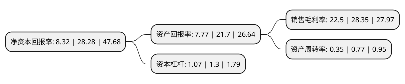

> 本页面由自动化程序生成于 2022年5月20日 01:23
> 内容可能存在错误，如有bug请提交issue至：https://github.com/Eroleice/doc-pi/issues
{.is-warning}

# 上市公司基本情况

## 基本资料

湖北亨迪药业股份有限公司（以下简称“亨迪药业”）成立于1995年12月29日，荆门市。于2021年12月22日在深交所创业板上市。

亨迪药业注册资本24,000万元，公司主要从事化学原料药及制剂产品的研发，生产和销售。经过多年的积累，公司形成了以非甾体抗炎类原料药为核心，心血管类，抗肿瘤类等特色原料药为辅助的产品体系，同时结合自身产业链优势向制剂生产销售环节进行延伸。以下是详细信息：

- 公司名称: 湖北亨迪药业股份有限公司
- 股票代码: 301211.SZ
- 所在地: 湖北 - 荆门市
- 成立日期: 1995年12月29日
- 注册资本: 24,000万元
- 法定代表人: 程志刚
- 主营业务: 公司主要从事化学原料药及制剂产品的研发，生产和销售经过多年的积累，公司形成了以非甾体抗炎类原料药为核心，心血管类，抗肿瘤类等特色原料药为辅助的产品体系，同时结合自身产业链优势向制剂生产销售环节进行延伸
- 公司官网: www.biocause.com
- 公司介绍: 湖北百科亨迪药业有限公司是中国最大、世界第二非甾体抗炎药布洛芬的供应商，是一家专注于高端规范市场的化学原料药及制剂的企业，是国内多条原料药行业标准及规范的制定者、起草者，是中国为数不多的同时通过中国GMP、美国FDA、欧盟CEP认证的的原料药生产企业之一。

## 股东及高管情况

上市公司第一大股东为上海勇达圣商务咨询有限公司，持股91,800,000股，占比38.25%，为上市公司实际控制人。

截至2022年03月31日，上市公司的前十大股东中，共有6名自然人股东，4名机构股东，其中5%以上大股东共有3名。上市公司前十大股东明细如下：

> 截至2022年03月31日，上市公司前十大股东信息如下：

| 股东名称 | 持股数量（股） | 持股比例 |
| --- | --- | --- |
| 上海勇达圣商务咨询有限公司 | 91,800,000 | 38.25% |
| 刘天超 | 28,800,000 | 12% |
| 荆门市宁康企业管理中心(有限合伙) | 13,500,000 | 5.63% |
| 刘妍超 | 10,800,000 | 4.5% |
| 刘雯超 | 10,800,000 | 4.5% |
| 刘思超 | 10,800,000 | 4.5% |
| 雷小艳 | 9,000,000 | 3.75% |
| 荆门市倍康企业管理中心(有限合伙) | 4,500,000 | 1.88% |
| 国泰君安证裕投资有限公司 | 1,138,281 | 0.47% |
| 黄建国 | 332,400 | 0.14% |

## 利润表分析

上市公司2021年总收入为5.4亿元，净利润为1.21亿元，实现盈利。

## 杜邦分析

> 数据列示周期：2021年 | 2020年 | 2019年
{.is-info}

上市公司的净资产收益率在近一年有所下降，下降幅度为-70.58%，其变化情况分解如下：
- 上市公司的销售毛利率在近一年下降了-20.63%，可能是生产效率的下降、商品原材料价格上涨或商品价格的下跌所致。
- 上市公司的资产周转率在近一年下降了-54.55%，可能是源自于更慢的销售回款或库存管理效果下降。
- 上市公司的财务杠杆比率在近一年下降了-17.69%，可能是减少负债降低财务费用。

