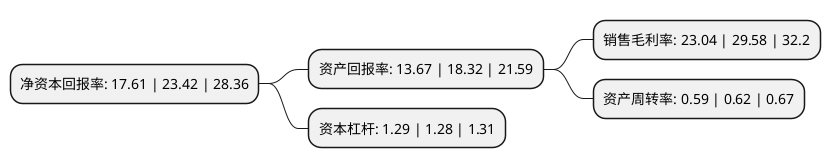

> 本页面由自动化程序生成于 2022年5月20日 01:23
> 内容可能存在错误，如有bug请提交issue至：https://github.com/Eroleice/doc-pi/issues
{.is-warning}

# 上市公司基本情况

## 基本资料

苏州富士莱医药股份有限公司（以下简称“富士莱”）成立于2000年11月27日，苏州市。于2022年03月29日在深交所创业板上市。

富士莱注册资本9,167万元，公司主要从事医药中间体，原料药以及保健品原料的研发，生产与销售，主要产品包括硫辛酸系列，磷脂酰胆碱系列，肌肽系列等三大系列产品。以下是详细信息：

- 公司名称: 苏州富士莱医药股份有限公司
- 股票代码: 301258.SZ
- 所在地: 江苏 - 苏州市
- 成立日期: 2000年11月27日
- 注册资本: 9,167万元
- 法定代表人: 钱祥云
- 主营业务: 公司主要从事医药中间体，原料药以及保健品原料的研发，生产与销售，主要产品包括硫辛酸系列，磷脂酰胆碱系列，肌肽系列等三大系列产品
- 公司官网: www.fuslai.com
- 公司介绍: 苏州富士莱医药股份有限公司是一家原料药及保健食品研发商，主要为用户提供硫辛酸系列、肌肽系列、磷脂酰胆碱系列三大产品，应用于医药、膳食补充剂以及化妆品等领域，具有抗氧化、延缓衰老、改善血糖等方面的功效。公司坚持以精细严谨服务客户、以务实创新回报社会，专注于医药中间体、原料药以及保健品原料生产经营近二十年，积累形成了较强的研发优势、生产制造优势、规模优势及成本优势等竞争优势，成为全球硫辛酸系列产品的重要供应商。公司产品远销欧美、日韩、印度及南美等境外市场，与下游众多医药、保健品企业等建立起长期稳定的合作关系。经过多年积累，公司形成了丰富的产品结构，包括硫辛酸系列、磷脂酰胆碱系列、肌肽系列三大系列产品，涵盖医药中间体、原料药以及保健品原料等三大领域。

## 股东及高管情况

上市公司第一大股东为苏州市富士莱技术服务发展中心(有限合伙)，持股55,200,000股，占比60.22%，为上市公司实际控制人。

截至2022年03月31日，上市公司的前十大股东中，共有6名自然人股东，4名机构股东，其中5%以上大股东共有1名。上市公司前十大股东明细如下：

> 截至2022年03月31日，上市公司前十大股东信息如下：

| 股东名称 | 持股数量（股） | 持股比例 |
| --- | --- | --- |
| 苏州市富士莱技术服务发展中心(有限合伙) | 55,200,000 | 60.22% |
| 吴江东方国发创业投资有限公司 | 3,000,000 | 3.27% |
| 王永兴 | 2,208,000 | 2.41% |
| 苏州国发天使创业投资企业(有限合伙) | 1,800,000 | 1.96% |
| 张卫东 | 1,425,000 | 1.55% |
| 苏州龙驹创联创业投资企业(有限合伙) | 1,375,000 | 1.5% |
| 陆建刚 | 350,000 | 0.38% |
| 钱桂英 | 300,000 | 0.33% |
| 陈健 | 300,000 | 0.33% |
| 钱怡 | 300,000 | 0.33% |

## 利润表分析

上市公司2021年总收入为5.21亿元，净利润为1.2亿元，实现盈利。

## 杜邦分析

> 数据列示周期：2021年 | 2020年 | 2019年
{.is-info}

上市公司的净资产收益率在近一年有所下降，下降幅度为-24.81%，其变化情况分解如下：
- 上市公司的销售毛利率在近一年下降了-22.11%，可能是生产效率的下降、商品原材料价格上涨或商品价格的下跌所致。
- 上市公司的资产周转率在近一年下降了-4.84%，可能是源自于更慢的销售回款或库存管理效果下降。
- 上市公司的财务杠杆比率在近一年上升了0.78%，可能是增加负债扩大生产规模。

