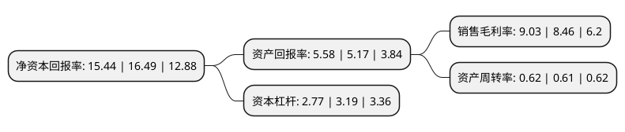

> 本页面由自动化程序生成于 2022年5月20日 01:24
> 内容可能存在错误，如有bug请提交issue至：https://github.com/Eroleice/doc-pi/issues
{.is-warning}

# 上市公司基本情况

## 基本资料

人福医药集团股份公司（以下简称“人福医药”）成立于1993年03月30日，武汉市。于1997年06月06日在上交所主板上市。

人福医药注册资本163,307.191万元，宜昌人福枸橼酸芬太尼注射液，枸橼酸舒芬太尼注射液，注射用盐酸瑞芬太尼，咪达唑仑注射液，盐酸氢吗啡酮注射液，盐酸纳布啡注射液;葛店人福(复方)米非司酮片，米索前列醇片，左炔诺孕酮胶囊;新疆维药祖卡木颗粒，寒喘祖帕颗粒，复方木尼孜其颗粒，通滞苏润江胶囊，养心达瓦依米西克蜜膏，石榴补血糖浆，护肝布祖热颗粒;杰士邦安全套等。以下是详细信息：

- 公司名称: 人福医药集团股份公司
- 股票代码: 600079.SH
- 所在地: 湖北 - 武汉市
- 成立日期: 1993年03月30日
- 注册资本: 163,307.191万元
- 法定代表人: 李杰
- 主营业务: 宜昌人福枸橼酸芬太尼注射液，枸橼酸舒芬太尼注射液，注射用盐酸瑞芬太尼，咪达唑仑注射液，盐酸氢吗啡酮注射液，盐酸纳布啡注射液;葛店人福(复方)米非司酮片，米索前列醇片，左炔诺孕酮胶囊;新疆维药祖卡木颗粒，寒喘祖帕颗粒，复方木尼孜其颗粒，通滞苏润江胶囊，养心达瓦依米西克蜜膏，石榴补血糖浆，护肝布祖热颗粒;杰士邦安全套等
- 公司官网: www.humanwell.com.cn
- 公司介绍: 人福医药集团股份公司成立于1993年，于1997年在上海证券交易所上市(600079.SH)，是湖北省医药工业龙头企业和国家级企业技术中心，位列中国医药工业信息中心“2018年度中国医药工业百强榜”第28位。公司以研发为先导，致力于打造国内一流的新药研发产业化平台；坚持“做医药健康领域细分市场领导者”的发展战略，主要从事药品的研发、生产和销售，在国内麻醉镇痛药、生育调节药、维吾尔民族药、两性健康等细分领域形成领导或领先地位；同时积极发展医药商业，稳步推进国际化进程，实现了在美国、非洲等全球范围内的研发、市场及产业布局。

## 股东及高管情况

上市公司第一大股东为武汉当代科技产业集团股份有限公司，持股472,962,157股，占比28.9615%，**疑似为**上市公司实际控制人。

截至2022年04月08日，上市公司的前十大股东中，共有4名自然人股东，5名机构股东，1个产品账户，其中5%以上大股东共有9名。上市公司前十大股东明细如下：

> 未能通过持股比例判定出上市公司实际控制人（持股30%以上）
> 可能存在通过间接持股、联合持股、协议控制等方式拥有实际控制权的主体，具体请参考上市公司定期公告！
{.is-warning}

> 截至2022年04月08日，上市公司前十大股东信息如下：

| 股东名称 | 持股数量（股） | 持股比例 |
| --- | --- | --- |
| 武汉当代科技产业集团股份有限公司 | 472,962,157 | 28.9615% |
| 武汉当代科技产业集团股份有限公司 | 463,610,474 | 28.3889% |
| 武汉当代科技产业集团股份有限公司 | 457,565,969 | 28.0187% |
| 武汉当代科技产业集团股份有限公司 | 457,010,269 | 27.9847% |
| 武汉当代科技产业集团股份有限公司 | 374,563,279 | 22.9361% |
| 李杰 | 97,480,104 | 5.9691% |
| 李杰 | 97,480,104 | 5.9691% |
| 李杰 | 97,480,104 | 5.9691% |
| 李杰 | 97,480,104 | 5.9691% |
| 中信证券-中信银行-中信证券卓越成长两年持有期混合型集合资产管理计划 | 15,142,359 | 0.93% |

## 利润表分析

上市公司2021年总收入为204.41亿元，净利润为18.45亿元，实现盈利。

## 杜邦分析

> 数据列示周期：2021年 | 2020年 | 2019年
{.is-info}

上市公司的净资产收益率在近一年有所下降，下降幅度为-6.37%，其变化情况分解如下：
- 上市公司的销售毛利率在近一年上升了6.74%，可能是生产效率的提升、商品原材料价格下跌或商品价格的上涨所致。
- 上市公司的资产周转率在近一年上升了1.64%，可能是源自于更快的销售回款或库存管理效果提升。
- 上市公司的财务杠杆比率在近一年下降了-13.17%，可能是减少负债降低财务费用。

