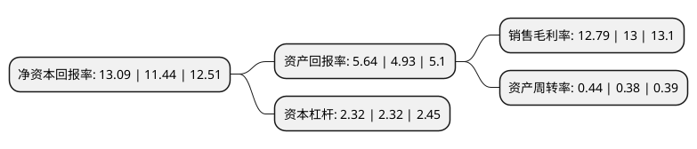

> 本页面由自动化程序生成于 2022年5月20日 01:25
> 内容可能存在错误，如有bug请提交issue至：https://github.com/Eroleice/doc-pi/issues
{.is-warning}

# 上市公司基本情况

## 基本资料

上海复星医药(集团)股份有限公司（以下简称“复星医药”）成立于1995年05月31日，上海市。于1998年08月07日在上交所主板上市。

复星医药注册资本256,289.855万元，主要产品:诊断产品，阿托莫兰，花红片，复方芦荟胶囊，青蒿琥酯，药品零售，药品批发，齿科治疗设备。以下是详细信息：

- 公司名称: 上海复星医药(集团)股份有限公司
- 股票代码: 600196.SH
- 所在地: 上海 - 上海市
- 成立日期: 1995年05月31日
- 注册资本: 256,289.855万元
- 法定代表人: 吴以芳
- 主营业务: 主要产品:诊断产品，阿托莫兰，花红片，复方芦荟胶囊，青蒿琥酯，药品零售，药品批发，齿科治疗设备
- 公司官网: www.fosunpharma.com
- 公司介绍: 公司是在中国医药行业处于领先地位的上市公司，专注现代生物医药健康产业。公司抓住中国医药市场的快速成长和中国企业进军世界主流医药市场的巨大机遇，战略性地覆盖研发制造、分销及终端等医药健康产业链的多个重要环节，形成了以药品研发制造为核心，同时在医药流通、医疗服务、医学诊断和医疗器械等领域拥有领先的市场地位，在研发创新、市场营销、并购整合、人才建设等方面形成竞争优势的大型专业医药健康产业集团。公司注重创新研发，拥有国家级企业技术中心，并在上海、重庆、美国建立了高效的国际化研发团队。公司研发专注于新陈代谢及消化道、心血管、抗肿瘤及免疫调节、神经系统、抗感染等治疗领域，且主要产品均在各自细分市场占据领先地位。在中国，复星医药已取得肝病、糖尿病、结核病、临床诊断产品等细分市场的竞争优势；在全球市场，复星医药也已成为抗疟药物的领先者。公司在聚焦发展核心制药业务的同时，积极发展医疗服务领域，并进一步巩固在医学诊断、医疗器械等领域的竞争优势。公司已在国内高端和专科医疗服务领域建立坚实基础。

## 股东及高管情况

上市公司第一大股东为上海复星高科技(集团)有限公司，持股938,095,290股，占比36.6%，为上市公司实际控制人。

截至2022年03月31日，上市公司的前十大股东中，共有2名自然人股东，4名机构股东，2个产品账户，2个海外主体，其中5%以上大股东共有2名。上市公司前十大股东明细如下：

> 截至2022年03月31日，上市公司前十大股东信息如下：

| 股东名称 | 持股数量（股） | 持股比例 |
| --- | --- | --- |
| 上海复星高科技(集团)有限公司 | 938,095,290 | 36.6% |
| 香港中央结算(代理人)有限公司 | 551,359,832 | 21.51% |
| 香港中央结算有限公司(陆股通) | 54,851,372 | 2.14% |
| 中国证券金融股份有限公司 | 38,736,079 | 1.51% |
| 邱明静 | 18,510,000 | 0.72% |
| 中国银行股份有限公司-招商国证生物医药指数分级证券投资基金 | 14,456,008 | 0.56% |
| 申万宏源证券有限公司 | 6,562,442 | 0.26% |
| 中国工商银行-上证50交易型开放式指数证券投资基金 | 6,515,655 | 0.25% |
| 白敏莉 | 6,000,000 | 0.23% |
| 中信证券股份有限公司 | 5,408,632 | 0.21% |

## 利润表分析

上市公司2021年总收入为390.05亿元，净利润为49.87亿元，实现盈利。

## 杜邦分析

> 数据列示周期：2021年 | 2020年 | 2019年
{.is-info}

上市公司的净资产收益率在近一年有所上升，上升幅度为14.42%，其变化情况分解如下：
- 上市公司的销售毛利率在近一年下降了-1.62%，可能是生产效率的下降、商品原材料价格上涨或商品价格的下跌所致。
- 上市公司的资产周转率在近一年上升了15.79%，可能是源自于更快的销售回款或库存管理效果提升。
- 上市公司的财务杠杆比率在近一年下降了0%，可能是减少负债降低财务费用。

