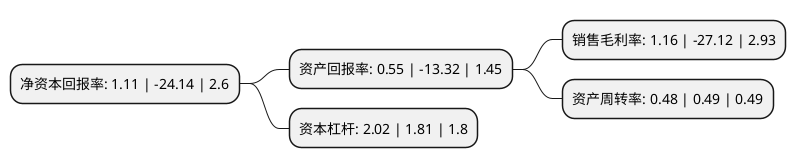

> 本页面由自动化程序生成于 2022年5月20日 01:25
> 内容可能存在错误，如有bug请提交issue至：https://github.com/Eroleice/doc-pi/issues
{.is-warning}

# 上市公司基本情况

## 基本资料

江苏吴中医药发展股份有限公司（以下简称“江苏吴中”）成立于1994年06月28日，苏州市。于1999年04月01日在上交所主板上市。

江苏吴中注册资本71,238.883万元，主营业务为医药，房地产和投资。以下是详细信息：

- 公司名称: 江苏吴中医药发展股份有限公司
- 股票代码: 600200.SH
- 所在地: 江苏 - 苏州市
- 成立日期: 1994年06月28日
- 注册资本: 71,238.883万元
- 法定代表人: 钱群英
- 主营业务: 主营业务为医药，房地产和投资
- 公司官网: www.600200.com
- 公司介绍: 公司是一家以医药为核心产业，房地产为重要产业，投资为辅的综合性上市公司。公司成立以来不断规范和完善治理结构，通过收购兼并和项目投资优化主业，全面实施品牌战略。公司旗下的江苏吴中医药集团已经形成了涵盖化学药、生物药、中药，集医药研发、生产、销售为一体的完整产业链，建立了江苏省基因药物工程技术中心，是苏州市医药行业协会的会长单位。公司旗下的江苏中吴置业有限公司，致力于房地产开发经营，所开发的金枫美地、岚山别墅和苏苑花园、阳光华城分别在苏州和宿迁具有较高的知名度和美誉度。在投资业务上公司控股或参股了江苏兴瑞贵金属材料有限公司、江苏省农药研究所股份有限公司、江苏银行等一批发展迅速并已具有一定地位的潜力企业。公司被江苏省科委认定为高新技术企业，被国家科技部火炬中心认定为火炬计划重点高新技术企业，公司曾被评为“江苏省十佳上市公司”。

## 股东及高管情况

上市公司第一大股东为苏州吴中投资控股有限公司，持股122,795,762股，占比17.24%，**疑似为**上市公司实际控制人。

截至2022年03月31日，上市公司的前十大股东中，共有7名自然人股东，1名机构股东，2个产品账户，其中5%以上大股东共有1名。上市公司前十大股东明细如下：

> 未能通过持股比例判定出上市公司实际控制人（持股30%以上）
> 可能存在通过间接持股、联合持股、协议控制等方式拥有实际控制权的主体，具体请参考上市公司定期公告！
{.is-warning}

> 截至2022年03月31日，上市公司前十大股东信息如下：

| 股东名称 | 持股数量（股） | 持股比例 |
| --- | --- | --- |
| 苏州吴中投资控股有限公司 | 122,795,762 | 17.24% |
| 诸毅 | 17,154,879 | 2.41% |
| 张晓峰 | 4,419,959 | 0.62% |
| 上海阿杏投资管理有限公司-阿杏松子10号私募证券投资基金 | 4,365,132 | 0.61% |
| 江苏吴中医药发展股份有限公司-第一期员工持股计划 | 3,705,000 | 0.52% |
| 蒋烈成 | 2,274,663 | 0.32% |
| 谢香镇 | 2,258,300 | 0.32% |
| 董维强 | 2,234,540 | 0.31% |
| 常起辉 | 2,181,800 | 0.31% |
| 周晓真 | 2,015,400 | 0.28% |

## 利润表分析

上市公司2021年总收入为17.75亿元，净利润为0.2亿元，实现盈利。

## 杜邦分析

> 数据列示周期：2021年 | 2020年 | 2019年
{.is-info}

上市公司的净资产收益率在近一年有所下降，下降幅度为-104.6%，其变化情况分解如下：
- 上市公司的销售毛利率在近一年下降了-104.28%，可能是生产效率的下降、商品原材料价格上涨或商品价格的下跌所致。
- 上市公司的资产周转率在近一年下降了-2.04%，可能是源自于更慢的销售回款或库存管理效果下降。
- 上市公司的财务杠杆比率在近一年上升了11.6%，可能是增加负债扩大生产规模。

