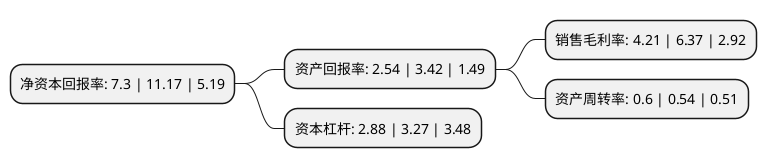

> 本页面由自动化程序生成于 2022年5月20日 01:25
> 内容可能存在错误，如有bug请提交issue至：https://github.com/Eroleice/doc-pi/issues
{.is-warning}

# 上市公司基本情况

## 基本资料

浙江海正药业股份有限公司（以下简称“海正药业”）成立于1998年02月11日，台州市。于2000年07月25日在上交所主板上市。

海正药业注册资本119,603.156万元，主要产品:抗寄生虫药，抗肿瘤药，心血管药，抗感染药。以下是详细信息：

- 公司名称: 浙江海正药业股份有限公司
- 股票代码: 600267.SH
- 所在地: 浙江 - 台州市
- 成立日期: 1998年02月11日
- 注册资本: 119,603.156万元
- 法定代表人: 蒋国平
- 主营业务: 主要产品:抗寄生虫药，抗肿瘤药，心血管药，抗感染药
- 公司官网: www.hisunpharm.com
- 公司介绍: 公司为中国领先的原料药生产企业，是中国最大的抗生素、抗肿瘤药物生产基地之一，研发领域涵盖化学合成、微生物发酵、生物技术、天然植物提取及制剂开发等多个方面，产品治疗领域涉及抗肿瘤、心血管系统、抗感染、抗寄生虫、内分泌调节、免疫抑制、抗抑郁等。与国内30多家知名的科研院校保持着密切的协作关系，在多所大学建有实验室。与美国、日本、欧洲等国外研究机构开展新药合作研究开发，与国外大公司通过项目转移、委托开发等模式进行合作。入选国家首批“创新型企业”、“国家知识产权示范企业”、“全国工业品牌培育示范企业”，列入“全国医药工业百强企业”、“中国化学制药行业工业企业综合实力百强”等。

## 股东及高管情况

上市公司第一大股东为浙江海正集团有限公司，持股320,783,590股，占比26.76%，**疑似为**上市公司实际控制人。

截至2022年05月12日，上市公司的前十大股东中，共有3名自然人股东，5名机构股东，2个海外主体，其中5%以上大股东共有6名。上市公司前十大股东明细如下：

> 未能通过持股比例判定出上市公司实际控制人（持股30%以上）
> 可能存在通过间接持股、联合持股、协议控制等方式拥有实际控制权的主体，具体请参考上市公司定期公告！
{.is-warning}

> 截至2022年05月12日，上市公司前十大股东信息如下：

| 股东名称 | 持股数量（股） | 持股比例 |
| --- | --- | --- |
| 浙江海正集团有限公司 | 320,783,590 | 26.76% |
| 浙江海正集团有限公司 | 320,783,590 | 26.82% |
| HPPC Holding SARL | 143,380,114 | 11.99% |
| HPPC Holding SARL | 119,407,114 | 9.96% |
| 浙江省国际贸易集团有限公司 | 85,799,207 | 7.16% |
| 浙江省国际贸易集团有限公司 | 85,799,207 | 7.17% |
| 台州市椒江区国有资本运营集团有限公司 | 59,931,506 | 5% |
| 张敏 | 4,342,687 | 0.36% |
| 向克坚 | 4,000,000 | 0.33% |
| 郑予 | 3,776,000 | 0.32% |

## 利润表分析

上市公司2021年总收入为121.36亿元，净利润为5.1亿元，实现盈利。

## 杜邦分析

> 数据列示周期：2021年 | 2020年 | 2019年
{.is-info}

上市公司的净资产收益率在近一年有所下降，下降幅度为-34.65%，其变化情况分解如下：
- 上市公司的销售毛利率在近一年下降了-33.91%，可能是生产效率的下降、商品原材料价格上涨或商品价格的下跌所致。
- 上市公司的资产周转率在近一年上升了11.11%，可能是源自于更快的销售回款或库存管理效果提升。
- 上市公司的财务杠杆比率在近一年下降了-11.93%，可能是减少负债降低财务费用。

