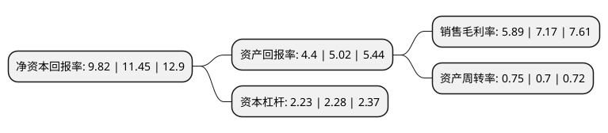

> 本页面由自动化程序生成于 2022年5月20日 01:26
> 内容可能存在错误，如有bug请提交issue至：https://github.com/Eroleice/doc-pi/issues
{.is-warning}

# 上市公司基本情况

## 基本资料

上海现代制药股份有限公司（以下简称“国药现代”）成立于1996年11月27日，上海市。于2004年06月16日在上交所主板上市。

国药现代注册资本102,696.456万元，抗生素，保肝类，降压类，社会品种批发，生化品种。以下是详细信息：

- 公司名称: 上海现代制药股份有限公司
- 股票代码: 600420.SH
- 所在地: 上海 - 上海市
- 成立日期: 1996年11月27日
- 注册资本: 102,696.456万元
- 法定代表人: 周斌
- 主营业务: 抗生素，保肝类，降压类，社会品种批发，生化品种
- 公司官网: www.shyndec.com
- 公司介绍: 公司是一家以原料药和制剂的生产为主业的医药企业。公司产品覆盖原料药和制剂、药物新型制剂和生物药品三大领域，主导产品包括阿奇霉素、硫辛酸、头孢氨苄缓释胶囊、硝苯地平控释片和人尿制品等。公司是国内颇具优势的缓释药技术产品生产厂家，生产的头孢氨苄缓释胶囊销量占国内同类产品市场的一半份额以上，独家生产的硝苯地平控释片广泛用于治疗高血压和心绞痛，知名度较高。公司多个产品被列入国家“九五”重点科技攻关项目、国家级火炬计划项目、上海市高新技术成果转化项目、上海市火炬计划项目，并多次荣获国家重点新产品奖、上海市科技成果奖、上海市优秀新产品奖、上海市名牌产品和上海市医药行业名优产品等。

## 股东及高管情况

上市公司第一大股东为上海医药工业研究院有限公司，持股239,512,622股，占比23.32%，**疑似为**上市公司实际控制人。

截至2022年03月31日，上市公司的前十大股东中，共有3名自然人股东，7名机构股东，其中5%以上大股东共有3名。上市公司前十大股东明细如下：

> 未能通过持股比例判定出上市公司实际控制人（持股30%以上）
> 可能存在通过间接持股、联合持股、协议控制等方式拥有实际控制权的主体，具体请参考上市公司定期公告！
{.is-warning}

> 截至2022年03月31日，上市公司前十大股东信息如下：

| 股东名称 | 持股数量（股） | 持股比例 |
| --- | --- | --- |
| 上海医药工业研究院有限公司 | 239,512,622 | 23.32% |
| 中国医药投资有限公司 | 174,005,559 | 16.94% |
| 国药集团一致药业股份有限公司 | 167,142,202 | 16.28% |
| 韩雁林 | 51,348,139 | 5% |
| 国药控股股份有限公司 | 19,068,440 | 1.86% |
| 山东省国有资产投资控股有限公司 | 15,834,626 | 1.54% |
| 上海广慈医学高科技有限责任公司 | 12,520,000 | 1.22% |
| 沈三和 | 9,129,757 | 0.89% |
| 刘少鸾 | 8,007,901 | 0.78% |
| 上海高东经济发展有限公司 | 7,615,356 | 0.74% |

## 利润表分析

上市公司2021年总收入为139.44亿元，净利润为8.21亿元，实现盈利。

## 杜邦分析

> 数据列示周期：2021年 | 2020年 | 2019年
{.is-info}

上市公司的净资产收益率在近一年有所下降，下降幅度为-14.24%，其变化情况分解如下：
- 上市公司的销售毛利率在近一年下降了-17.85%，可能是生产效率的下降、商品原材料价格上涨或商品价格的下跌所致。
- 上市公司的资产周转率在近一年上升了7.14%，可能是源自于更快的销售回款或库存管理效果提升。
- 上市公司的财务杠杆比率在近一年下降了-2.19%，可能是减少负债降低财务费用。

