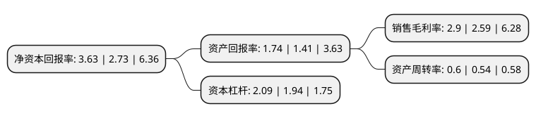

> 本页面由自动化程序生成于 2022年5月20日 01:26
> 内容可能存在错误，如有bug请提交issue至：https://github.com/Eroleice/doc-pi/issues
{.is-warning}

# 上市公司基本情况

## 基本资料

天津天药药业股份有限公司（以下简称“天药股份”）成立于1999年12月01日，天津市。于2001年06月18日在上交所主板上市。

天药股份注册资本110,004.668万元，主要产品:皮质激素，类原料药，心血管类，原料药，水针剂，商品贸易，原料。主营业务为原料药和制剂的生产和销售，出口。以下是详细信息：

- 公司名称: 天津天药药业股份有限公司
- 股票代码: 600488.SH
- 所在地: 天津 - 天津市
- 成立日期: 1999年12月01日
- 注册资本: 110,004.668万元
- 法定代表人: 刘欣
- 主营业务: 主要产品:皮质激素，类原料药，心血管类，原料药，水针剂，商品贸易，原料主营业务为原料药和制剂的生产和销售，出口
- 公司官网: www.tjpcty.com
- 公司介绍: 公司是中国皮质激素类药物的开拓者之一，国内颇具影响力的皮质激素原料药科研、生产和出口基地。2017年公司完成了收购天津金耀药业有限公司的重组项目，实现了从单一“原料药”到“原料药和制剂”业务优势互补、双轮联动的战略转型。公司主要生产皮质激素及氨基酸类原料药，常年生产品种包括地塞米松系列、泼尼松系列、甲泼尼龙系列、倍他米松系列等6大系列30余个皮质激素原料药品种，金耀药业拥有小容量注射剂、软膏剂、乳膏剂、涂膜剂、凝胶剂、膜剂、栓剂、硬胶囊剂、丸剂、冻干粉针剂等14个剂型208个产品文号。公司在天津、新加坡和美国新泽西建立了三家控股销售公司，分别负责公司在欧洲、亚洲和美洲的业务开拓，皮质激素原料药有60%以上出口到亚洲、欧洲、美洲的70多个国家和地区，国内销售覆盖中国近百个城市，具有较强的市场影响力和占有率。金耀药业的制剂产品销售也是覆盖全国，产品品牌享誉国内外。

## 股东及高管情况

上市公司第一大股东为天津药业集团有限公司，持股554,530,149股，占比50.41%，为上市公司实际控制人。

截至2022年03月31日，上市公司的前十大股东中，共有4名自然人股东，5名机构股东，1个海外主体，其中5%以上大股东共有2名。上市公司前十大股东明细如下：

> 截至2022年03月31日，上市公司前十大股东信息如下：

| 股东名称 | 持股数量（股） | 持股比例 |
| --- | --- | --- |
| 天津药业集团有限公司 | 554,530,149 | 50.41% |
| 津沪深生物医药科技有限公司 | 58,206,300 | 5.29% |
| UBS AG | 5,048,696 | 0.46% |
| 天津宜药印务有限公司 | 3,812,802 | 0.35% |
| 李莲子 | 3,367,429 | 0.31% |
| 吴伟立 | 2,855,000 | 0.26% |
| 中国国际金融香港资产管理有限公司 | 2,490,779 | 0.23% |
| 华泰证券股份有限公司 | 2,054,045 | 0.19% |
| 钱海航 | 1,903,160 | 0.17% |
| 张国荣 | 1,643,700 | 0.15% |

## 利润表分析

上市公司2021年总收入为37.48亿元，净利润为1.08亿元，实现盈利。

## 杜邦分析

> 数据列示周期：2021年 | 2020年 | 2019年
{.is-info}

上市公司的净资产收益率在近一年有所上升，上升幅度为32.97%，其变化情况分解如下：
- 上市公司的销售毛利率在近一年上升了11.97%，可能是生产效率的提升、商品原材料价格下跌或商品价格的上涨所致。
- 上市公司的资产周转率在近一年上升了11.11%，可能是源自于更快的销售回款或库存管理效果提升。
- 上市公司的财务杠杆比率在近一年上升了7.73%，可能是增加负债扩大生产规模。

