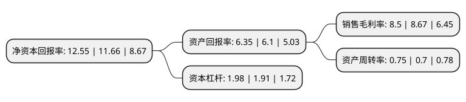

> 本页面由自动化程序生成于 2022年5月20日 01:27
> 内容可能存在错误，如有bug请提交issue至：https://github.com/Eroleice/doc-pi/issues
{.is-warning}

# 上市公司基本情况

## 基本资料

江苏联环药业股份有限公司（以下简称“联环药业”）成立于2000年02月22日，扬州市。于2003年03月19日在上交所主板上市。

联环药业注册资本28,799.037万元，主要产品:敏迪，爱普列特片，达那唑胶囊，联环尔定。以下是详细信息：

- 公司名称: 江苏联环药业股份有限公司
- 股票代码: 600513.SH
- 所在地: 江苏 - 扬州市
- 成立日期: 2000年02月22日
- 注册资本: 28,799.037万元
- 法定代表人: 吴文格
- 主营业务: 主要产品:敏迪，爱普列特片，达那唑胶囊，联环尔定
- 公司官网: www.lhpharma.com
- 公司介绍: 公司历经多年的改革发展，现已茁壮成长为集研发、生产、销售为一体的国家高新技术企业，在国内外医药制造领域享有较高的知名度和美誉度。公司主要产品有泌尿系统药、抗组胺药、心血管药、甾体激素、抗生素等几大系列，涵盖化学原料药和注射剂、冻干制剂及固体制剂多种药物剂型，拥有135个品种规格，包含国家一类新药爱普列特、二类新药依巴斯汀以及非洛地平等核心产品。公司拥有健全严密的质量保证体系和遍布全国的营销网络，拥有经验丰富的国内外销售专业队伍，产品已远销欧美、东南亚、澳大利亚等二十多个国家和地区，在全球都享有良好声誉。

## 股东及高管情况

上市公司第一大股东为江苏联环药业集团有限公司，持股108,718,516股，占比37.75%，为上市公司实际控制人。

截至2022年03月31日，上市公司的前十大股东中，共有5名自然人股东，3名机构股东，1个产品账户，1个海外主体，其中5%以上大股东共有1名。上市公司前十大股东明细如下：

> 截至2022年03月31日，上市公司前十大股东信息如下：

| 股东名称 | 持股数量（股） | 持股比例 |
| --- | --- | --- |
| 江苏联环药业集团有限公司 | 108,718,516 | 37.75% |
| 国药集团药业股份有限公司 | 3,752,073 | 1.3% |
| UBS   AG | 3,139,243 | 1.09% |
| 上海意定投资管理有限公司-上海意志坚定1期全天候证券投资基金 | 2,200,000 | 0.76% |
| 淮海天玺投资管理有限公司 | 1,749,899 | 0.61% |
| 张颖 | 1,285,064 | 0.45% |
| 吴吉林 | 1,052,370 | 0.37% |
| 贺国平 | 1,037,600 | 0.36% |
| 陈峰 | 1,016,300 | 0.35% |
| 翁焕钧 | 832,900 | 0.29% |

## 利润表分析

上市公司2021年总收入为16.45亿元，净利润为1.39亿元，实现盈利。

## 杜邦分析

> 数据列示周期：2021年 | 2020年 | 2019年
{.is-info}

上市公司的净资产收益率在近一年有所上升，上升幅度为7.63%，其变化情况分解如下：
- 上市公司的销售毛利率在近一年下降了-1.96%，可能是生产效率的下降、商品原材料价格上涨或商品价格的下跌所致。
- 上市公司的资产周转率在近一年上升了7.14%，可能是源自于更快的销售回款或库存管理效果提升。
- 上市公司的财务杠杆比率在近一年上升了3.66%，可能是增加负债扩大生产规模。

