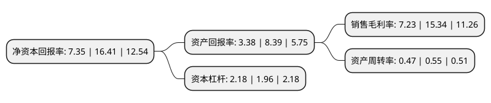

> 本页面由自动化程序生成于 2022年5月20日 01:27
> 内容可能存在错误，如有bug请提交issue至：https://github.com/Eroleice/doc-pi/issues
{.is-warning}

# 上市公司基本情况

## 基本资料

浙江华海药业股份有限公司（以下简称“华海药业”）成立于2001年02月28日，台州市。于2003年03月04日在上交所主板上市。

华海药业注册资本149,175.588万元，主要产品:普利类产品，沙坦类产品，抗忧郁类产品，抗组胺类产品，制剂。以下是详细信息：

- 公司名称: 浙江华海药业股份有限公司
- 股票代码: 600521.SH
- 所在地: 浙江 - 台州市
- 成立日期: 2001年02月28日
- 注册资本: 149,175.588万元
- 法定代表人: 陈保华
- 主营业务: 主要产品:普利类产品，沙坦类产品，抗忧郁类产品，抗组胺类产品，制剂
- 公司官网: www.huahaipharm.com
- 公司介绍: 公司是一家集医药制剂和原料药为一体的制药企业，公司是国家重点高新技术企业，国家创新型企业，浙江省医药工业十强企业，中国民营500强企业，设有“国家级企业技术中心”、“博士后科研工作站”，是中国首家荣获“国家环境友好企业”称号的医药企业。公司在国内首家制剂通过美国FDA认证，并自主拥有ANDA制剂文号，是国内通过美国FDA、欧洲COS、澳大利亚TGA等国际主流市场官方认证最多的制药企业之一，在制剂出口以及国际化发展领域走在了国内医药行业的前列，是目前中国唯一一家能够进行大规模、商业化制剂生产及出口欧美市场的制药企业。公司是国内特色原料药行业的龙头企业，特别是心血管普利类、沙坦类药物领域，公司拥有核心技术，目前在国际上生产品种最多，技术水平领先，是全球最大的普利类和沙坦类药物供应商。

## 股东及高管情况

上市公司第一大股东为陈保华，持股365,697,935股，占比24.51%，**疑似为**上市公司实际控制人。

截至2022年03月31日，上市公司的前十大股东中，共有3名自然人股东，3名机构股东，3个产品账户，1个海外主体，其中5%以上大股东共有2名。上市公司前十大股东明细如下：

> 未能通过持股比例判定出上市公司实际控制人（持股30%以上）
> 可能存在通过间接持股、联合持股、协议控制等方式拥有实际控制权的主体，具体请参考上市公司定期公告！
{.is-warning}

> 截至2022年03月31日，上市公司前十大股东信息如下：

| 股东名称 | 持股数量（股） | 持股比例 |
| --- | --- | --- |
| 陈保华 | 365,697,935 | 24.51% |
| 周明华 | 235,453,890 | 15.78% |
| 中国工商银行股份有限公司-中欧医疗健康混合型证券投资基金 | 28,605,682 | 1.92% |
| 香港中央结算有限公司(陆股通) | 22,053,554 | 1.48% |
| 台州市金融投资集团有限公司 | 16,849,364 | 1.13% |
| 华夏人寿保险股份有限公司-自有资金 | 15,046,063 | 1.01% |
| 中国银行股份有限公司-招商安华债券型证券投资基金 | 14,486,638 | 0.97% |
| 中国银行股份有限公司-嘉实领先优势混合型证券投资基金 | 12,859,135 | 0.86% |
| 临海市金融投资有限公司 | 9,145,526 | 0.61% |
| 苏春莲 | 8,793,379 | 0.59% |

## 利润表分析

上市公司2021年总收入为66.43亿元，净利润为4.8亿元，实现盈利。

## 杜邦分析

> 数据列示周期：2021年 | 2020年 | 2019年
{.is-info}

上市公司的净资产收益率在近一年有所下降，下降幅度为-55.21%，其变化情况分解如下：
- 上市公司的销售毛利率在近一年下降了-52.87%，可能是生产效率的下降、商品原材料价格上涨或商品价格的下跌所致。
- 上市公司的资产周转率在近一年下降了-14.55%，可能是源自于更慢的销售回款或库存管理效果下降。
- 上市公司的财务杠杆比率在近一年上升了11.22%，可能是增加负债扩大生产规模。

