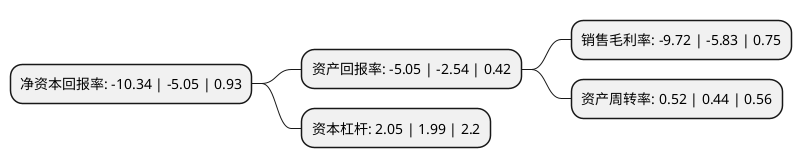

> 本页面由自动化程序生成于 2022年5月20日 01:27
> 内容可能存在错误，如有bug请提交issue至：https://github.com/Eroleice/doc-pi/issues
{.is-warning}

# 上市公司基本情况

## 基本资料

上海复旦复华科技股份有限公司（以下简称“复旦复华”）成立于1990年11月17日，上海市。于1993年01月05日在上交所主板上市。

复旦复华注册资本68,471.201万元，主营业务:制造业，园区房地产，软件开发。以下是详细信息：

- 公司名称: 上海复旦复华科技股份有限公司
- 股票代码: 600624.SH
- 所在地: 上海 - 上海市
- 成立日期: 1990年11月17日
- 注册资本: 68,471.201万元
- 法定代表人: 褚建平
- 主营业务: 主营业务:制造业，园区房地产，软件开发
- 公司官网: www.forwardgroup.com
- 公司介绍: 公司是复旦大学控股的上市公司，是全国高校第一家上市公司。依托复旦大学雄厚的科研、技术、人才优势，历经初创拓展、改制上市、调整转型、全面发展，复旦复华在“发展高科技、实现产业化”的探索与实践中，成功确立了以软件开发、生物医药、园区房产为核心的科技产业体系，目前已拥有中国重要的对日软件出口平台，具有科技创新能力的药品研发、生产、营销基地，以及广纳国内外高新技术企业的国家级高新技术园区。药业公司专注于做专科药、特色药，围绕消化系统药物、神经系统用药物、抗肿瘤药物、循环系统药物等核心治疗领域，研发生产了注射用还原型谷胱甘肽、双益平、氟他胺片、枸橼酸他莫昔芬片、雷公藤多苷片、心脑舒通片等药品，注射用还原型谷胱甘肽等多个重点产品的市场占有率在国内同类产品中居于前列。中和软件拥有以期生培训制度为核心的人才培养机制，经过二十多年的发展，形成了强大的SE的团队优势，在对日软件外包市场上具有极强的竞争力。公司从事高新技术园区建设及相关房产开发二十多年，在相关领域积累了丰富的运作经验，在嘉定拥有国内首家由企业创办的高新技术园区—国家级上海复华高新技术园区。

## 股东及高管情况

上市公司第一大股东为上海奉贤投资(集团)有限公司，持股128,338,600股，占比18.74%，**疑似为**上市公司实际控制人。

截至2022年03月31日，上市公司的前十大股东中，共有2名自然人股东，3名机构股东，5个产品账户，其中5%以上大股东共有2名。上市公司前十大股东明细如下：

> 未能通过持股比例判定出上市公司实际控制人（持股30%以上）
> 可能存在通过间接持股、联合持股、协议控制等方式拥有实际控制权的主体，具体请参考上市公司定期公告！
{.is-warning}

> 截至2022年03月31日，上市公司前十大股东信息如下：

| 股东名称 | 持股数量（股） | 持股比例 |
| --- | --- | --- |
| 上海奉贤投资(集团)有限公司 | 128,338,600 | 18.74% |
| 上海上科科技投资有限公司 | 69,206,536 | 10.11% |
| 上海复旦复控科技产业控股有限公司 | 17,656,000 | 2.58% |
| 深圳金善银股权投资基金管理有限公司-金善银金沙私募证券投资基金 | 7,690,765 | 1.12% |
| 上海复旦复华科技股份有限公司回购专用证券账户 | 5,365,068 | 0.78% |
| 上海阿杏投资管理有限公司-阿杏延安10号私募证券投资基金 | 5,250,363 | 0.77% |
| 上海阿杏投资管理有限公司-阿杏朝阳7号私募证券投资基金 | 5,107,530 | 0.75% |
| 深圳前海千惠资产管理有限公司-千惠盛景二号私募证券投资基金 | 4,942,386 | 0.72% |
| 孙勤勇 | 4,649,425 | 0.68% |
| 林乐民 | 4,271,753 | 0.62% |

## 利润表分析

上市公司2021年总收入为10.41亿元，净利润为-1.02亿元，**未实现盈利**。

## 杜邦分析

> 数据列示周期：2021年 | 2020年 | 2019年
{.is-info}

上市公司的净资产收益率在近一年有所上升，上升幅度为104.75%，其变化情况分解如下：
- 上市公司的销售毛利率在近一年上升了66.72%，可能是生产效率的提升、商品原材料价格下跌或商品价格的上涨所致。
- 上市公司的资产周转率在近一年上升了18.18%，可能是源自于更快的销售回款或库存管理效果提升。
- 上市公司的财务杠杆比率在近一年上升了3.02%，可能是增加负债扩大生产规模。

