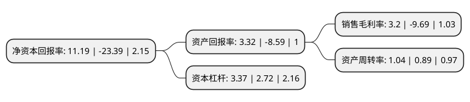

> 本页面由自动化程序生成于 2022年5月20日 01:28
> 内容可能存在错误，如有bug请提交issue至：https://github.com/Eroleice/doc-pi/issues
{.is-warning}

# 上市公司基本情况

## 基本资料

哈药集团股份有限公司（以下简称“哈药股份”）成立于1991年12月28日，哈尔滨市。于1993年06月29日在上交所主板上市。

哈药股份注册资本251,965.108万元，主要产品:中药，西药，保健品。以下是详细信息：

- 公司名称: 哈药集团股份有限公司
- 股票代码: 600664.SH
- 所在地: 黑龙江 - 哈尔滨市
- 成立日期: 1991年12月28日
- 注册资本: 251,965.108万元
- 法定代表人: 徐海瑛
- 主营业务: 主要产品:中药，西药，保健品
- 公司官网: www.hayao.com
- 公司介绍: 公司是全国医药行业首家上市公司,也是黑龙江省首家上市公司。公司主营涵盖抗生素、非处方药及保健品、传统与现代中药、生物医药及医药商业等业务板块。主导产品有注射用盐酸头孢替安、葡萄糖酸钙口服液、葡萄糖酸锌口服液、前列地尔注射液、护彤、高钙片、双黄连粉针、注射用丹参等。公司旗下拥有哈药人民同泰(上市公司)、哈药总厂、哈药三精、哈药六厂、哈药中药二厂、哈药世一堂、哈药生物、哈药三精明水制药、哈药三精千鹤制药、哈药营销公司等分子公司。还拥有一个科研力量雄厚的药物研究院，注重于抗生素、现代中药、生物制药等高新技术领域的创新研发。其所属生产企业已全部通过新版GMP认证。拥有“哈药”、“三精”、“盖中盖”、“护彤”及“世一堂”等中国著名商标。

## 股东及高管情况

上市公司第一大股东为哈药集团有限公司，持股1,173,237,023股，占比46.56%，为上市公司实际控制人。

截至2022年03月31日，上市公司的前十大股东中，共有4名自然人股东，4名机构股东，1个产品账户，1个海外主体，其中5%以上大股东共有1名。上市公司前十大股东明细如下：

> 截至2022年03月31日，上市公司前十大股东信息如下：

| 股东名称 | 持股数量（股） | 持股比例 |
| --- | --- | --- |
| 哈药集团有限公司 | 1,173,237,023 | 46.56% |
| 中国证券投资者保护基金有限责任公司 | 55,725,125 | 2.21% |
| 夏重阳 | 41,620,000 | 1.65% |
| 浙江省财务开发有限责任公司 | 23,883,418 | 0.95% |
| 孙锟 | 22,800,071 | 0.9% |
| 上海城建置业发展有限公司 | 16,055,000 | 0.64% |
| 练勇 | 15,695,712 | 0.62% |
| MORGAN STANLEY & CO. INTERNATIONAL   PLC. | 12,427,735 | 0.49% |
| 哈尔滨天翔伟业投资有限公司 | 11,700,000 | 0.46% |
| 彭晓梅 | 8,108,967 | 0.32% |

## 利润表分析

上市公司2021年总收入为128.02亿元，净利润为4.09亿元，实现盈利。

## 杜邦分析

> 数据列示周期：2021年 | 2020年 | 2019年
{.is-info}

上市公司的净资产收益率在近一年有所下降，下降幅度为-147.84%，其变化情况分解如下：
- 上市公司的销售毛利率在近一年下降了-133.02%，可能是生产效率的下降、商品原材料价格上涨或商品价格的下跌所致。
- 上市公司的资产周转率在近一年上升了16.85%，可能是源自于更快的销售回款或库存管理效果提升。
- 上市公司的财务杠杆比率在近一年上升了23.9%，可能是增加负债扩大生产规模。

