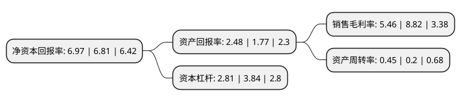

> 本页面由自动化程序生成于 2022年5月20日 01:28
> 内容可能存在错误，如有bug请提交issue至：https://github.com/Eroleice/doc-pi/issues
{.is-warning}

# 上市公司基本情况

## 基本资料

汉商集团股份有限公司（以下简称“汉商集团”）成立于1990年04月20日，武汉市。于1996年11月08日在上交所主板上市。

汉商集团注册资本29,503.24万元，主要业务:零售业，会展业，地产业及旅业等业务。以下是详细信息：

- 公司名称: 汉商集团股份有限公司
- 股票代码: 600774.SH
- 所在地: 湖北 - 武汉市
- 成立日期: 1990年04月20日
- 注册资本: 29,503.24万元
- 法定代表人: 阎志
- 主营业务: 零售业，会展业，地产业及旅业等业务
- 公司官网: www.whhsg.com
- 公司介绍: 公司是一家集零售业、会展业、地产业、婚庆旅游业于一体的商业上市公司。公司及子公司所从事的主要业务是零售、会展、商业地产，零售主营业态有百货商场、购物中心和专业店，经营模式是联营+租赁+品牌代理。公司上下树立从追赶到超越发展的雄心壮志，进一步明晰“优质资产+优秀团队=市场竞争力”的发展模式，保持汉商的经营特色、文化特色、组织特色和作风特色，以“提质、提效、提速”为主题，继续围绕“三圈一心”的优质资源，做实做强零售、会展、商业地产等主业，强力推进21世纪购物中心扩建、银座2号、知音站台、咸宁温泉山庄改造等项目，全力拓展婚庆、酒店、物业、自营等业务。公司先后荣获全国商业先进企业、国家二级企业、全国“五·一”劳动奖状、中国商业名牌企业等荣誉称号。

## 股东及高管情况

上市公司第一大股东为武汉市汉阳投资发展集团有限公司，持股79,444,603股，占比26.93%，**疑似为**上市公司实际控制人。

截至2022年03月31日，上市公司的前十大股东中，共有2名自然人股东，4名机构股东，4个产品账户，其中5%以上大股东共有3名。上市公司前十大股东明细如下：

> 未能通过持股比例判定出上市公司实际控制人（持股30%以上）
> 可能存在通过间接持股、联合持股、协议控制等方式拥有实际控制权的主体，具体请参考上市公司定期公告！
{.is-warning}

> 截至2022年03月31日，上市公司前十大股东信息如下：

| 股东名称 | 持股数量（股） | 持股比例 |
| --- | --- | --- |
| 武汉市汉阳投资发展集团有限公司 | 79,444,603 | 26.93% |
| 卓尔控股有限公司 | 45,389,595 | 15.38% |
| 阎志 | 44,254,715 | 15% |
| 上海华汯资产管理有限公司-华汯格致精一私募投资基金 | 8,178,438 | 2.77% |
| 周升俊 | 7,509,293 | 2.55% |
| 宇业资产管理有限公司 | 7,434,944 | 2.52% |
| 上海驰泰资产管理有限公司-淄博驰泰诚运证券投资合伙企业(有限合伙) | 7,434,944 | 2.52% |
| 上海驰泰资产管理有限公司-驰泰卓越二号私募证券投资基金 | 7,434,944 | 2.52% |
| 圆信永丰基金-青岛中鉅投资有限公司-圆信永丰金水木阳1号单一资产管理计划 | 4,416,356 | 1.5% |
| 上海驰泰资产管理有限公司-驰泰量化价值一号私募证券投资基金 | 3,717,472 | 1.26% |

## 利润表分析

上市公司2021年总收入为14.75亿元，净利润为0.8亿元，实现盈利。

## 杜邦分析

> 数据列示周期：2021年 | 2020年 | 2019年
{.is-info}

上市公司的净资产收益率在近一年有所上升，上升幅度为2.35%，其变化情况分解如下：
- 上市公司的销售毛利率在近一年下降了-38.1%，可能是生产效率的下降、商品原材料价格上涨或商品价格的下跌所致。
- 上市公司的资产周转率在近一年上升了125%，可能是源自于更快的销售回款或库存管理效果提升。
- 上市公司的财务杠杆比率在近一年下降了-26.82%，可能是减少负债降低财务费用。

