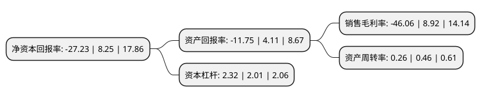

> 本页面由自动化程序生成于 2022年5月20日 01:29
> 内容可能存在错误，如有bug请提交issue至：https://github.com/Eroleice/doc-pi/issues
{.is-warning}

# 上市公司基本情况

## 基本资料

辅仁药业集团制药股份有限公司（以下简称“ST辅仁”）成立于1993年08月13日，周口市。于1996年12月18日在上交所主板上市。

ST辅仁注册资本62,715.751万元，以子公司辅仁堂的中成药生产与销售为主，公司主要产品是各类中成药，同时提供仓储服务。以下是详细信息：

- 公司名称: 辅仁药业集团制药股份有限公司
- 股票代码: 600781.SH
- 所在地: 河南 - 周口市
- 成立日期: 1993年08月13日
- 注册资本: 62,715.751万元
- 法定代表人: 朱成功
- 主营业务: 以子公司辅仁堂的中成药生产与销售为主，公司主要产品是各类中成药，同时提供仓储服务
- 公司官网: www.shfuren.cn
- 公司介绍: 公司是一家以药业、酒业为主导，集研发、生产、经营、投资、管理于一体的综合性集团公司。辅仁药业集团一直遵循“济世药为辅惠民志在仁”的企业理念，以“专门、专业、专注”的产业发展方向，以一系列精准巧妙的加法“加”出了一个产业体系。公司产品涵盖了中西药制剂、生化制药、生物制药、原料药等多个门类，“辅仁”商标被认定为中国驰名商标。2017年公司通过资产重组，持有开药集团100%股权，上市公司主营业务从较为单一的中成药业务拓展到综合性医药业务，将显著提升上市公司抗风险能力，扩展未来发展空间。

## 股东及高管情况

上市公司第一大股东为辅仁药业集团有限公司，持股63,358,881股，占比10.1025%，**疑似为**上市公司实际控制人。

截至2022年02月21日，上市公司的前十大股东中，共有10名机构股东，其中5%以上大股东共有10名。上市公司前十大股东明细如下：

> 未能通过持股比例判定出上市公司实际控制人（持股30%以上）
> 可能存在通过间接持股、联合持股、协议控制等方式拥有实际控制权的主体，具体请参考上市公司定期公告！
{.is-warning}

> 截至2022年02月21日，上市公司前十大股东信息如下：

| 股东名称 | 持股数量（股） | 持股比例 |
| --- | --- | --- |
| 辅仁药业集团有限公司 | 63,358,881 | 10.1025% |
| 辅仁药业集团有限公司 | 63,358,881 | 10.1025% |
| 上海耘林融资租赁有限公司 | 46,000,000 | 7.33% |
| 上海耘林融资租赁有限公司 | 46,000,000 | 7.33% |
| 河南标木建材销售有限公司 | 40,000,000 | 6.38% |
| 河南标木建材销售有限公司 | 40,000,000 | 6.38% |
| 河南标木建材销售有限公司 | 40,000,000 | 6.38% |
| 深圳市平嘉鑫元股权投资合伙企业(有限合伙) | 33,398,147 | 5.3253% |
| 河南泊之品商贸有限公司 | 31,900,000 | 5.09% |
| 河南泊之品商贸有限公司 | 31,900,000 | 5.09% |

## 利润表分析

上市公司2020年总收入为28.9亿元，净利润为-13.32亿元，**未实现盈利**。

## 杜邦分析

> 数据列示周期：2020年 | 2019年 | 2018年
{.is-info}

上市公司的净资产收益率在近一年有所下降，下降幅度为-430.06%，其变化情况分解如下：
- 上市公司的销售毛利率在近一年下降了-616.37%，可能是生产效率的下降、商品原材料价格上涨或商品价格的下跌所致。
- 上市公司的资产周转率在近一年下降了-43.48%，可能是源自于更慢的销售回款或库存管理效果下降。
- 上市公司的财务杠杆比率在近一年上升了15.42%，可能是增加负债扩大生产规模。

