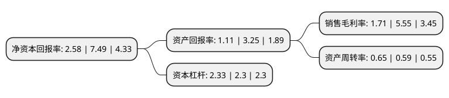

> 本页面由自动化程序生成于 2022年5月20日 01:29
> 内容可能存在错误，如有bug请提交issue至：https://github.com/Eroleice/doc-pi/issues
{.is-warning}

# 上市公司基本情况

## 基本资料

山东鲁抗医药股份有限公司（以下简称“鲁抗医药”）成立于1993年02月15日，济宁市。于1997年02月26日在上交所主板上市。

鲁抗医药注册资本88,155.737万元，普药及半合抗原料药，普药及半合抗制剂，兽用抗生素。以下是详细信息：

- 公司名称: 山东鲁抗医药股份有限公司
- 股票代码: 600789.SH
- 所在地: 山东 - 济宁市
- 成立日期: 1993年02月15日
- 注册资本: 88,155.737万元
- 法定代表人: 彭欣
- 主营业务: 普药及半合抗原料药，普药及半合抗制剂，兽用抗生素
- 公司官网: www.lkpc.com
- 公司介绍: 公司大股东鲁抗医药集团是中国重要的抗生素生产基地。公司生产经营人用抗生素、半合成抗生素、兽用农用抗生素、生物技术药品以及抗生素相关制剂、医药中间体、药用树脂、葡萄糖等；全部生产车间均已全面通过ISO9001质量体系认证、ISO14000环境体系认证和OSHMS职业健康安全体系认证、GMP认证和GSP认证，青霉素钠原料药及粉针获得国家质量金奖，酒石酸泰乐霉素、大观霉素原料药获得欧盟CEP证书，大观霉素通过德国cGMP认证，AIV、盐酸大观霉素均通过美国FDA认证。主要产品：青霉素、链霉素、乙酰螺旋霉素、大观霉素、盐霉素、泰乐霉素等已形成规模优势；产品国内销售分布华东、华北、华南、东北、西北、西南等地区，并出口远销欧洲、北美洲和东南亚。“鲁抗”牌商标是“中国驰名商标”，被评为“商务部重点培育和发展的出口名牌”，先后获得了“全国质量效益型先进企业”、“全国用户满意企业”、“全国医药优秀企业”等荣誉称号。

## 股东及高管情况

上市公司第一大股东为华鲁控股集团有限公司，持股185,896,620股，占比21.09%，**疑似为**上市公司实际控制人。

截至2022年03月31日，上市公司的前十大股东中，共有5名自然人股东，3名机构股东，1个产品账户，1个海外主体，其中5%以上大股东共有1名。上市公司前十大股东明细如下：

> 未能通过持股比例判定出上市公司实际控制人（持股30%以上）
> 可能存在通过间接持股、联合持股、协议控制等方式拥有实际控制权的主体，具体请参考上市公司定期公告！
{.is-warning}

> 截至2022年03月31日，上市公司前十大股东信息如下：

| 股东名称 | 持股数量（股） | 持股比例 |
| --- | --- | --- |
| 华鲁控股集团有限公司 | 185,896,620 | 21.09% |
| 华鲁投资发展有限公司 | 28,108,107 | 3.19% |
| 富诚海富资管-山东发展投资控股集团有限公司-富诚海富通新逸二号单一资产管理计划 | 8,800,000 | 1% |
| 山东发展投资控股集团有限公司 | 7,025,508 | 0.8% |
| 姜志丹 | 4,040,640 | 0.46% |
| UBS   AG | 2,763,643 | 0.31% |
| 周华 | 2,126,600 | 0.24% |
| 苗文政 | 2,002,000 | 0.23% |
| 张素珍 | 2,000,070 | 0.23% |
| 尹作雄 | 1,769,530 | 0.2% |

## 利润表分析

上市公司2021年总收入为48.9亿元，净利润为0.83亿元，实现盈利。

## 杜邦分析

> 数据列示周期：2021年 | 2020年 | 2019年
{.is-info}

上市公司的净资产收益率在近一年有所下降，下降幅度为-65.55%，其变化情况分解如下：
- 上市公司的销售毛利率在近一年下降了-69.19%，可能是生产效率的下降、商品原材料价格上涨或商品价格的下跌所致。
- 上市公司的资产周转率在近一年上升了10.17%，可能是源自于更快的销售回款或库存管理效果提升。
- 上市公司的财务杠杆比率在近一年上升了1.3%，可能是增加负债扩大生产规模。

