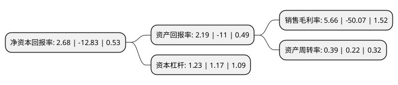

> 本页面由自动化程序生成于 2022年5月20日 01:33
> 内容可能存在错误，如有bug请提交issue至：https://github.com/Eroleice/doc-pi/issues
{.is-warning}

# 上市公司基本情况

## 基本资料

浙江莎普爱思药业股份有限公司（以下简称“莎普爱思”）成立于2000年07月17日，嘉兴市。于2014年07月02日在上交所主板上市。

莎普爱思注册资本32,259.25万元，主营业务为滴眼液与大输液系列产品的研发，生产和销售，主要产品包括预防，治疗白内障的莎普爱思滴眼液等系列眼科药品，葡萄糖注射液，氯化钠注射液，乳酸左氧氟沙星注射液，甲磺酸帕珠沙星注射液等大输液制剂。以下是详细信息：

- 公司名称: 浙江莎普爱思药业股份有限公司
- 股票代码: 603168.SH
- 所在地: 浙江 - 嘉兴市
- 成立日期: 2000年07月17日
- 注册资本: 32,259.25万元
- 法定代表人: 鄢标
- 主营业务: 主营业务为滴眼液与大输液系列产品的研发，生产和销售，主要产品包括预防，治疗白内障的莎普爱思滴眼液等系列眼科药品，葡萄糖注射液，氯化钠注射液，乳酸左氧氟沙星注射液，甲磺酸帕珠沙星注射液等大输液制剂
- 公司官网: www.zjspas.com
- 公司介绍: 公司的主营业务为滴眼液与大输液系列产品的研发、生产和销售。公司产品主要涵盖眼科用药(抗白内障类)、抗微生物药(头孢菌素类)、抗微生物药(喹诺酮类)和调节水、电解质及酸碱平衡药等细分治疗领域，主要产品包括莎普爱思滴眼液、大输液和头孢克肟产品等，其中莎普爱思滴眼液在抗白内障药物市场中处于领先地位。核心产品抗白内障药物莎普爱思滴眼液被列入国家火炬计划、国家重点新产品计划，是国家二类新药，商标“莎普爱思”是国家工商行政管理总局认定的中国驰名商标。公司先后被评为“国家高新技术企业”、“浙江省标准创新型企业”、“浙江省百家最具投资价值企业”、“浙江省绿色企业”、“浙江省知名商号”、“浙江省商标品牌示范企业”、“嘉兴市重点企业技术创新团队”、“专家院士工作站”等荣誉。

## 股东及高管情况

上市公司第一大股东为陈德康，持股52,572,504股，占比16.3%，**疑似为**上市公司实际控制人。

截至2022年03月31日，上市公司的前十大股东中，共有5名自然人股东，5名机构股东，其中5%以上大股东共有5名。上市公司前十大股东明细如下：

> 未能通过持股比例判定出上市公司实际控制人（持股30%以上）
> 可能存在通过间接持股、联合持股、协议控制等方式拥有实际控制权的主体，具体请参考上市公司定期公告！
{.is-warning}

> 截至2022年03月31日，上市公司前十大股东信息如下：

| 股东名称 | 持股数量（股） | 持股比例 |
| --- | --- | --- |
| 陈德康 | 52,572,504 | 16.3% |
| 上海养和实业有限公司 | 31,154,075 | 9.66% |
| 上海谊和医疗管理有限公司 | 23,365,557 | 7.24% |
| 上海景兴实业投资有限公司 | 21,072,390 | 6.53% |
| 上海同辉医疗管理有限公司 | 17,524,167 | 5.43% |
| 胡正国 | 9,250,000 | 2.87% |
| 王泉平 | 5,511,000 | 1.71% |
| 王璐 | 2,915,300 | 0.9% |
| 浙江商裕投资管理有限公司 | 2,499,999 | 0.77% |
| 谢雨皓 | 2,434,931 | 0.75% |

## 利润表分析

上市公司2021年总收入为6.29亿元，净利润为0.35亿元，实现盈利。

## 杜邦分析

> 数据列示周期：2021年 | 2020年 | 2019年
{.is-info}

上市公司的净资产收益率在近一年有所下降，下降幅度为-120.89%，其变化情况分解如下：
- 上市公司的销售毛利率在近一年下降了-111.3%，可能是生产效率的下降、商品原材料价格上涨或商品价格的下跌所致。
- 上市公司的资产周转率在近一年上升了77.27%，可能是源自于更快的销售回款或库存管理效果提升。
- 上市公司的财务杠杆比率在近一年上升了5.13%，可能是增加负债扩大生产规模。

