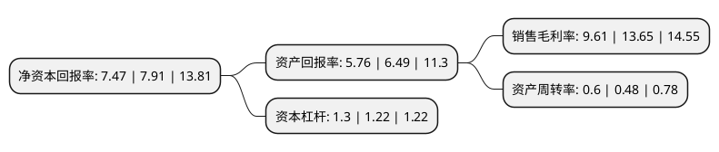

> 本页面由自动化程序生成于 2022年5月20日 01:33
> 内容可能存在错误，如有bug请提交issue至：https://github.com/Eroleice/doc-pi/issues
{.is-warning}

# 上市公司基本情况

## 基本资料

南京威尔药业集团股份有限公司（以下简称“威尔药业”）成立于2000年02月18日，南京市。于2019年01月30日在上交所主板上市。

威尔药业注册资本13,547.843万元，主营业务:专注于药用辅料及合成润滑基础油产品的研发，生产和销售。主要产品:高安全性，多功能性的药用辅料，为润滑油企业提供性能卓越的合成润滑基础油。以下是详细信息：

- 公司名称: 南京威尔药业集团股份有限公司
- 股票代码: 603351.SH
- 所在地: 江苏 - 南京市
- 成立日期: 2000年02月18日
- 注册资本: 13,547.843万元
- 法定代表人: 吴仁荣
- 主营业务: 主营业务:专注于药用辅料及合成润滑基础油产品的研发，生产和销售主要产品:高安全性，多功能性的药用辅料，为润滑油企业提供性能卓越的合成润滑基础油
- 公司官网: www.well-js.com
- 公司介绍: 公司创立于2000年2月，由南京威尔化工有限公司股份制改造而整体变更设立，现位于国家级南京江北新区南京化学工业园区。致力于药用辅料、高级合成润滑油基础油等特种精细化学新材料的研发、制造和服务。药用辅料产品应用辐射全国医药行业各大制药企业，合成润滑油基础油主要应用于我国特种作业机械、航空航天及军工机械、空调压缩机等领域用润滑油企业，部分合成润滑油基础油产品远销欧、美、东南亚等海外市场，公司为江苏省认定的高新技术企业、江苏省民营科技企业、江苏省文明单位。

## 股东及高管情况

上市公司第一大股东为吴仁荣，持股18,521,981股，占比13.67%，**疑似为**上市公司实际控制人。

截至2022年03月31日，上市公司的前十大股东中，共有7名自然人股东，1名机构股东，2个产品账户，其中5%以上大股东共有6名。上市公司前十大股东明细如下：

> 未能通过持股比例判定出上市公司实际控制人（持股30%以上）
> 可能存在通过间接持股、联合持股、协议控制等方式拥有实际控制权的主体，具体请参考上市公司定期公告！
{.is-warning}

> 截至2022年03月31日，上市公司前十大股东信息如下：

| 股东名称 | 持股数量（股） | 持股比例 |
| --- | --- | --- |
| 吴仁荣 | 18,521,981 | 13.67% |
| 唐群松 | 14,111,986 | 10.42% |
| 陈新国 | 14,111,986 | 10.42% |
| 高正松 | 14,111,986 | 10.42% |
| 南京舜泰宗华企业管理中心(有限合伙) | 10,142,990 | 7.49% |
| 沈九四 | 7,174,000 | 5.3% |
| 雷立军 | 4,377,720 | 3.23% |
| 吴荣文 | 2,980,000 | 2.2% |
| 中国工商银行股份有限公司-中欧医疗健康混合型证券投资基金 | 1,889,375 | 1.39% |
| 华泰证券股份有限公司-中庚价值领航混合型证券投资基金 | 1,000,344 | 0.74% |

## 利润表分析

上市公司2021年总收入为10.42亿元，净利润为1亿元，实现盈利。

## 杜邦分析

> 数据列示周期：2021年 | 2020年 | 2019年
{.is-info}

上市公司的净资产收益率在近一年有所下降，下降幅度为-5.56%，其变化情况分解如下：
- 上市公司的销售毛利率在近一年下降了-29.6%，可能是生产效率的下降、商品原材料价格上涨或商品价格的下跌所致。
- 上市公司的资产周转率在近一年上升了25%，可能是源自于更快的销售回款或库存管理效果提升。
- 上市公司的财务杠杆比率在近一年上升了6.56%，可能是增加负债扩大生产规模。

