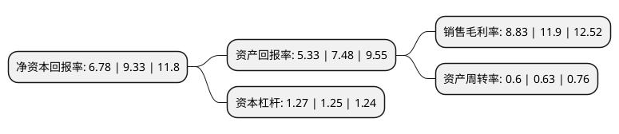

> 本页面由自动化程序生成于 2022年5月20日 01:34
> 内容可能存在错误，如有bug请提交issue至：https://github.com/Eroleice/doc-pi/issues
{.is-warning}

# 上市公司基本情况

## 基本资料

辰欣药业股份有限公司（以下简称“辰欣药业”）成立于1998年11月06日，济宁市。于2017年09月29日在上交所主板上市。

辰欣药业注册资本45,333.3万元，主营业务:医药产品的研发，生产和销售，以生产化学药品制剂为主;主要产品:大容量注射剂(包括非PVC软袋，塑瓶，玻瓶)，冻干粉针剂，小容量注射剂，片剂，胶囊剂，膏剂，滴剂和原料药等8大剂型276个品种405个规格的产品。以下是详细信息：

- 公司名称: 辰欣药业股份有限公司
- 股票代码: 603367.SH
- 所在地: 山东 - 济宁市
- 成立日期: 1998年11月06日
- 注册资本: 45,333.3万元
- 法定代表人: 杜振新
- 主营业务: 主营业务:医药产品的研发，生产和销售，以生产化学药品制剂为主;主要产品:大容量注射剂(包括非PVC软袋，塑瓶，玻瓶)，冻干粉针剂，小容量注射剂，片剂，胶囊剂，膏剂，滴剂和原料药等8大剂型276个品种405个规格的产品
- 公司官网: www.cisen-pharma.com
- 公司介绍: 公司是一家集研发、生产、销售于一体的综合性制药企业。公司现为国家认定企业技术中心，中国化学制药工业协会副会长单位、中国制药工业百强企业、国家级高新技术企业，国家守合同重信用企业，设有博士后科研工作站、院士工作站及山东省泰山学者药学特聘专家岗位，拥有静脉营养大容量注射剂国家地方联合工程实验室、山东省抗生素工程技术研究中心及山东省静脉营养大容量注射剂工程实验室，并获得国家认可评定委员会(CNAS)认可证书。

## 股东及高管情况

上市公司第一大股东为辰欣科技集团有限公司，持股165,673,200股，占比36.55%，为上市公司实际控制人。

截至2022年03月31日，上市公司的前十大股东中，共有4名自然人股东，5名机构股东，1个产品账户，其中5%以上大股东共有4名。上市公司前十大股东明细如下：

> 截至2022年03月31日，上市公司前十大股东信息如下：

| 股东名称 | 持股数量（股） | 持股比例 |
| --- | --- | --- |
| 辰欣科技集团有限公司 | 165,673,200 | 36.55% |
| 四川科伦药业股份有限公司 | 45,335,300 | 10% |
| 石家庄四药有限公司 | 27,661,441 | 6.1% |
| 天津乾鼎企业管理合伙企业(有限合伙) | 26,539,650 | 5.85% |
| 赵白雪 | 7,700,000 | 1.7% |
| 庞冠丽 | 4,617,600 | 1.02% |
| 包头市龙邦贸易有限责任公司 | 3,773,000 | 0.83% |
| 付强 | 2,652,600 | 0.59% |
| 招商银行股份有限公司-宝盈成长精选混合型证券投资基金 | 2,439,999 | 0.54% |
| 王瑞腾 | 2,053,158 | 0.45% |

## 利润表分析

上市公司2021年总收入为37.82亿元，净利润为3.33亿元，实现盈利。

## 杜邦分析

> 数据列示周期：2021年 | 2020年 | 2019年
{.is-info}

上市公司的净资产收益率在近一年有所下降，下降幅度为-27.33%，其变化情况分解如下：
- 上市公司的销售毛利率在近一年下降了-25.8%，可能是生产效率的下降、商品原材料价格上涨或商品价格的下跌所致。
- 上市公司的资产周转率在近一年下降了-4.76%，可能是源自于更慢的销售回款或库存管理效果下降。
- 上市公司的财务杠杆比率在近一年上升了1.6%，可能是增加负债扩大生产规模。

