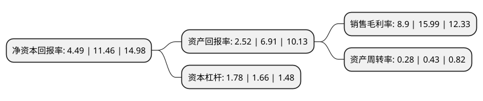

> 本页面由自动化程序生成于 2022年5月20日 01:35
> 内容可能存在错误，如有bug请提交issue至：https://github.com/Eroleice/doc-pi/issues
{.is-warning}

# 上市公司基本情况

## 基本资料

灵康药业集团股份有限公司（以下简称“灵康药业”）成立于2003年12月24日，山南市。于2015年05月28日在上交所主板上市。

灵康药业注册资本72,122.773万元，主营业务;主要从事化药处方药的研发，生产和销售。主要产品:集中在肠外营养类，抗感染类以及消化系统类三大药品领域。以下是详细信息：

- 公司名称: 灵康药业集团股份有限公司
- 股票代码: 603669.SH
- 所在地: 西藏 - 山南市
- 成立日期: 2003年12月24日
- 注册资本: 72,122.773万元
- 法定代表人: 陶灵萍
- 主营业务: 主营业务;主要从事化药处方药的研发，生产和销售主要产品:集中在肠外营养类，抗感染类以及消化系统类三大药品领域
- 公司官网: www.lingkang.com.cn
- 公司介绍: 公司是一家集医药研发、生产、销售为一体的创新型集团企业。经过多年的创业和发展，成为中国医药行业中具备雄厚实力的高科技、高成长的集团型企业。公司先后获得了“国家级高新技术企业”“中国新型工业化贡献奖”、“中国专利优秀奖”、“实施名牌战略先进单位称号”、“海南省工业质量效益型示范企业”、“海口市创新型企业”等荣誉。公司主导产品“注射用丙氨酰谷氨酰胺”荣获科技部“国家重点新产品”、“注射用果糖”荣获科技部“国家火炬计划项目”。公司研发的多个医药产品获得“科学技术进步奖”。公司商标“欣坤畅”和“瑞勃奇”等多个商标被海南省政府认定为海南省著名商标。公司拥有180个批文，拥有普通粉针车间、头孢粉针车间、头孢冻干粉针车间、普通冻干粉针车间、小容量注射剂车间、口服固体制剂车间、头孢原料车间、普通原料车间等八个车间，全部通过国家GMP认证。其中冻干生产线的技术水平和生产能力达到国际先进、国内领先水平，医药营养类产品的市场份额居行业领先地位。

## 股东及高管情况

上市公司第一大股东为灵康控股集团有限公司，持股339,652,800股，占比47.09%，为上市公司实际控制人。

截至2022年03月31日，上市公司的前十大股东中，共有6名自然人股东，1名机构股东，3个产品账户，其中5%以上大股东共有2名。上市公司前十大股东明细如下：

> 截至2022年03月31日，上市公司前十大股东信息如下：

| 股东名称 | 持股数量（股） | 持股比例 |
| --- | --- | --- |
| 灵康控股集团有限公司 | 339,652,800 | 47.09% |
| 陶灵萍 | 48,157,200 | 6.68% |
| 王文南 | 21,908,600 | 3.04% |
| 金鹰基金-沈建军-金鹰优选36号单一资产管理计划 | 19,255,559 | 2.67% |
| 华润元大基金-朱明良-华润元大基金创盈1号单一资产管理计划 | 17,676,089 | 2.45% |
| 陶小刚 | 16,128,840 | 2.24% |
| 国信证券-姜晓东-国信证券鼎信掘金108号单一资产管理计划 | 14,260,000 | 1.98% |
| 陶灵刚 | 9,825,141 | 1.36% |
| 陶晓鹏 | 6,568,244 | 0.91% |
| 陶晓燕 | 6,493,974 | 0.9% |

## 利润表分析

上市公司2021年总收入为7.4亿元，净利润为0.65亿元，实现盈利。

## 杜邦分析

> 数据列示周期：2021年 | 2020年 | 2019年
{.is-info}

上市公司的净资产收益率在近一年有所下降，下降幅度为-60.82%，其变化情况分解如下：
- 上市公司的销售毛利率在近一年下降了-44.34%，可能是生产效率的下降、商品原材料价格上涨或商品价格的下跌所致。
- 上市公司的资产周转率在近一年下降了-34.88%，可能是源自于更慢的销售回款或库存管理效果下降。
- 上市公司的财务杠杆比率在近一年上升了7.23%，可能是增加负债扩大生产规模。

