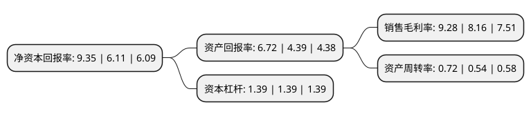

> 本页面由自动化程序生成于 2022年5月20日 01:35
> 内容可能存在错误，如有bug请提交issue至：https://github.com/Eroleice/doc-pi/issues
{.is-warning}

# 上市公司基本情况

## 基本资料

西藏卫信康医药股份有限公司（以下简称“卫信康”）成立于2006年03月17日，拉萨市。于2017年07月21日在上交所主板上市。

卫信康注册资本43,591.9万元，主营业务:化学药品制剂及其原料药的研发，生产，销售。主要产品:静脉维生素补充剂，静脉电解质补充剂，静脉补铁剂，护肝类用药，抗生素类产品。以下是详细信息：

- 公司名称: 西藏卫信康医药股份有限公司
- 股票代码: 603676.SH
- 所在地: 西藏 - 拉萨市
- 成立日期: 2006年03月17日
- 注册资本: 43,591.9万元
- 法定代表人: 张勇
- 主营业务: 主营业务:化学药品制剂及其原料药的研发，生产，销售主要产品:静脉维生素补充剂，静脉电解质补充剂，静脉补铁剂，护肝类用药，抗生素类产品
- 公司官网: www.wxkpharma.com
- 公司介绍: 公司以临床需求为导向，立足于研发创新，坚持仿创结合，以化学药品制剂及其原料药的研发、生产、销售为主营业务，在静脉维生素补充剂、静脉电解质补充剂、静脉补铁剂等领域具有较强竞争力，同时生产和销售护肝类用药、抗生素类产品。公司专注于药品研发，并逐步设立北京京卫信康科技、北京京卫众智、洋浦京泰药业等主体开展药品研发、经营活动，坚持以市场为导向，结合自身技术优势，开发填补临床空白的化学药品制剂及其原料药。公司在行业产能充裕的背景下通过业务合作或技术转让实现研发成果的产业化，并通过区域经销模式构建了覆盖全国的销售网络。公司主导合作产品包括注射用12种复合维生素、蔗糖铁注射剂、注射用门冬氨酸钾镁等，该等产品均系5类新药或独家国产产品，技术门槛较高、市场竞争品种较少。

## 股东及高管情况

上市公司第一大股东为西藏卫信康投资管理有限公司，持股205,248,960股，占比47.08%，为上市公司实际控制人。

截至2022年03月31日，上市公司的前十大股东中，共有5名自然人股东，3名机构股东，1个产品账户，1个海外主体，其中5%以上大股东共有4名。上市公司前十大股东明细如下：

> 截至2022年03月31日，上市公司前十大股东信息如下：

| 股东名称 | 持股数量（股） | 持股比例 |
| --- | --- | --- |
| 西藏卫信康投资管理有限公司 | 205,248,960 | 47.08% |
| 张勇 | 53,402,400 | 12.25% |
| 钟丽娟 | 36,000,000 | 8.26% |
| 天津京卫信康管理咨询合伙企业(有限合伙) | 33,734,440 | 7.74% |
| 刘烽 | 3,817,120 | 0.88% |
| 张宏 | 3,775,920 | 0.87% |
| 泰康人寿保险有限责任公司-投连-行业配置 | 1,744,200 | 0.4% |
| 阮寿国 | 1,584,141 | 0.36% |
| 招商银行股份有限公司-安信医药健康主题股票型发起式证券投资基金 | 1,316,100 | 0.3% |
| 高华-汇丰-GOLDMAN, SACHS & CO.LLC | 1,124,400 | 0.26% |

## 利润表分析

上市公司2021年总收入为10.33亿元，净利润为0.95亿元，实现盈利。

## 杜邦分析

> 数据列示周期：2021年 | 2020年 | 2019年
{.is-info}

上市公司的净资产收益率在近一年有所上升，上升幅度为53.03%，其变化情况分解如下：
- 上市公司的销售毛利率在近一年上升了13.73%，可能是生产效率的提升、商品原材料价格下跌或商品价格的上涨所致。
- 上市公司的资产周转率在近一年上升了33.33%，可能是源自于更快的销售回款或库存管理效果提升。
- 上市公司的财务杠杆比率在近一年下降了0%，可能是减少负债降低财务费用。

