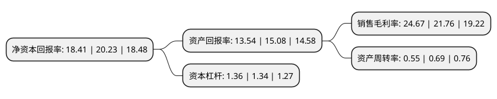

> 本页面由自动化程序生成于 2022年5月20日 01:35
> 内容可能存在错误，如有bug请提交issue至：https://github.com/Eroleice/doc-pi/issues
{.is-warning}

# 上市公司基本情况

## 基本资料

浙江诚意药业股份有限公司（以下简称“诚意药业”）成立于2001年06月22日，温州市。于2017年03月15日在上交所主板上市。

诚意药业注册资本23,378.88万元，主营业务:本公司专业从事化学药品原料药及制剂的研发，生产和销售。主要产品:产品覆盖范围涉及关节炎类，利尿类，安神补脑类，抗病毒及抗肿瘤类等，主要产品包括盐酸氨基葡萄糖原料药及制剂，托拉塞米注射液及胶囊，天麻素原料药，利巴韦林及硫唑嘌呤原料药等。其中，盐酸氨基葡萄糖原料药及制剂，托拉塞米制剂及天麻素原料药主攻国内市场，利巴韦林及硫唑嘌呤原料药主要出口。以下是详细信息：

- 公司名称: 浙江诚意药业股份有限公司
- 股票代码: 603811.SH
- 所在地: 浙江 - 温州市
- 成立日期: 2001年06月22日
- 注册资本: 23,378.88万元
- 法定代表人: 颜贻意
- 主营业务: 主营业务:本公司专业从事化学药品原料药及制剂的研发，生产和销售主要产品:产品覆盖范围涉及关节炎类，利尿类，安神补脑类，抗病毒及抗肿瘤类等，主要产品包括盐酸氨基葡萄糖原料药及制剂，托拉塞米注射液及胶囊，天麻素原料药，利巴韦林及硫唑嘌呤原料药等其中，盐酸氨基葡萄糖原料药及制剂，托拉塞米制剂及天麻素原料药主攻国内市场，利巴韦林及硫唑嘌呤原料药主要出口
- 公司官网: www.chengyipharma.com
- 公司介绍: 公司创办于1966年，现为一家专业生产胶囊剂、针剂、片剂、原料药和医药中间体的综合性现代化制药企业。是国家重点高新技术企业、全国守合同重信用单位、省、市重点骨干企业、洞头区本土民营企业的龙头企业。公司可生产60多个品种，近百个规格的药品，主要产品包括盐酸氨基葡萄糖原料药及制剂、托拉塞米注射液及胶囊、天麻素原料药、利巴韦林及硫唑嘌呤原料药等。所有产品均已通过了国家GMP认证，多只产品通过了美国FDA、欧盟EMEA、澳大利亚TGA、英国MHRA、墨西哥COFEPRIS等多个国家地区的认证。

## 股东及高管情况

上市公司第一大股东为颜贻意，持股55,137,200股，占比23.58%，**疑似为**上市公司实际控制人。

截至2022年03月31日，上市公司的前十大股东中，共有8名自然人股东，2个产品账户，其中5%以上大股东共有2名。上市公司前十大股东明细如下：

> 未能通过持股比例判定出上市公司实际控制人（持股30%以上）
> 可能存在通过间接持股、联合持股、协议控制等方式拥有实际控制权的主体，具体请参考上市公司定期公告！
{.is-warning}

> 截至2022年03月31日，上市公司前十大股东信息如下：

| 股东名称 | 持股数量（股） | 持股比例 |
| --- | --- | --- |
| 颜贻意 | 55,137,200 | 23.58% |
| 深圳市优美利投资管理有限公司-优美利金安99号私募证券投资基金 | 13,600,000 | 5.82% |
| 全国社保基金六零四组合 | 10,875,340 | 4.65% |
| 颜茂林 | 6,677,678 | 2.86% |
| 岑均达 | 5,762,400 | 2.46% |
| 柯泽慧 | 5,268,480 | 2.25% |
| 庄小萍 | 4,219,000 | 1.8% |
| 任秉钧 | 4,116,039 | 1.76% |
| 沈爱兰 | 3,653,512 | 1.56% |
| 邱克荣 | 2,508,800 | 1.07% |

## 利润表分析

上市公司2021年总收入为6.93亿元，净利润为1.71亿元，实现盈利。

## 杜邦分析

> 数据列示周期：2021年 | 2020年 | 2019年
{.is-info}

上市公司的净资产收益率在近一年有所下降，下降幅度为-9%，其变化情况分解如下：
- 上市公司的销售毛利率在近一年上升了13.37%，可能是生产效率的提升、商品原材料价格下跌或商品价格的上涨所致。
- 上市公司的资产周转率在近一年下降了-20.29%，可能是源自于更慢的销售回款或库存管理效果下降。
- 上市公司的财务杠杆比率在近一年上升了1.49%，可能是增加负债扩大生产规模。

